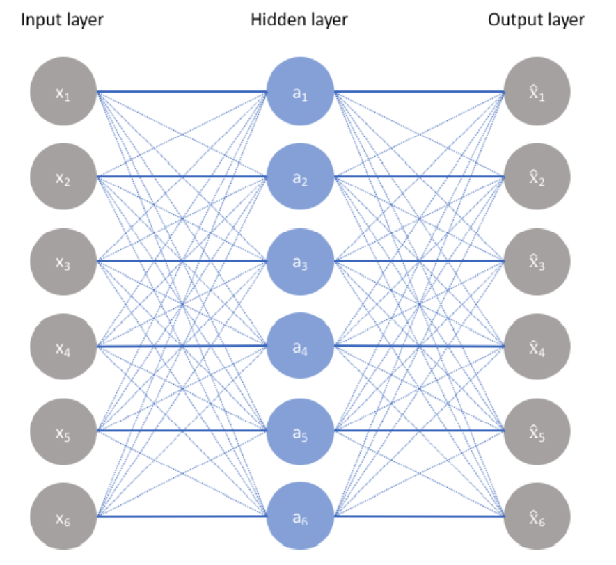
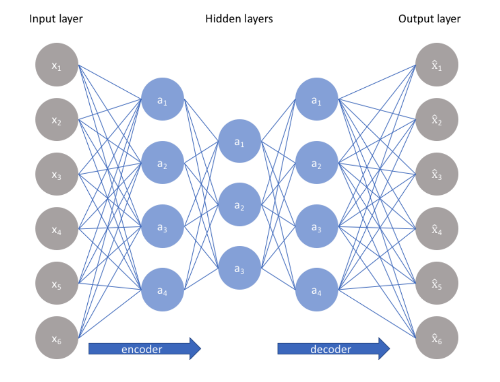
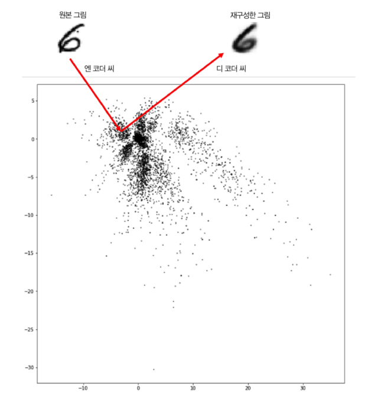
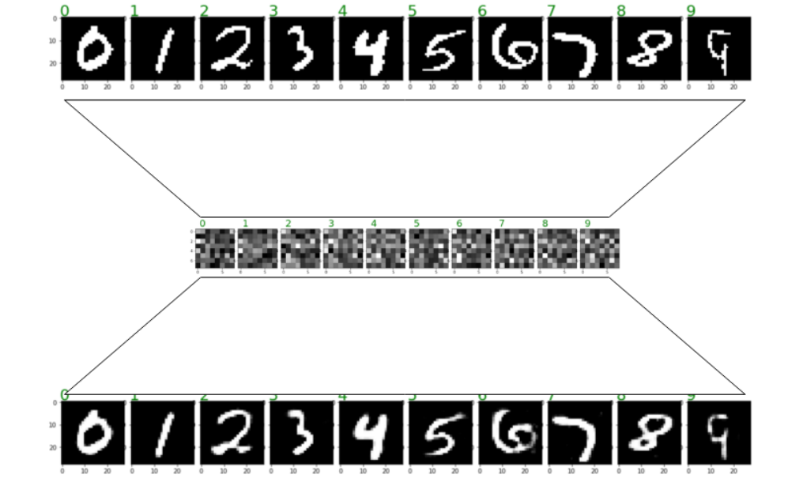
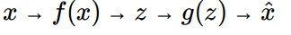
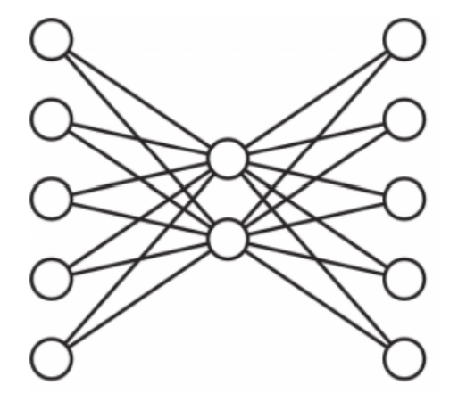
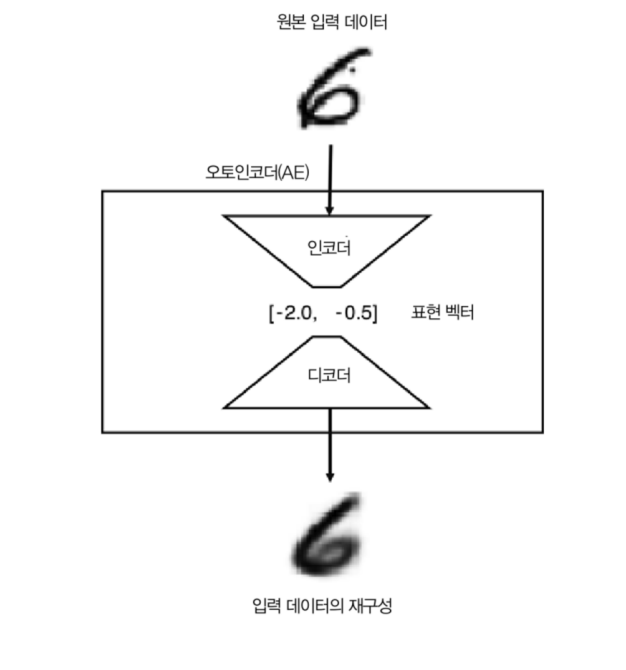

## 비지도 학습(Unsupervised Learning)

### AE(AutoEncoder)

- AutoEncoder는 Output을 Input의 근사로 하는 함수를 학습하는 비지도 학습

- 도입

  - Feature를 복제하는 방법
    - 1 to 1으로 신경망을 구성해준다.
  - Feature Extraction 해주는 방법
    - 제약을 주고 Feature를 복제한다. -> 중요 요소들을 스스로 판별해준다.

- 구성

  - Encoder
    - 입력 FeatureSet을 표현 학습을 통해 다른 표현으로 반환
    - 특징을 추출(<b>Feature Extraction</b>)
    - 네트워크는 고차원 입력 데이터를 저차원 표현 벡터로 압축한다.
  - Decoder
    - 새로 학습한 표현을 원본의 형식으로 재구성 (<b>Feature Construction / Reconstruction</b>)
    - 주어진 표현 벡터를 원본 차원으로 다시 압축 해제

- 특징

  - 입력의 shape와 출력의 shape이 같다.
  - 가운데 계층의 노드수가 입력값보다 작다.
    - 데이터를 압축함
    - 차원을 축소함 (Feature를 요약하여, 필요한 값들로 정리해 놓는다.)
  - 입력 -> encoding -> 차원축소 -> decoding -> 출력

- 설계

  - feature를 압축하여 가능한 만큼 feature의 갯수를 줄인다.

  - 많이 줄이지만 원본이 의미하고 있는 핵심은 포함해야함

  - feature의 성질은 신경망에 의해 변경됨.

  - Function

    - Encoder function: z = f(x)

    - Decoder function: x^ = g(z)

      

- 동작

  - 학습 원리: input Data를 output Data로 학습하는 방식으로 학습시킨다.

  - 가장 쉬운 방법

    - 항등함수로 생성한 신경망

    - f(x) = x

    - AE가 항등함수를 학습하는것은 비효율적이다.

    - 100% 복사 되지만 차원이 줄어들지 않는다.

      

    - Dimension reduction이 포함된 방식을 차용한다면?

      - 예) 6개의 Input Data 정보를 유지할 수 있도록 Key가 되는 정보를 Feature Extraction 해준다.

      - Hidden Layers에 제약조건을 주고 데이터를 입력한다면 중요한 요소들만 판별해낼 수 있따. (6 -> 3 -> 6)

        

      - 3개의 데이터를 이용해 6개의 데이터를 유추한다. (즉, 3개는 각각 독립적인 요소들만 남게된다.)

        - Latent Space( 위 그림에서 가장 중간에 a1 ~ a3 )는 입력된 Data를 표현하는 가장 핵심적인 값들을 갖고있는 차원이다.

        

        

        

- 손실함수

  - E[∥X − g ∘ f(X)∥ ] ≈ 0

    - Encoder function: z = f(x)

    - Decoder function: x = g(z)

      

  - 입력과 Encoding -> Decoding 된 결과에 차이에 대한 평균이 0에 가까워 지도록 설계하면 된다.

- 과소완전 AE

  

  - AE에서 Encoder의 역할은 원본데이터의 새로운 표현을 학습하는 구성요소이다.
  - 과소완전(undercomplete)이란 내부의 표현이 입력 데이터보다 저차원이기 때문에 사용하는 용어이다.
  - Feature는 원본 피처 및 관측치 셋에서 파생된 새로운 피처셋이다.
    - Encoder: h = f(x)
      - x: 원본 관츠기
      - f: 학습되는 값
      - h: 새롭게 학습된 feature
    - Decoder: r = g(h)
    - 제대로 수행된다면 g(f(x))는 모든 x와 정확히 같지 않지만 충분히 가까운 값을 갖는다.
      - 즉, g(f(x)) != x

- 적층 AE

  - 여러 은닉층을 가진 AE를 Stacked AE(또는 Deep)라고 한다.

  - MNIST를 활용한 Stacked AE

    

    

- Denoising AE

  - 오토인코더는 원본 입력 데이터로 부터 새로운 표현을 학습 가장 핵심적인 요소를 추출 <b>원본 데이터의 노이즈는 무시.</b>

  - 배경에서 들려오는 잡담(노이즈)으로 부터 대화(신호)를 분리할 수 있다.

  - 잡음은 입력에 추가된 순수한 가우시안 잡음 이거나 드롭아우서럼 무작위로 입력을 꺼서 발생시킬 수도 있다.

    

    

  - 입력된 정보를 유지할 수 있는 특징을 추출할 수 있지만, 결과에 포함된 잡음을 제거 할 수 있다.

    
