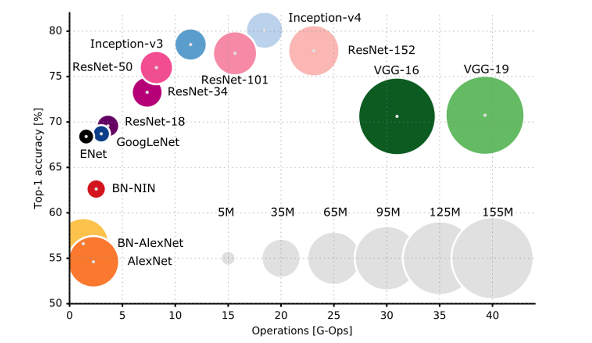

# DL(Deep Learning)

### Tensorflow


- <b>텐서플로(Tensorflow)</b>는 다양한 작업에 대해 데이터 흐름 프로그래밍을 위한 오픈소스 소프트웨어 라이브러리이다.
- 인공 신경망 같은 기계학습 응용프로그램 및 <b>딥러닝(Deep Learning)</b>에 사용된다.


### 신경망의 구조

- 신경망 훈련에 관련된 요소들

  - 네트워크를 구성하는 층(layer)

  - 입력 데이터(data)와 그에 상응하는 타겟 데이터(label)

  - 학습에 사용할 피드백 신호를 정의하는 손실 함수

  - 학습 진행 방식을 결정하는 옵티마이저

    

- <b>Layer</b>

  - 하나 이상의 텐서를 입력으로 받아 하나 이상의 텐서를 출력하는 데이터 처리 모듈
  - 대부분 <b>가중치</b>라는 상태를 가진다.
  - 가중치는 확률적 경사 하강법에 의해 학습 되는 하나 이상의 텐서이며 여기에 네트워크가 학습한 <b>정보</b>가 담겨있다.
  - Layer 종류
    - 완전 연결층 (Fully Connected Layer)
    - 밀집층 (Dense Layer)
    - 순환층 (Recurrent Layer)
    - 합성곱층 (Convolution Layer)
  - 예)

  ```python
  from tensorflow.keras import layers
  layer = layers.Dense(32, input_shape=(784, )
  ```
  - 첫 번째 차원이 784인 2D 텐서만 입력으로 받는 층
  - 이 층은 첫 번째 차원 크기가 32로 변화된 텐서를 출력할 것이다.
  - 따라서 32차원의 벡터를 입력으로 받는 하위 층이 연결 되어야 한다.
  - 하지만 케라스(keras)에서는 모델에 추가된 층을 자동으로 <b>상위 층의 크기에 맞추어</b> 주기 때문에 호환성을 걱정하지 않아도 된다.


- Dense Layer

  - Dense Layer는 다음과 같이 입력과 출력이 모두 연결된 Layer이다.

    

- Loss Function

  - 훈련하는 동안 최소화 될 값
  - 종류
    - 회귀 타입에 쓰이는 손실함수
      1. MSE: Regression 문제
      2. MAE
      3. MSLE
      4. MAPE
      5. KLD
      6. Poisson
      7. Logcosh
      8. Cosine Similarity
      9. Huber
      10. CTC(Connection Temporal Classification): 시퀀스 학습
    - 분류에 쓰이는 손실함수
      1. Binary cross-entropy: 2개의 class
      2. Categorical cross-entropy: n개의 class
      3. Sparse categorical cross-entropy
      4. Hinge
      5. Squared Hinge
      6. Categorical Hinge


### DNN(Deep Neural Network)

- 가장 기본적인 layer 구조

  

  ```python
  model = models.Sequential()
  model.add(tf.keras.layers.Dense(32, input_shape=(784, )))
  model.add(tf.keras.layers.Dense(10))
  model.add(tf.keras.layers.Dense(20))
  model.summary()
  ```

  - 모델을 만들어 input layer의 shape을 784로 주고 결과를 32의 크기로 나오게 함
  - hidden layer에서는 32의 크기로 받고 10의 크기로 나옴
  - output layer는 10의 크기로 들어가서 20크기의 vector로 나옴


### CNN(Convolution Neural Network)

- 도입

  - 이미지를 인식하는 방법?
    - 기계라면? 픽셀 단위로 쪼개서 학습
    - 사람이라면? 전체적인 모양을 학습
  - 이미지를 인식하기 위해선 어떻게 이미지를 처리해야 할까?
    - 이미지의 윤곽을 찾아내기
      - kernel 기법 사용
    - 이미지의 윤곽을 인식했다면 어떤 사물인지 어떻게 알 수 있을까
      - Data -> kernel -> 윤곽 -> Label

- CNN의 전체구조

  - Convolution은 일정 영역의 값들에 대해 가중치를 적용하여 하나의 값을 만드는 연산이다.

    

    

- 각 계층별 요소

  - Convolution
    - 입력데이터의 특징을 추출하는 역할
  - Pooling
    - 입력으로 주어지는 정보를 최대/최소/평균값으로 압축하여 데이터 연산량을 줄여주는 역할을 수행(즉, 대푯값을 추출)
    - max pooling
    - min pooling
    - average pooling


- Convolution 이란?

  - 두개의 신호를 합성해서 내보내는 연산을 의미한다. (곱한다음 적분)

    

  - 합성곱 연산은 이미지 처리에서 말하는 필터 연산에 해당한다.

  - 필터 = 커널(kernel)

  - 합성곱 연산은 필터의 window를 일정 간격으로 이동해 가며 입력 데이터를 적용한다.

  - 4x4 * 3x3 -> 2x2

    


- 패딩(Padding)

  - 합성곱 연산을 수행하기 전에 입력 데이터 주변을 0과 같은 특정 값으로 채운다.

    - 보통 출력 크기를 조정하기 위해 사용한다.

    - 4x4 + padding1 * 3x3 -> 4x4

      


- 스트라이드

  - 필터를 적용하는 위치의 간격

    


- Pooling 계층

  - 풀링은 2차원 데이터의 세로 및 가로 방향의 공간을 줄이는 연산

  - 풀링에는 최대 풀링(Max Pooling), 평균 풀링(Average Pooling)

  - 최대 풀링은 대상 영역에서 최댓값을 취하는 연산이고, 평균 풀링은 대상 영역의 평균을 계산한다. 이미지 인식 분야에서는 주로 최대 풀링을 사용한다.

  - 대푯값을 추출해내는 과정이다.

    


- 컬러 이미지의 2D conv 연산

  

- 3D conv

  - 3D filter가 3-direction으로 이동하면서 연산된다.

    


- CNN model 종류

  

  - VGG16

    - 가장 대표적이고 보편적인 model

      

      


- CNN modeling 과정

  

  

  

  

  

  

  

  

  


### RNN(Recurrent Neural Network)

- Sequence Data의 표현법

  

- 일반화

  

- Sequence Data의 특징

  - 순서가 중요하다.
  - 샘플마다 길이가 다르다.
    - 순환 신경망은 은닉층에 순환 에지를 부여하여 가변 길이 수용
    - 길이가 τ인 데이터를 처리 하기 위해서는 은닉층이 τ번 나타나야 한다.
    - τ는 가변적이다.
  - 이전 데이터의 의존성
    - 이전에 나타난 결과를 저장하여 이후에 나타나는 데이터에 적용한다.
    - 주어 -> 동사
    - 23일의 주가 -> 24일의 주가


- 순환 신경망의 구조

  - 기능

    - 위에서 나타난 sequence data의 해석에 필요한 기능들이 필요하다.

    - 입력층, 은닉층, 출력층을 가진다.

    - 순환 에지(recurrent edge)

      

      

      

- RNN의 특징 가중치 공유

  - 매개변수는 서로 다른값이 아닌 같은 값을 공유한다. 즉, 동일한 네트워크가 시퀀스의 각 요소에 적용되는 구조
    - 학습시 추정할 매개변수의 수가 엄청 줄어든다.


- RNN의 종류

  

  

- RNN의 구조 예

  

  - 가중치 U의 크기는 입력 4개, 출력 6개 이므로 크기 6x4인 행렬
  - 가중치 V의 크기는 입력 6개, 출력 2개 이므로 크기 2x6인 행렬
  - 은닉층에서 은닉층으로의 가중치 W의 크기는 입력 6개, 출력 6개 이므로 크기가 6x6인 행렬
