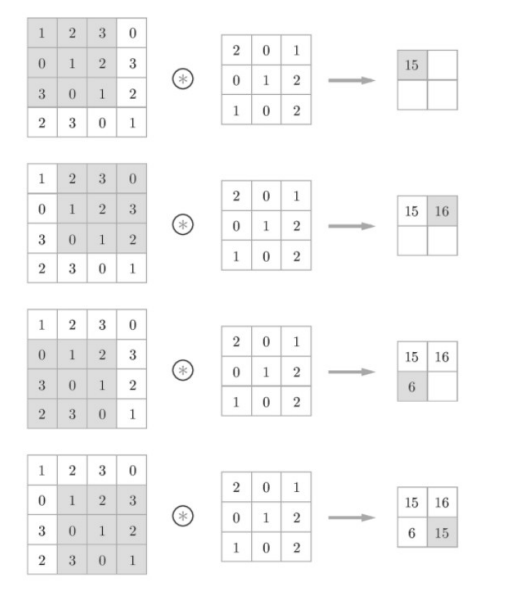
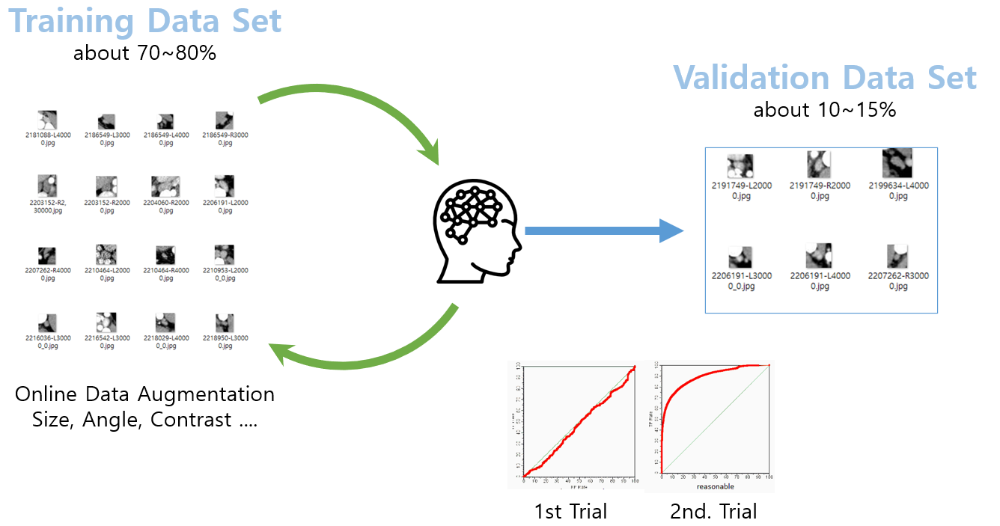
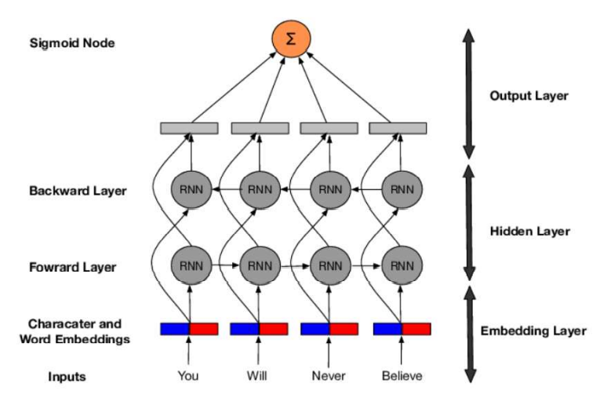
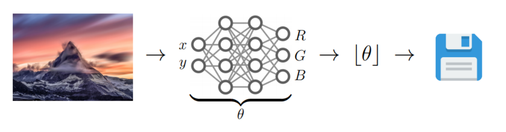
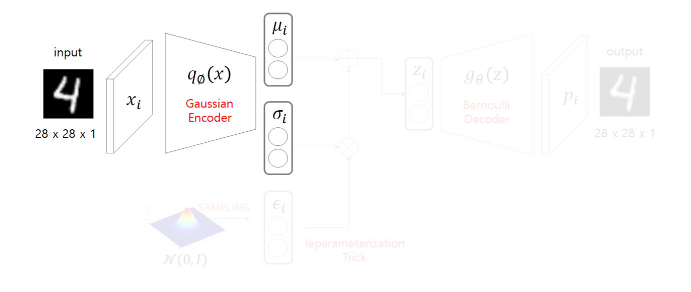

# DL(Deep Learning)

### Tensorflow


- <b>텐서플로(Tensorflow)</b>는 다양한 작업에 대해 데이터 흐름 프로그래밍을 위한 오픈소스 소프트웨어 라이브러리이다.
- 인공 신경망 같은 기계학습 응용프로그램 및 <b>딥러닝(Deep Learning)</b>에 사용된다.


### 신경망의 구조

- 신경망 훈련에 관련된 요소들

  - 네트워크를 구성하는 층(layer)

  - 입력 데이터(data)와 그에 상응하는 타겟 데이터(label)

  - 학습에 사용할 피드백 신호를 정의하는 손실 함수

  - 학습 진행 방식을 결정하는 옵티마이저

    

- <b>Layer</b>

  - 하나 이상의 텐서를 입력으로 받아 하나 이상의 텐서를 출력하는 데이터 처리 모듈
  - 대부분 <b>가중치</b>라는 상태를 가진다.
  - 가중치는 확률적 경사 하강법에 의해 학습 되는 하나 이상의 텐서이며 여기에 네트워크가 학습한 <b>정보</b>가 담겨있다.
  - Layer 종류
    - 완전 연결층 (Fully Connected Layer)
    - 밀집층 (Dense Layer)
    - 순환층 (Recurrent Layer)
    - 합성곱층 (Convolution Layer)
  - 예)

  ```python
  from tensorflow.keras import layers
  layer = layers.Dense(32, input_shape=(784, )
  ```
  - 첫 번째 차원이 784인 2D 텐서만 입력으로 받는 층
  - 이 층은 첫 번째 차원 크기가 32로 변화된 텐서를 출력할 것이다.
  - 따라서 32차원의 벡터를 입력으로 받는 하위 층이 연결 되어야 한다.
  - 하지만 케라스(keras)에서는 모델에 추가된 층을 자동으로 <b>상위 층의 크기에 맞추어</b> 주기 때문에 호환성을 걱정하지 않아도 된다.


- Dense Layer

  - Dense Layer는 다음과 같이 입력과 출력이 모두 연결된 Layer이다.

    

- Loss Function

  - 훈련하는 동안 최소화 될 값
  - 종류
    - 회귀 타입에 쓰이는 손실함수
      1. MSE: Regression 문제
      2. MAE
      3. MSLE
      4. MAPE
      5. KLD
      6. Poisson
      7. Logcosh
      8. Cosine Similarity
      9. Huber
      10. CTC(Connection Temporal Classification): 시퀀스 학습
    - 분류에 쓰이는 손실함수
      1. Binary cross-entropy: 2개의 class
      2. Categorical cross-entropy: n개의 class
      3. Sparse categorical cross-entropy
      4. Hinge
      5. Squared Hinge
      6. Categorical Hinge


## 지도 학습(Supervised Learning)

### DNN(Deep Neural Network)

- 가장 기본적인 layer 구조

  

  ```python
  model = models.Sequential()
  model.add(tf.keras.layers.Dense(32, input_shape=(784, )))
  model.add(tf.keras.layers.Dense(10))
  model.add(tf.keras.layers.Dense(20))
  model.summary()
  ```

  - 모델을 만들어 input layer의 shape을 784로 주고 결과를 32의 크기로 나오게 함
  - hidden layer에서는 32의 크기로 받고 10의 크기로 나옴
  - output layer는 10의 크기로 들어가서 20크기의 vector로 나옴


### CNN(Convolution Neural Network)

- 도입

  - 이미지를 인식하는 방법?
    - 기계라면? 픽셀 단위로 쪼개서 학습
    - 사람이라면? 전체적인 모양을 학습
  - 이미지를 인식하기 위해선 어떻게 이미지를 처리해야 할까?
    - 이미지의 윤곽을 찾아내기
      - kernel 기법 사용
    - 이미지의 윤곽을 인식했다면 어떤 사물인지 어떻게 알 수 있을까
      - Data -> kernel -> 윤곽 -> Label

- CNN의 전체구조

  - Convolution은 일정 영역의 값들에 대해 가중치를 적용하여 하나의 값을 만드는 연산이다.

    

    

- 각 계층별 요소

  - Convolution
    - 입력데이터의 특징을 추출하는 역할
  - Pooling
    - 입력으로 주어지는 정보를 최대/최소/평균값으로 압축하여 데이터 연산량을 줄여주는 역할을 수행(즉, 대푯값을 추출)
    - max pooling
    - min pooling
    - average pooling


- Convolution 이란?

  - 두개의 신호를 합성해서 내보내는 연산을 의미한다. (곱한다음 적분)

    

  - 합성곱 연산은 이미지 처리에서 말하는 필터 연산에 해당한다.

  - 필터 = 커널(kernel)

  - 합성곱 연산은 필터의 window를 일정 간격으로 이동해 가며 입력 데이터를 적용한다.

  - 4x4 * 3x3 -> 2x2

    


- 패딩(Padding)

  - 합성곱 연산을 수행하기 전에 입력 데이터 주변을 0과 같은 특정 값으로 채운다.

    - 보통 출력 크기를 조정하기 위해 사용한다.

    - 4x4 + padding1 * 3x3 -> 4x4

      


- 스트라이드

  - 필터를 적용하는 위치의 간격

    


- Pooling 계층

  - 풀링은 2차원 데이터의 세로 및 가로 방향의 공간을 줄이는 연산

  - 풀링에는 최대 풀링(Max Pooling), 평균 풀링(Average Pooling)

  - 최대 풀링은 대상 영역에서 최댓값을 취하는 연산이고, 평균 풀링은 대상 영역의 평균을 계산한다. 이미지 인식 분야에서는 주로 최대 풀링을 사용한다.

  - 대푯값을 추출해내는 과정이다.

    


- 컬러 이미지의 2D conv 연산

  

- 3D conv

  - 3D filter가 3-direction으로 이동하면서 연산된다.

    


- CNN model 종류

  

  - VGG16

    - 가장 대표적이고 보편적인 model

      

      


- CNN modeling 과정

  

  

  

  

  

  

  

  

  


### RNN(Recurrent Neural Network)

- Sequence Data의 표현법

  

- 일반화

  

- Sequence Data의 특징

  - 순서가 중요하다.
  - 샘플마다 길이가 다르다.
    - 순환 신경망은 은닉층에 순환 에지를 부여하여 가변 길이 수용
    - 길이가 τ인 데이터를 처리 하기 위해서는 은닉층이 τ번 나타나야 한다.
    - τ는 가변적이다.
  - 이전 데이터의 의존성
    - 이전에 나타난 결과를 저장하여 이후에 나타나는 데이터에 적용한다.
    - 주어 -> 동사
    - 23일의 주가 -> 24일의 주가


- 순환 신경망의 구조

  - 기능

    - 위에서 나타난 sequence data의 해석에 필요한 기능들이 필요하다.

    - 입력층, 은닉층, 출력층을 가진다.

    - 순환 에지(recurrent edge)

      

      

      

- RNN의 특징 가중치 공유

  - 매개변수는 서로 다른값이 아닌 같은 값을 공유한다. 즉, 동일한 네트워크가 시퀀스의 각 요소에 적용되는 구조
    - 학습시 추정할 매개변수의 수가 엄청 줄어든다.


- RNN의 종류

  

  

- RNN의 구조 예

  

  - 가중치 U의 크기는 입력 4개, 출력 6개 이므로 크기 6x4인 행렬
  
  - 가중치 V의 크기는 입력 6개, 출력 2개 이므로 크기 2x6인 행렬
  
  - 은닉층에서 은닉층으로의 가중치 W의 크기는 입력 6개, 출력 6개 이므로 크기가 6x6인 행렬
  
    
  
    


- RNN의 문제점

  

  - 만약 W(state) 값이 0.1라면? -> 4회 recurrent: 0.1^4 = 0.001(Gradient Vanishing) 금방 0에 수렴 => Recurrent state 값이 0에 수렴하여 전혀 네트워크에 영향을 못 줌
  - (Gradient Exploding: 무한대 NaN: Not a number)

- LSTM(Long-Short Term Memory)

  

  - Notation

    

  - Cell State

    

  - Forget & Input gate Layer

    

  - Cell state Update

    

  - Output gate Layer

    

- GRU

  

- RNN 활용

  - Word Embedding

    - Word -> Embedding -> Vector
    - 다양한 임베딩 방법들이 존재
    - 단어 수준 임베딩: Word2Vec, FastText
      - 단어 자체를 구분
    - 문장 수준 임베딩: Elmo, Bert, GPT
      - 문장의 앞뒤를 보고 파악할 수 있다. (문법을 이해함)
  
  - One-Hot Encoding
  
    - 임베딩을 위한 가장 쉬운 방법
  
      
  
    - 문제점: 원핫 인코딩은 행렬의 대부분이 "0"인 희소행렬(Sparse Matrix)이다.
  
      - 메모리 낭비 심함
      - 단어사이의 유사도를 찾기 어렵다.
  
    - 해결책: 단어 임베딩을 통해 Dense Matrix로 변경한다.
  
      
  
  - Keras Embedding
  
    
  
    - 임베딩 레이어를 통해 단어를 통과 시키면 밀집된 차원으로 변경 된다.
  
  - Bidirectional RNN
  
    
  
    - 양방향 RNN은 Sequential 데이터를 순서대로 처리한 다음 역순으로 처리하여 더 좋은 성능을 나타낸다.
      - 빨리 ____ 가고 싶다.
      - "빨리"를 통해 "집에"를 예측할 순 없지만, "가고 싶다."를 통해 "집에"를 예측 할 순 있다.
  
  - Stacked RNN
  
    
  
    - RNN 또는 Bidirection RNN을 여러 층을 쌓아서 Model 생성 가능
    - 이때, return_sequences=True를 이용해 출력의 단위를 맞춰줄 수 있다.
  
  
  
  
  
  
## 비지도 학습(Unsupervised Learning)


### 지도 학습과 비지도 학습 비교

- <u><b>지도 학습</b></u>

  - AI 에이전트가 레이블에 엑세스 할 수 있다.
  - 이를 사용해 일부 작업에서 성능을 향상 시킬 수 있다.

- <u><b>비지도 학습</b></u>

  - 레이블을 사용할 수 없다.

  - AI 에이전트의 작업이 명확히 정의되지 않으므로 모델의 성능을 명확히 측정할 수 없다. (성능을 측정할 기준이 없으므로)

  - 데이터를 분석하고 중요한 feature를 찾아낼 수 있다.

    

- 장/단점

  - <u><b>지도 학습</b></u>
    - 장점
      - 레이블이 충분히 확보되고 <b>명확하게 정의된 작업</b>에서 성능을 최적화 하는데 탁월하다.
      - 충분히 큰 데이터셋 + 적절한 Model + 컴퓨팅 파워 => 우수한 Model
      - Cost Function을 이용해 성능을 측정할 수 있다.
    - 단점
      - 레이블을 지정하는데 비용이 많이 든다. (수작업)
      - 사전에 학습한 레이블이 지정된 항목 이상의 지식을 밝혀내거나 일반화 하는데 한계가 있다.
      - 현실세계의 데이터는 대부분 레이블이 없다.
  - <u><b>비지도 학습</b></u>
    - 장점
      - 패턴을 알 수 없거나 끊임없이 변화하는 데이터, 레이블 데이터가 충분히 확보되지 않는 문제 영역에서는 비지도 학습이 장점을 보여준다.
      - 레이블이 아닌 데이터 자체의 내재된 구조를 학습하여 작동한다.
      - 이전에 다루기 어려웠던 문제를 해결하는데 도움이 되고 모델 훈련에 사용되는 과정 데이터와 미래에 발생할 데이터 모두에서 숨겨진 패턴을 찾는데 유리하다.
      - 개방적인 문제를 해결하거나 지식을 일반화 하는데 적합하다.
    - 단점
      - 명확하고 좁게 정의된 문제를 해결하는데는 지도 학습보다 덜 능숙하다.


### 비지도 학습을 사용한 문제점 해결

- <b>과대적합</b>

  - 머신러닝 알고리즘이 훈련 데이터에 지나치게 접한 함수를 학습하면 Valid Set, Test Set과 같은 새로운 Data에서 제대로 수행되지 않을 수 있다.
  - 비지도 학습을 <b>정규화기(regularizer)</b>로 사용하면 문제를 해결할 수 있다.
  - 비지도 기반 사전 학습은 데이터를 지도학습 알고리즘에 직접 대한하는 대신  비지도 사전 훈련을 통해 생성된 원본 입력 데이터의 새로운 표현을 제공할 수 있다.
    - 새로운 구조는 기존 데이터의 노이즈를 제거하고, 내재된 본질적인 구조를 포착할 수 있도록 도와준다

- <b>차원의 저주</b>

  - 차원이 증가할수록 데이터의 분포 분석 또는 모델추정에 필요한 샘플 데이터의 개수가 기하급수적으로 증가하게 되는데 이러한 어려움을 표현한 용어가 <u><b>차원의 저주</b></u>이다.
  - 결국 Feature의 수가 많을때 최적해를 구하는 함수 근사를 구하는 시간이 늘어나게 된다.
  - 비지도 학습은 차원 감소를 통해 원래의 피저 집합에서 가장 핵심적인 피처를 찾고 -> 중요한 정보를 보존 -> 차원 수를 적용 가능한 개수로 줄인 후 -> 지도 학습 알고리즘을 적용해 효율적으로 최적의 함수 근사를 찾아낼 수 있다.

- <b>피처 엔지니어링</b>

  - 적절한 피처를 통해 학습시켜야 Model이 새로운 데이터에 대해 좋은 결정을 내릴 수 있다.
  - 올바른 유형의 피처를 창의적으로 설계
  - 비지도 학습 알고리즘을 통해 적절한 유형의 피처 표현을 자동으로 학습하게 하여 추출할 수 있다.

- <b>이상치 탐지</b>

  

  - 비지도 학습은 왜곡된 이상치를 탐지할 수 있다.


### 차원축소

- 도입

  - 변수의 수가 많아 차원이 높은경우 발생하는 문제들

    - 시각화가 어렵다.
    - 신경망 또는 알고리즘의 연산시 계산이 복잡해 진다.

  - 해결방법

    - 꼭 필요한 변수들만 추출한다.

    - 기존의 변수들을 이용해 새로운 변수를 만들어 낸다.

      

- 차원축소의 방법

  - Feature Selection
    - 기존의 변수들 중 상관관계가 존재하는 변수를 추출한다.
    - P(original) > P(new)
    - x(1), x(2),x(3), .... ,x(n), -> x(1), x(2), .... , x(m) 단, m < n
      - 장점: 기존의 특성이 가진 성질을 유지하면서 데이터를 줄일 수 있다.
      - 단점: Feature를 압축하지 않고 줄여준다.
  - Feature Extraction
    - 기존의 변수들을 변환해 새로운 변수를 추출한다.
    - P(original) > P(new)
    - x(1), x(2),x(3), .... ,x(n), -> y(1), y(2), .... , y(m) 단, m < n
      - 장점: 각각의 변수가 내재한 정보가 많아 진다.
      - 단점: 생성된 특성은 사람이 이해할 수 없는 데이터이다.


### Manifold Learning

- 데이터의 차원을 축소하기 위해 실행한다.

- 1000 차원 -> 2차원

- 256x256x3 -> ?

- 전체 sample을 어우루는 sub space를 찾아내는 방법을 manifold 라고 한다

- 10만 차원 -> 3차원으로 줄이는 방법은?

  - 조건: 원래 데이터의 분포를 최대한 유지하고 싶다.
  - 목적
    1. Data compression
    2. Data Visualization
    3. Curse of Dimensionality
    4. Discovering most important features

- Data compression

  

  - 이미지 압출을 활용한 Autoencoder -> 기존의 JPEG보다 성능이 좋다.

  

- Data Visualization

  - Data에 대한 직관을 얻기 위해

  - Model 학습 후 차원 축소의 결과를 직관적으로 보여주기 위해

    

- 차원의 저주(Curse of Dimensionality)

  - 차원이 증가할수록 데이터의 분포 분석 또는 모델 추정에 필요한 샘플 데이터의 개수가 기하급수적으로 증가한다.
  - 학습에 필요한 차원이 증가할수록 많은 샘플이 필요해 진다.

- Manifole Hypothesis

  - 고차원 데이터의 밀도는 낮지만, 이들의 집합을 포함하는 저차원의 Manifolds가 있다.

  - 저차원의 Manifold를 벗어나는 순간 밀도는 낮아진다.

    

    

  - 결국 feature를 잘 어우르는 Manifold를 잘 찾아 낸다면 각각의 특징을 확실하게 표현할 수 있다.

    

  - 이러한 요소들을 AutoEncoder가 자동으로 찾아준다

  - 이들을 찾을 수 있는 이유는 비지도 학습을 통해서 학습되기 때문이다.

  - ManiFold 위에 있는 데이터를 호출하는지 아니면 위에 있지 않은 데이터를 호출하느냐에 따라서 데이터가 표현되는 방법은 달라진다.

    - MainFold위에 있지 않은 데이터는 우리가 원하는 Data가 아니다.

      

    - ManiFold위에 있는 데이터는 우리가 원하는 Data이다.

      


### AE(AutoEncoder)

- AutoEncoder는 Output을 Input의 근사로 하는 함수를 학습하는 비지도 학습

- 도입

  - Feature를 복제하는 방법
    - 1 to 1으로 신경망을 구성해준다.
  - Feature Extraction 해주는 방법
    - 제약을 주고 Feature를 복제한다. -> 중요 요소들을 스스로 판별해준다.

- 구성

  - Encoder
    - 입력 FeatureSet을 표현 학습을 통해 다른 표현으로 반환
    - 특징을 추출(<b>Feature Extraction</b>)
    - 네트워크는 고차원 입력 데이터를 저차원 표현 벡터로 압축한다.
  - Decoder
    - 새로 학습한 표현을 원본의 형식으로 재구성 (<b>Feature Construction / Reconstruction</b>)
    - 주어진 표현 벡터를 원본 차원으로 다시 압축 해제

- 특징

  - 입력의 shape와 출력의 shape이 같다.
  - 가운데 계층의 노드수가 입력값보다 작다.
    - 데이터를 압축함
    - 차원을 축소함 (Feature를 요약하여, 필요한 값들로 정리해 놓는다.)
  - 입력 -> encoding -> 차원축소 -> decoding -> 출력

- 설계

  - feature를 압축하여 가능한 만큼 feature의 갯수를 줄인다.

  - 많이 줄이지만 원본이 의미하고 있는 핵심은 포함해야함

  - feature의 성질은 신경망에 의해 변경됨.

  - Function

    - Encoder function: z = f(x)

    - Decoder function: x^ = g(z)

      

- 동작

  - 학습 원리: input Data를 output Data로 학습하는 방식으로 학습시킨다.

  - 가장 쉬운 방법

    - 항등함수로 생성한 신경망

    - f(x) = x

    - AE가 항등함수를 학습하는것은 비효율적이다.

    - 100% 복사 되지만 차원이 줄어들지 않는다.

      

    - Dimension reduction이 포함된 방식을 차용한다면?

      - 예) 6개의 Input Data 정보를 유지할 수 있도록 Key가 되는 정보를 Feature Extraction 해준다.

      - Hidden Layers에 제약조건을 주고 데이터를 입력한다면 중요한 요소들만 판별해낼 수 있따. (6 -> 3 -> 6)

        

      - 3개의 데이터를 이용해 6개의 데이터를 유추한다. (즉, 3개는 각각 독립적인 요소들만 남게된다.)

        - Latent Space( 위 그림에서 가장 중간에 a1 ~ a3 )는 입력된 Data를 표현하는 가장 핵심적인 값들을 갖고있는 차원이다.

        

        

        

- 손실함수

  - E[∥X − g ∘ f(X)∥ ] ≈ 0

    - Encoder function: z = f(x)

    - Decoder function: x = g(z)

      

  - 입력과 Encoding -> Decoding 된 결과에 차이에 대한 평균이 0에 가까워 지도록 설계하면 된다.

- 과소완전 AE

  

  - AE에서 Encoder의 역할은 원본데이터의 새로운 표현을 학습하는 구성요소이다.
  - 과소완전(undercomplete)이란 내부의 표현이 입력 데이터보다 저차원이기 때문에 사용하는 용어이다.
  - Feature는 원본 피처 및 관측치 셋에서 파생된 새로운 피처셋이다.
    - Encoder: h = f(x)
      - x: 원본 관츠기
      - f: 학습되는 값
      - h: 새롭게 학습된 feature
    - Decoder: r = g(h)
    - 제대로 수행된다면 g(f(x))는 모든 x와 정확히 같지 않지만 충분히 가까운 값을 갖는다.
      - 즉, g(f(x)) != x

- 적층 AE

  - 여러 은닉층을 가진 AE를 Stacked AE(또는 Deep)라고 한다.

  - MNIST를 활용한 Stacked AE

    

    

- Denoising AE

  - 오토인코더는 원본 입력 데이터로 부터 새로운 표현을 학습 가장 핵심적인 요소를 추출 <b>원본 데이터의 노이즈는 무시.</b>

  - 배경에서 들려오는 잡담(노이즈)으로 부터 대화(신호)를 분리할 수 있다.

  - 잡음은 입력에 추가된 순수한 가우시안 잡음 이거나 드롭아우서럼 무작위로 입력을 꺼서 발생시킬 수도 있다.

    

    

  - 입력된 정보를 유지할 수 있는 특징을 추출할 수 있지만, 결과에 포함된 잡음을 제거 할 수 있다.

    


### VAE(Variational AutoEncoder)

- 도입

  - Auto Encoder의 목적을 생각하고 Manifold에서 새로운 Data를 생성

- 목적

  - Manifold Learning을 통해 Feature의 차원을 줄이는게 목적이다.

  - Manifold 위에 찍힌 점을 찍는다면 어떻게 될까?

    - 데이터를 새로 생성할 수 있지 않을까?
    - 실제 결과는 제대로된 데이터가 생성되진 않는다.
    - Laten Space는 입력 데이터들에 대한 특징 정보들을 함축하고 있는데, 그렇다면 데이터를 생성할 순 없을까?

    

    

- Generative Model

  - Goal: Data Set에 존재할만한 Data를 생성해 낸다.
  - 종류
    - Variation AutoEncoder
    - Generative Adversarial Network

- Density Estimation

  - 데이터를 제대로 생성해내지 못한 이유를 생각해보자.

    - 데이터 자체의 Density(밀도)가 많이 떨어진다.
    - 해결법: 데이터의 밀도를 추정하면 됨

  - Unsupervised Learning: DataSet이 존재하면 DataSet의 밀도를 추정하여 확률 밀도 함수를 만든다. 물론, <b>함수 자체를 알 수 없다.</b>

  - 확률 밀도 함수(pdf) 생성 -> Data Set의 분포를 알 수 있다.

    

    

    

- Variational Autoencoder

  

  - 학습 데이터의 분포를 따르는 새로운 데이터를 만드는 AutoEncoder 기반의 생성 모델
  - AE는 Encoder를 이용해 차원을 축소하기 위한 목적
  - VAE는 Decoder를 이용해 새로운 Data를 생성하기 위한 Model


- Variational(변분법) Method

  - 어떤 함수 p(x)의 극점을 찾는 문제에서 해당 함수를 직접 다루는 것이 쉽지 않을 때, 쉽게 다룰 수 있는 다른 함수 q(x)로 대체해 이를 최적화 하여, p(x)에 대한 근사적인 해를 구하는 방법

  - HOW?

    

    

    - 단계1. Encoder

      

      

    - 단계2. Reparameterization Trick (Sampling)

      

      

      - 새로운 Data를 생성하기 위해 Sampling을 통해 Decoding 해준다.

      - Sampling을 위해 Data의 평균과 분산을 학습한다.

      - Sampling 없이 추론한 경우

        

      - Reparameterized form

        

        - 우리가 추정하고 싶은 확률 분포

          

          - Sampling 결과를 backpropagation 할 수 없다.

        - reparmeterization trick을 통해 추정할 식

          

          

          - 정규분포에서 z(i)를 샘플링 하는것과 ε을 정규분포에서 샘플링하고 그 값을 분산과 곱하고 평균을 더하는것은 같은 분포를 갖는다.

    - 단계3. Decoder

      

      

      - p(i)의 값을 Bernoulli 시행의 결과로 가정했기 때문에 activation function은 sigmoid로 설정 준다.

    - Loss Function

      

      - Loss Function은 Reconstruction Error와 Regularization 두가지를 고려해야 한다.
        - Reconstruction Error : input data와 output data에 대한 손실함수이다.
          - Decoder의 결과가 Bernoulli 분포를 따른다고 가정하였으므로 확률값으로 손실함수를 계산할 수 있는 cross entropy를 사용
        - Regularization : 원래 Data가 갖고있는 True 분포에 근사하기 위한 loss function
          - True pdf와 Approximated pdf 두 확률 분포간의 차이를 계산하기 위해 <u><b>Kullback–Leibler divergence</b></u> 방식을 사용한다.


- 참고

  

  

  

  - 확률분포 학습에 따른 새로운 Data 출력

    

    

    


### GAN(Generative Adversarial Networks)

- Generative: 생성하다

- Adversarial: 적대적 방식으로

- Overview

  

  1. Latent Space에서 z(Noise Data)입력

  2. z를 이용해 G(z) (위조 지폐) 생성

  3.  Discriminator 가 D(G(z))와 D(x) 수행하여 진짜인지 가짜인지 판별

     - x : 진짜 지폐

     - 진짜 : 1 출력

     - 가짜 : 0 출력

       

- <b>GAN</b>  vs  <b>VAE</b>

  


- 단계1. Discriminator Model

  

  - Discriminator가 진짜와 가짜를 구분할 수 있도록 학습한다.
  - sigmoid function을 이용해 학습시킨다.


- 단계2. Generator Model

  

  - Generator는 D(G(z))가 1이 되도록 학습한다.


- Loss Function

  - <b>Discriminator</b>  vs  <b>Generator</b>

    

    

    

    1. <b>Discriminator</b>

       

       - Object Function을 최대화 하는 D를 찾기 위해서는 2가지가 수행되면 된다.
         - D(x) = 1 : Real Data를 Real Data라고 판별
         - D(G(z)) = 0 : Fake Data를 Fake Data라고 판별

