## 지도 학습(Supervised Learning)

### CNN(Convolution Neural Network)

- 도입

  - 이미지를 인식하는 방법?
    - 기계라면? 픽셀 단위로 쪼개서 학습
    - 사람이라면? 전체적인 모양을 학습
  - 이미지를 인식하기 위해선 어떻게 이미지를 처리해야 할까?
    - 이미지의 윤곽을 찾아내기
      - kernel 기법 사용
    - 이미지의 윤곽을 인식했다면 어떤 사물인지 어떻게 알 수 있을까
      - Data -> kernel -> 윤곽 -> Label

- CNN의 전체구조

  - Convolution은 일정 영역의 값들에 대해 가중치를 적용하여 하나의 값을 만드는 연산이다.

    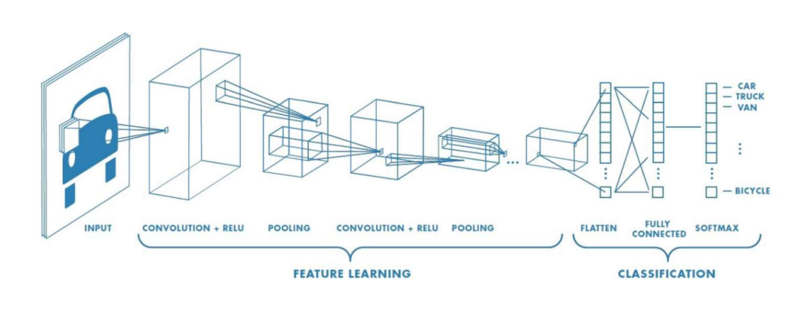

    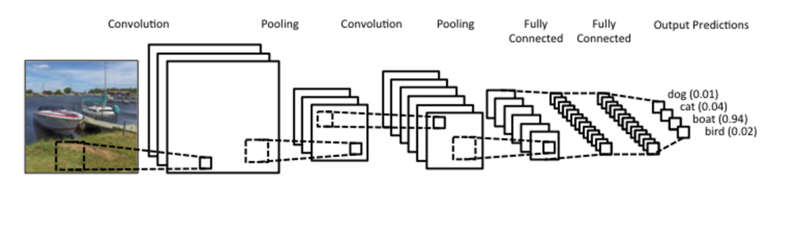

- 각 계층별 요소

  - Convolution
    - 입력데이터의 특징을 추출하는 역할
  - Pooling
    - 입력으로 주어지는 정보를 최대/최소/평균값으로 압축하여 데이터 연산량을 줄여주는 역할을 수행(즉, 대푯값을 추출)
    - max pooling
    - min pooling
    - average pooling

- Convolution 이란?

  - 두개의 신호를 합성해서 내보내는 연산을 의미한다. (곱한다음 적분)

    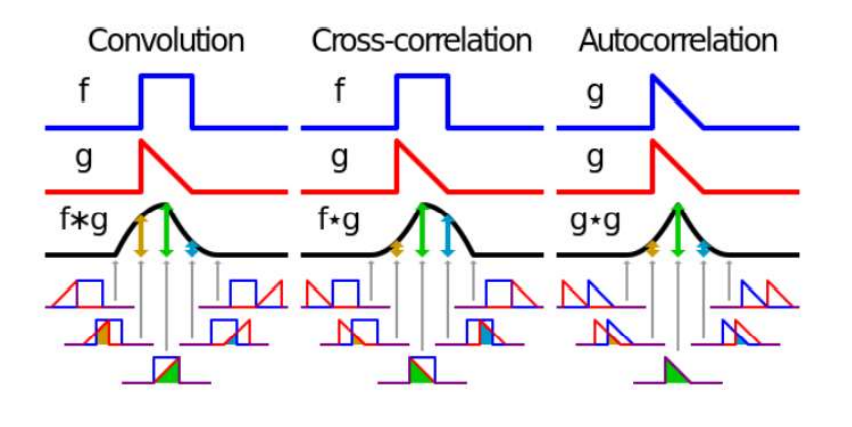

  - 합성곱 연산은 이미지 처리에서 말하는 필터 연산에 해당한다.

  - 필터 = 커널(kernel)

  - 합성곱 연산은 필터의 window를 일정 간격으로 이동해 가며 입력 데이터를 적용한다.

  - 4x4 * 3x3 -> 2x2

    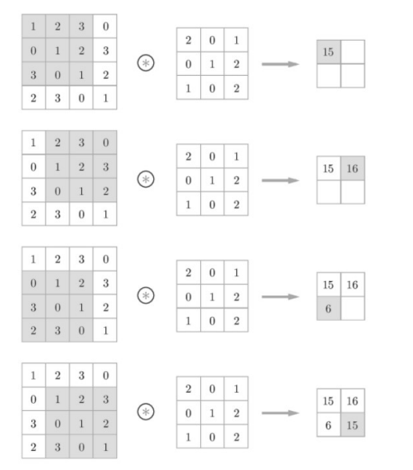

- 패딩(Padding)

  - 합성곱 연산을 수행하기 전에 입력 데이터 주변을 0과 같은 특정 값으로 채운다.

    - 보통 출력 크기를 조정하기 위해 사용한다.

    - 4x4 + padding1 * 3x3 -> 4x4

      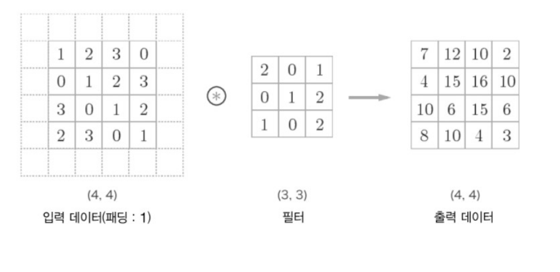

- 스트라이드

  - 필터를 적용하는 위치의 간격

    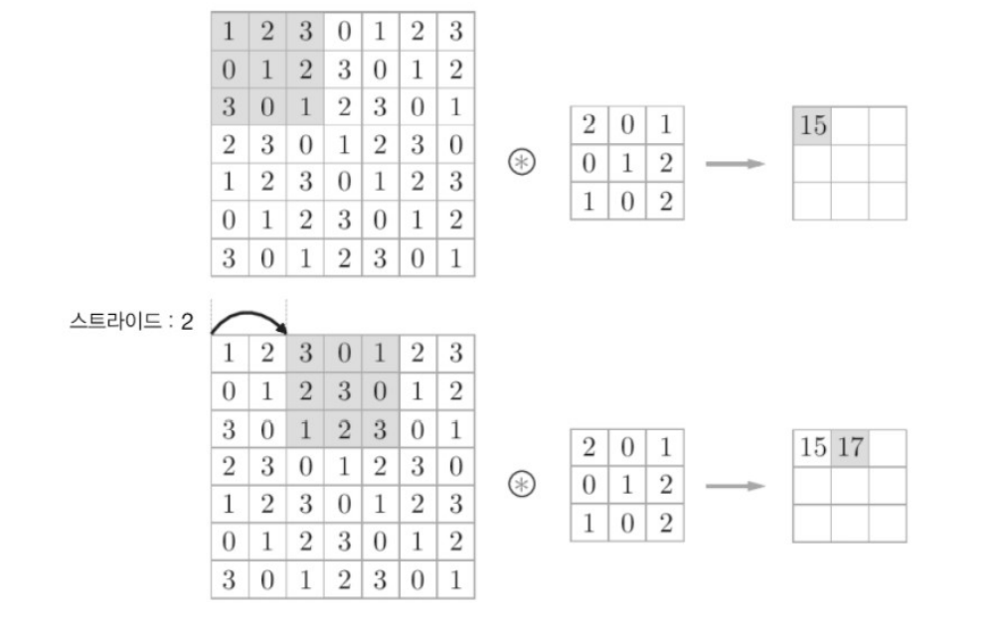

- Pooling 계층

  - 풀링은 2차원 데이터의 세로 및 가로 방향의 공간을 줄이는 연산

  - 풀링에는 최대 풀링(Max Pooling), 평균 풀링(Average Pooling)

  - 최대 풀링은 대상 영역에서 최댓값을 취하는 연산이고, 평균 풀링은 대상 영역의 평균을 계산한다. 이미지 인식 분야에서는 주로 최대 풀링을 사용한다.

  - 대푯값을 추출해내는 과정이다.

    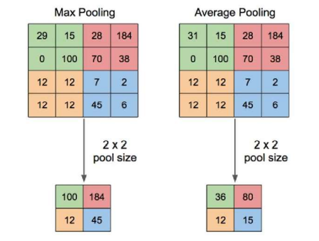

- 컬러 이미지의 2D conv 연산

  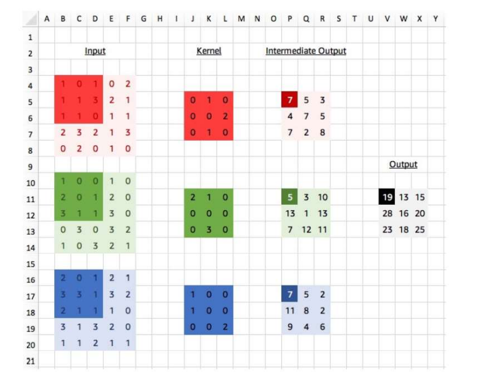

- 3D conv

  - 3D filter가 3-direction으로 이동하면서 연산된다.

    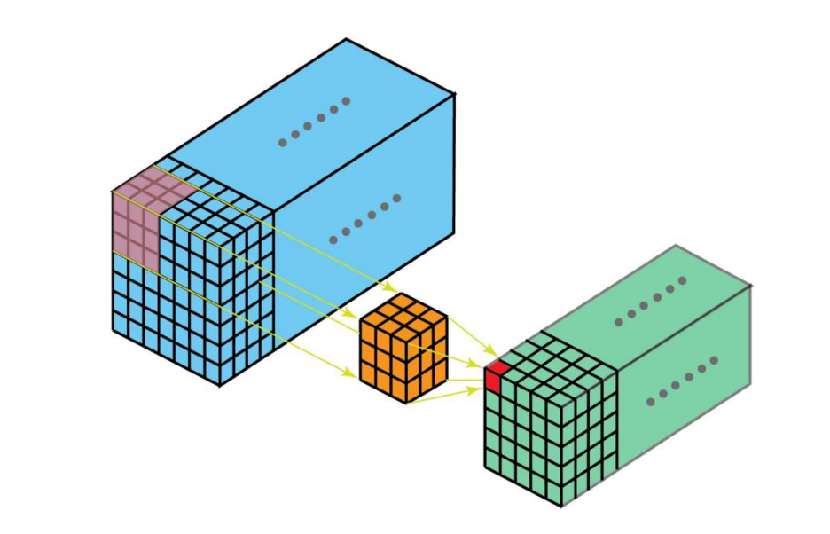

- CNN model 종류

  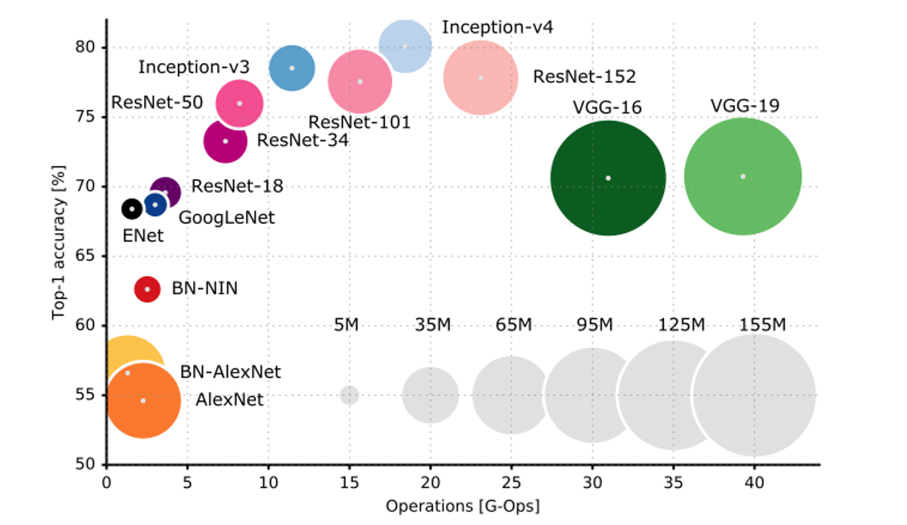

  - VGG16

    - 가장 대표적이고 보편적인 model

      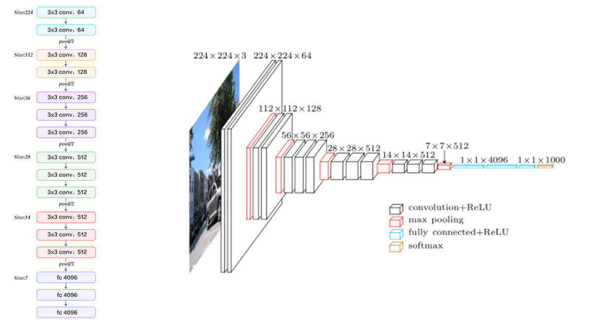

      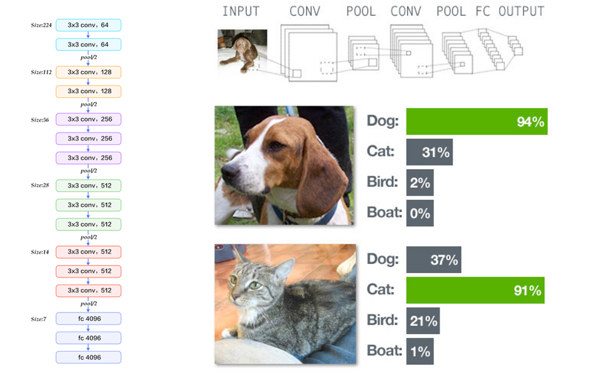

- CNN modeling 과정

  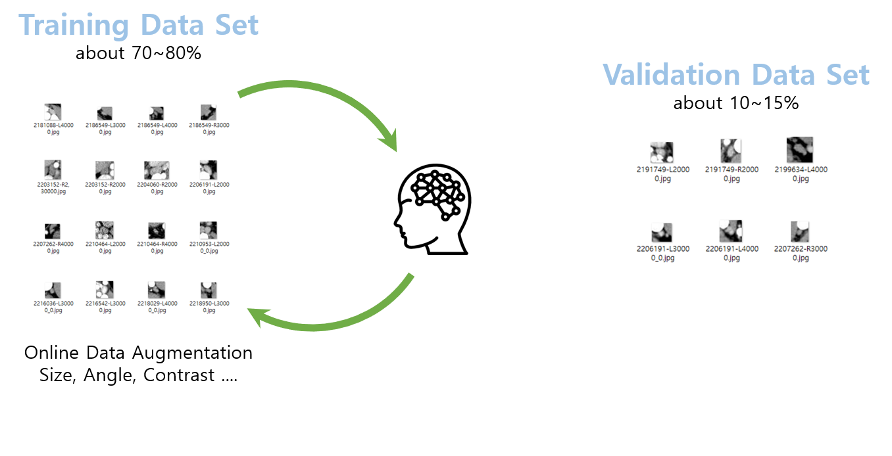

  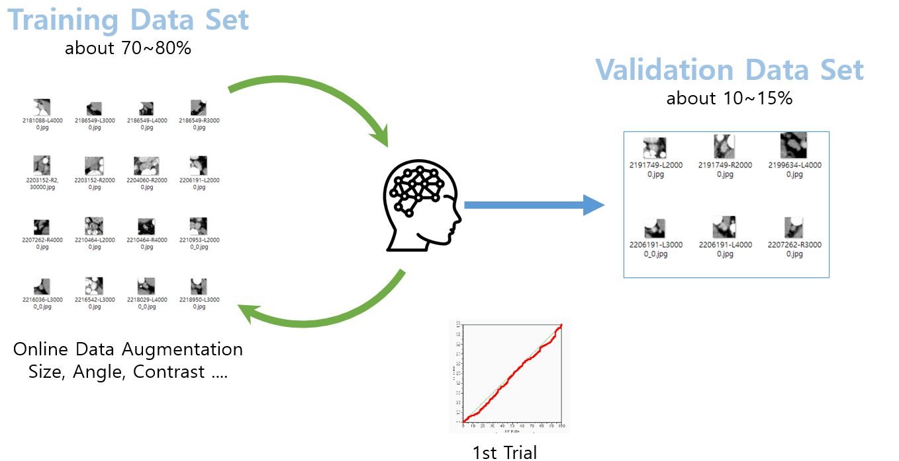

  

  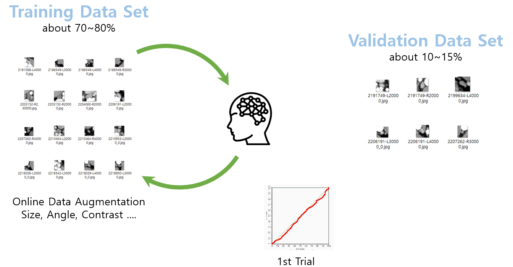

  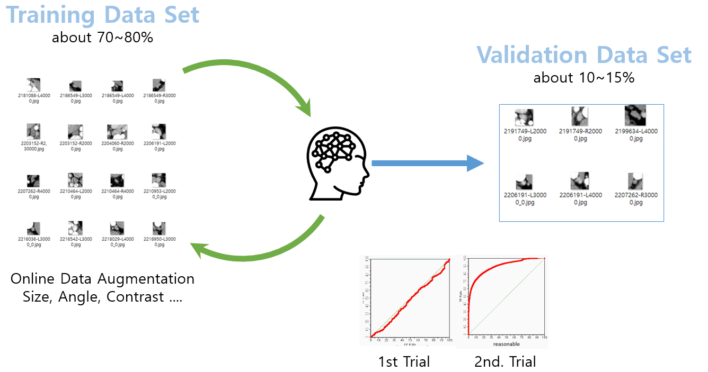

  

  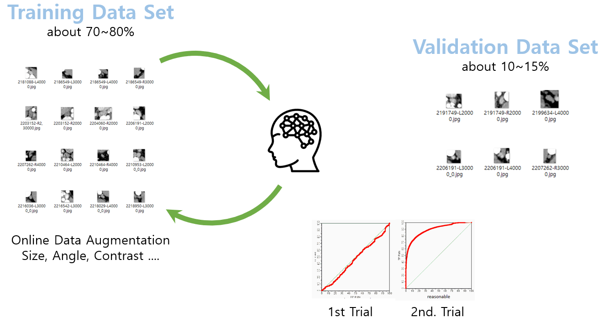

  

  

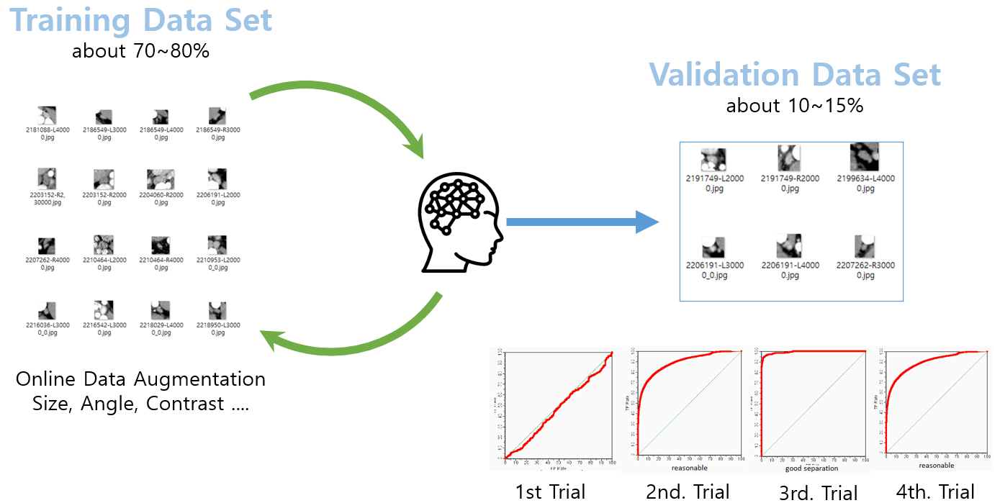

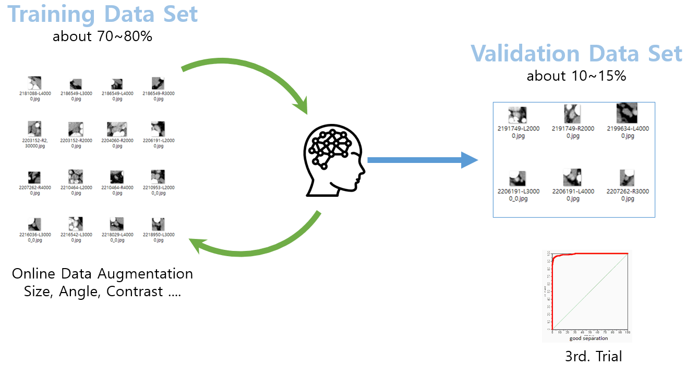

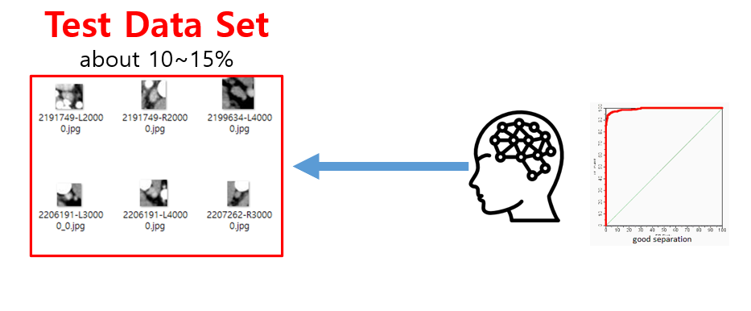
