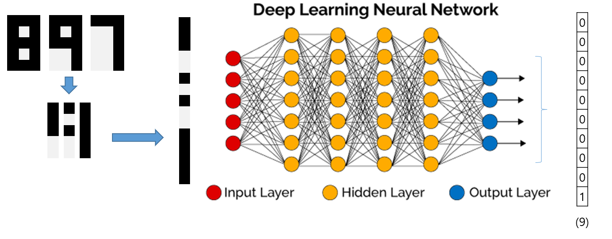

# 지도 학습(Supervised Learning)

### DNN(Deep Neural Network)

- 가장 기본적인 layer 구조

  

  ```python
  model = models.Sequential()
  model.add(tf.keras.layers.Dense(32, input_shape=(784, )))
  model.add(tf.keras.layers.Dense(10))
  model.add(tf.keras.layers.Dense(20))
  model.summary()
  ```

  - 모델을 만들어 input layer의 shape을 784로 주고 결과를 32의 크기로 나오게 함
  - hidden layer에서는 32의 크기로 받고 10의 크기로 나옴
  - output layer는 10의 크기로 들어가서 20크기의 vector로 나옴
