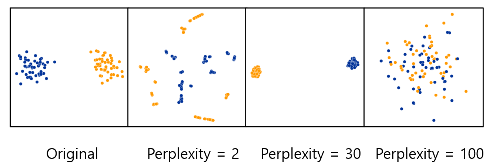

## 비지도 학습(Unsupervised Learning)

### 차원축소

- 도입

  - 변수의 수가 많아 차원이 높은경우 발생하는 문제들

    - 시각화가 어렵다.
    - 신경망 또는 알고리즘의 연산시 계산이 복잡해 진다.

  - 해결방법

    - 꼭 필요한 변수들만 추출한다.

    - 기존의 변수들을 이용해 새로운 변수를 만들어 낸다.

      

- 차원축소의 방법

  - Feature Selection
    - 기존의 변수들 중 상관관계가 존재하는 변수를 추출한다.
    - P(original) > P(new)
    - x(1), x(2),x(3), .... ,x(n), -> x(1), x(2), .... , x(m) 단, m < n
      - 장점: 기존의 특성이 가진 성질을 유지하면서 데이터를 줄일 수 있다.
      - 단점: Feature를 압축하지 않고 줄여준다.
  - Feature Extraction
    - 기존의 변수들을 변환해 새로운 변수를 추출한다.
    - P(original) > P(new)
    - x(1), x(2),x(3), .... ,x(n), -> y(1), y(2), .... , y(m) 단, m < n
      - 장점: 각각의 변수가 내재한 정보가 많아 진다.
      - 단점: 생성된 특성은 사람이 이해할 수 없는 데이터이다.

- PCA(Principle Components Analysis)

  - PCA는 데이터의 분산(variance)을 최대한 보존하면서 서로 직교하는 새 기저(축)를 차자아, 고차원 공간의 표본들을 선형 연관성이 없는 저차원 공간으로 변환하는 기법

    

    

  - 작동 방법

    - 2개의 Dimension, 그리고 10개의 샘플의 예

      

    - 분산을 제일 크게 하는 line을 찾고, 직교하는 line을 찾음

      

      - 찾은 Vector로 데이터를 projection (투영)

        

      - Single Vector or <b>'eigenvector'</b>

      - Loadings : Gene1 = 0.82, Gene2 = 0.57

      - 높은 variance (loadings)  ==> 높은 설명력

  - 축에 따른 Variance가 클 수록, 설명력 ↑

    

  - 단점

    - Linear scaling이기 때문에, 2개의 차원에 최선의 projection이 불가능
    - Non-linear scaling이 필요함 ==> tSNE(T-Distributed Stochastic Neighbour Embedding)

  - Perplexity에 따른 Distance scaling

    - Perplexity = 이웃의 수

    - 거리는 Perplexity에 따라 다르게 구해짐

      

    - Perplexity Robustness

      

- tSNE

  - 공간 내의 모든 점을 무작위로 분산

  - 시뮬레이션 시작

    - 목표는 점들간의 거리가 거리 행렬과 일치하도록 하는 것
    - 얼마나 잘 일치하는지에 따라 셔플 포인트
    - 고정된 반복 횟수 후에 중지하거나 거리가 수렴한 후 정지

    

    - X와 Y는 아무 의미가 없음 (PCA와 달리)
    - 거리는 아무 의미가 없음 (PCA와 달리)
    - 근접성은 매우 유익
    - 원거리 근접은 그다지 의미 없음
    - 거리를 통해 의미를 부여할 수 없음
    - 데이터를 추가할 수 없음

  - tSNE Practical Examples

    - Perplexity 셋팅에 따라 달라지는 문제

      

    - 각 클러스터의 size 또한 의미 없음

      

- UMAP(Uniform Manifold Approximation and Projection for Dimensioin Reduction)

  - 장점

    - 빠르다.
    - 전역 구조에 대해 의미를 더 많이 보존함.
    - tSNE처럼 PCA 전처리 등이 필요하지 않음
    - 프로젝션에 새 데이터를 추가할 수 있음

  - Nearest Neighbours: global vs local 정보에 영향을 줌

  - Minimum distance: 국소 영역의 시각화에 영향을 줌

    

  - 항상 UMAP이 좋은 것은 아니지만, 대체로 좋음

    
