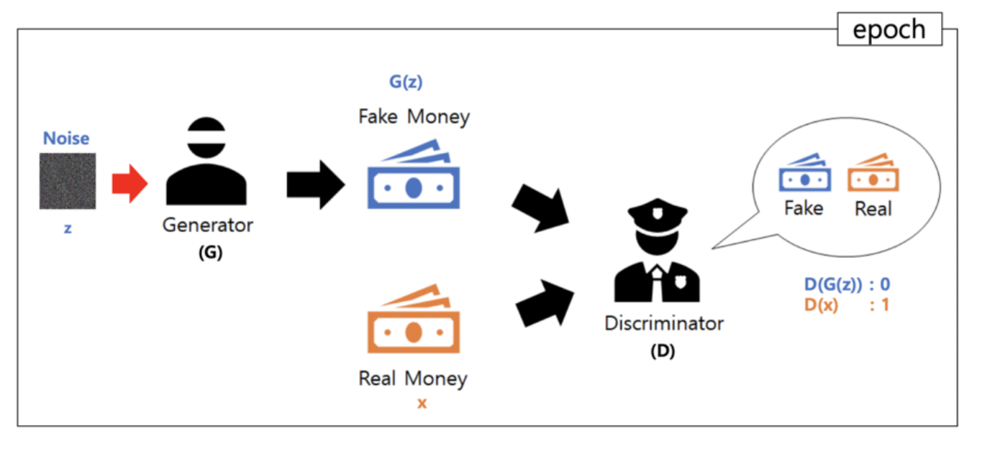
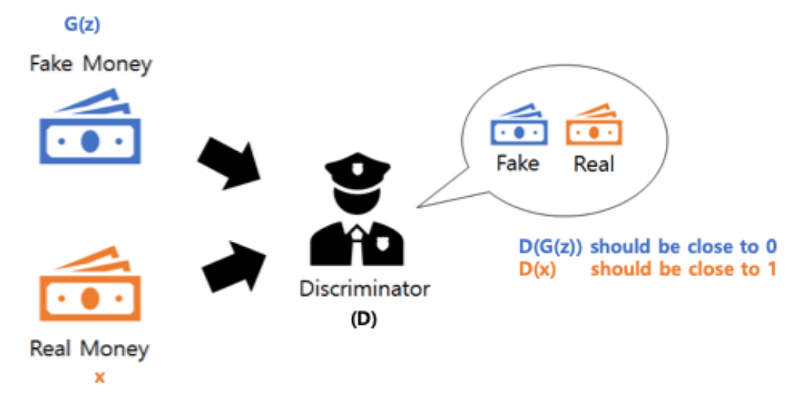
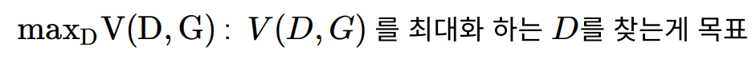
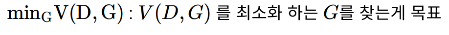
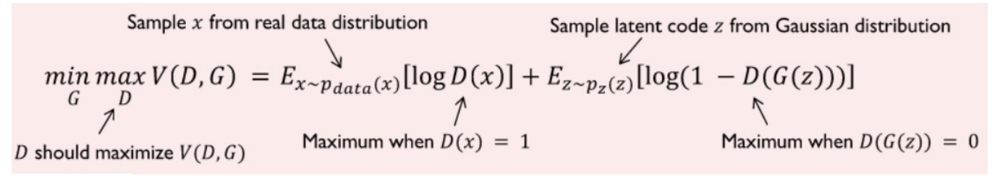
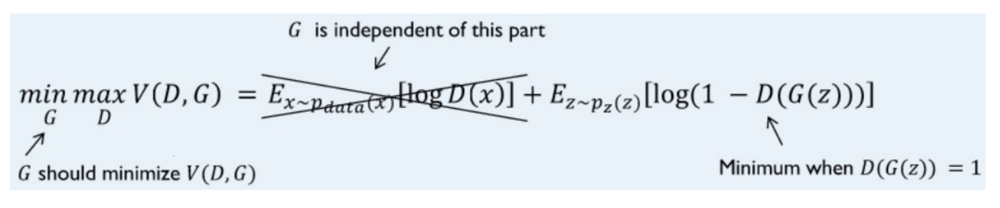
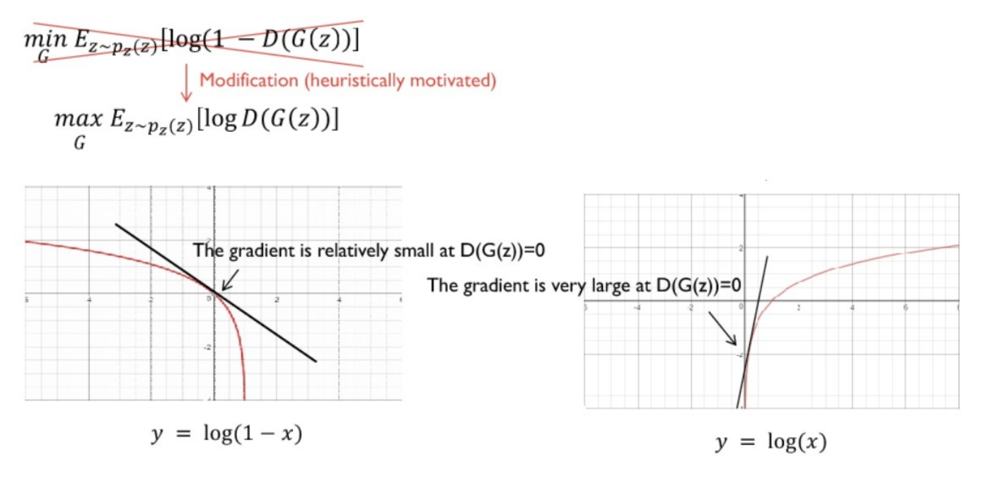
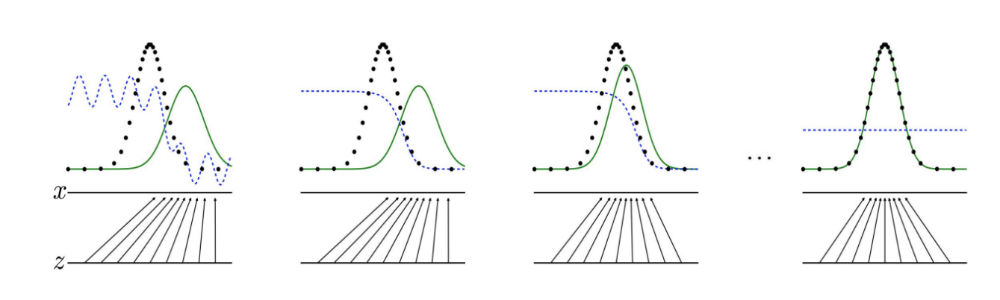

## 비지도 학습(Unsupervised Learning)

### GAN(Generative Adversarial Networks)

- Generative : 생성하다

- Adversarial : 적대적 방식으로

- Overview

  

  1. Latent Space에서 z(Noise Data)입력
  2. z를 이용해 G(z) (위조 지폐) 생성
  3. Discriminator 가 D(G(z))와 D(x) 수행하여 진짜인지 가짜인지 판별
     - x : 진짜 지폐
     - 진짜 : 1 출력
     - 가짜 : 0 출력

- <b>GAN</b>  vs  <b>VAE</b>

  

- 단계1. Discriminator Model

  

  - Discriminator가 진짜와 가짜를 구분할 수 있도록 학습한다.
  - sigmoid function을 이용해 학습시킨다.

- 단계2. Generator Model

  

  - Generator는 D(G(z))가 1이 되도록 학습한다.

- Loss Function

  - <b>Discriminator</b>  vs <b>Generator</b>

    

    

    

    1. <b>Discriminator</b>

       

       - Object Function을 최대화 하는 D를 찾기 위해서는 2가지가 수행되면 된다.
         - D(x) = 1 : Real Data를 Real Data라고 판별
         - D(G(z)) = 0 : Fake Data를 Fake Data라고 판별

    2. <b>Generator</b>

       

       - logD(x) : G에 관련된 함수가 아니므로 상수 (학습의 대상이 아니다)

       - log(1 - D(G(z))) : D(G(z)) = 1 일때 log0 이므로 값이 최소화 된다.

         - 좀 더 학습이 잘되는 형태인 max(g)[log(D(G(z)))] 로 변경하여 문제를 해결한다.
         - Generator의 학습을 0에서 시작하는 이유는 학습 초반 Discriminator의 성능이 우세하여 초기 D(G(z))의 값은 0에 가깝기 때문이다.

         

- 학습에 따른 분포 근사

  

  - Blue : Discriminator distribution
  - Green : Generative distribution
  - Black : Real Data distribution
  - 단계를 거듭할수록 Discriminator distribution의 값이 0.5가 되는 것을 확인할 수 있다.
    - 진짜와 가짜를 제대로 판별 못 하는중

- GAN 예

  
