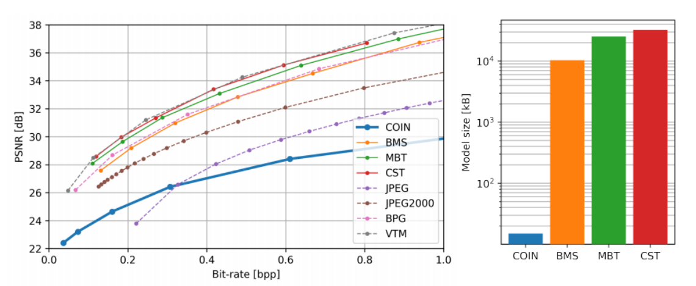
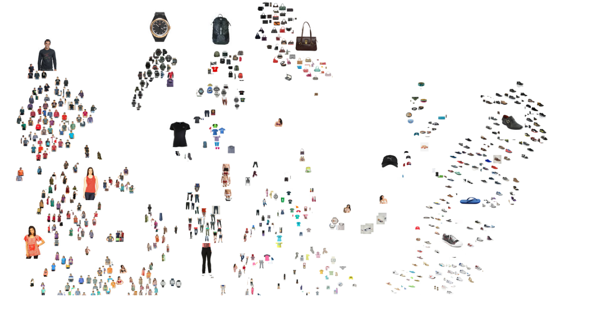
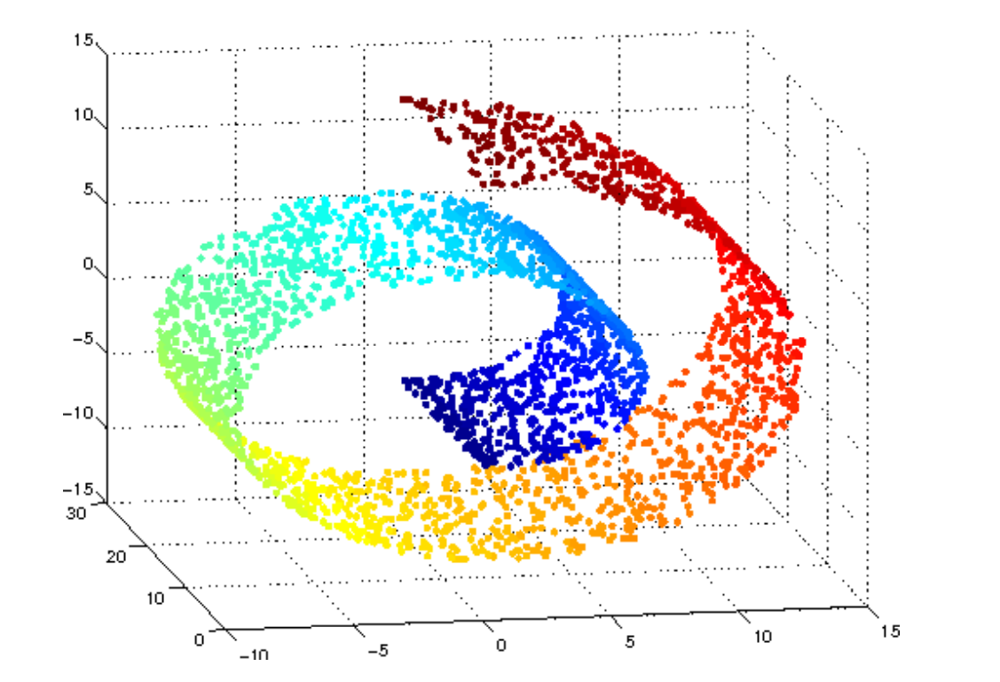
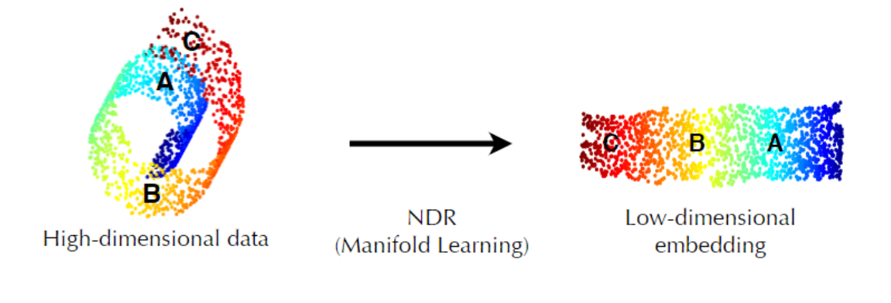
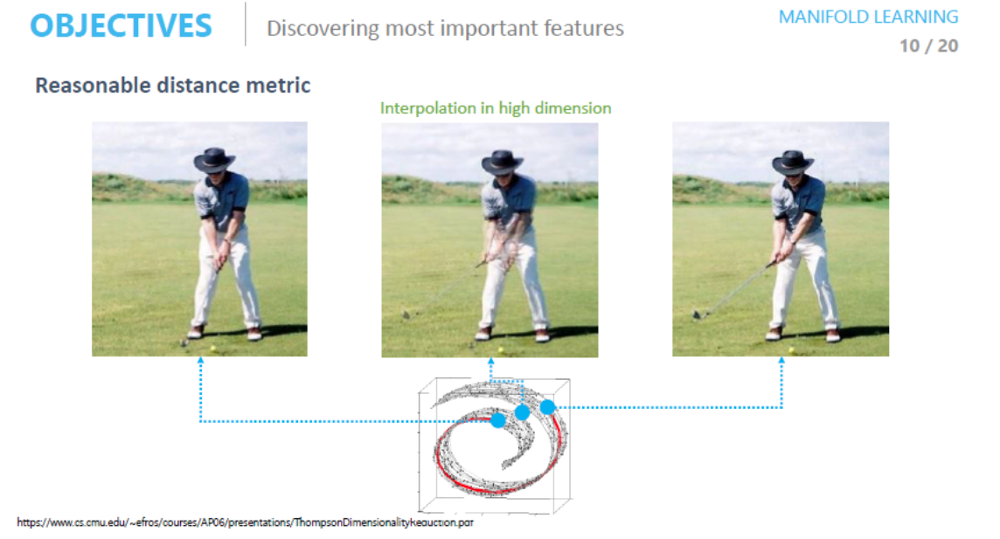
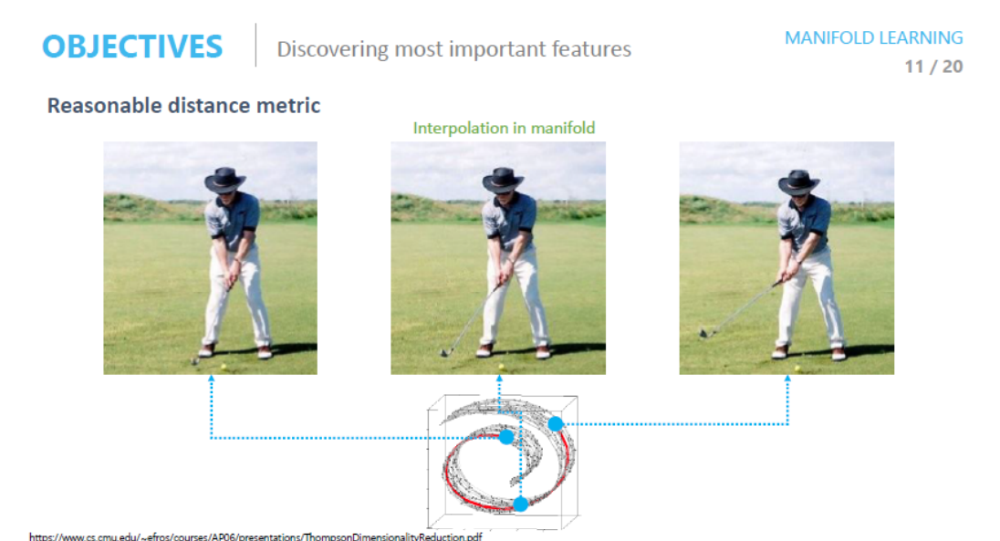

## 비지도 학습(Unsupervised Learning)

### Manifold Learning

- 데이터의 차원을 축소하기 위해 실행한다.

- 1000 차원 -> 2차원

- 256x256x3 -> ?

- 전체 sample을 어우루는 sub space를 찾아내는 방법을 manifold 라고 한다

- 10만 차원 -> 3차원으로 줄이는 방법은?

  - 조건: 원래 데이터의 분포를 최대한 유지하고 싶다.
  - 목적
    1. Data compression
    2. Data Visualization
    3. Curse of Dimensionality
    4. Discovering most important features

- Data compression

  

  - 이미지 압출을 활용한 Autoencoder -> 기존의 JPEG보다 성능이 좋다.

  

- Data Visualization

  - Data에 대한 직관을 얻기 위해

  - Model 학습 후 차원 축소의 결과를 직관적으로 보여주기 위해

    

- 차원의 저주(Curse of Dimensionality)

  - 차원이 증가할수록 데이터의 분포 분석 또는 모델 추정에 필요한 샘플 데이터의 개수가 기하급수적으로 증가한다.
  - 학습에 필요한 차원이 증가할수록 많은 샘플이 필요해 진다.

- Manifole Hypothesis

  - 고차원 데이터의 밀도는 낮지만, 이들의 집합을 포함하는 저차원의 Manifolds가 있다.

  - 저차원의 Manifold를 벗어나는 순간 밀도는 낮아진다.

    

    

  - 결국 feature를 잘 어우르는 Manifold를 잘 찾아 낸다면 각각의 특징을 확실하게 표현할 수 있다.

    

  - 이러한 요소들을 AutoEncoder가 자동으로 찾아준다

  - 이들을 찾을 수 있는 이유는 비지도 학습을 통해서 학습되기 때문이다.

  - ManiFold 위에 있는 데이터를 호출하는지 아니면 위에 있지 않은 데이터를 호출하느냐에 따라서 데이터가 표현되는 방법은 달라진다.

    - MainFold위에 있지 않은 데이터는 우리가 원하는 Data가 아니다.

      

    - ManiFold위에 있는 데이터는 우리가 원하는 Data이다.

      
