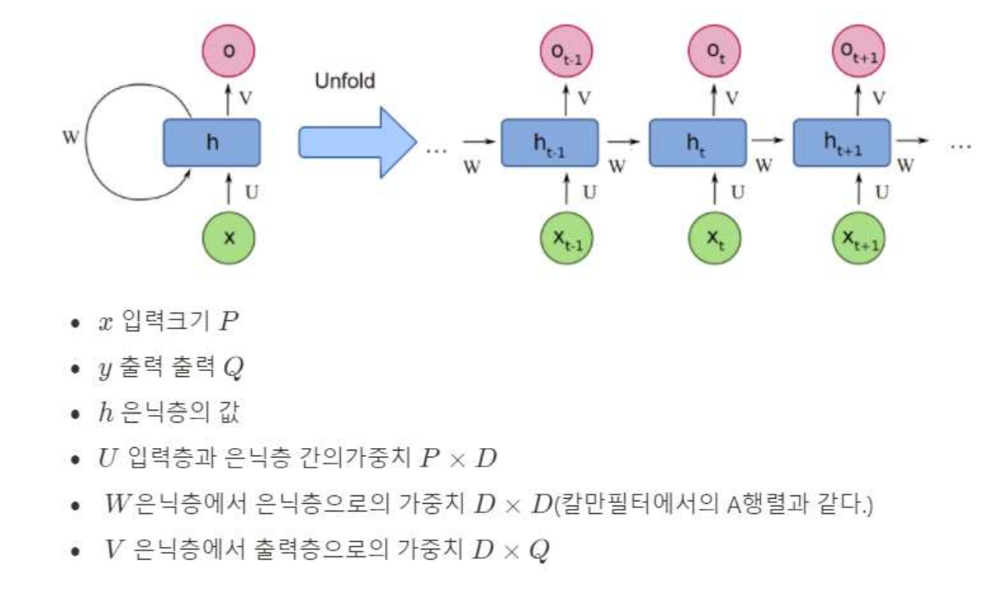
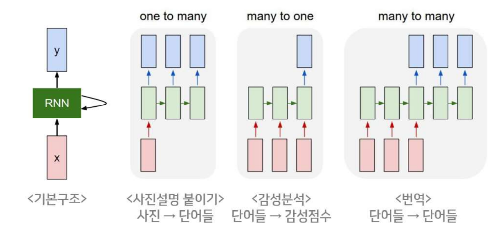
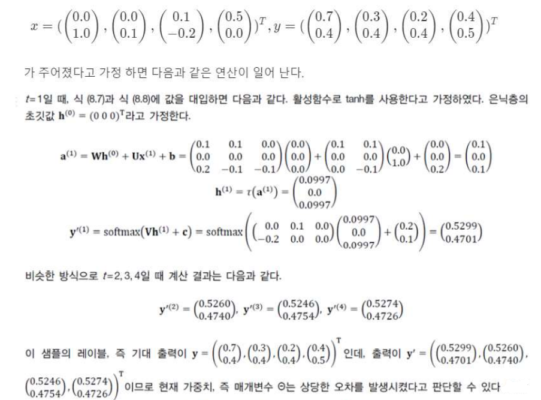
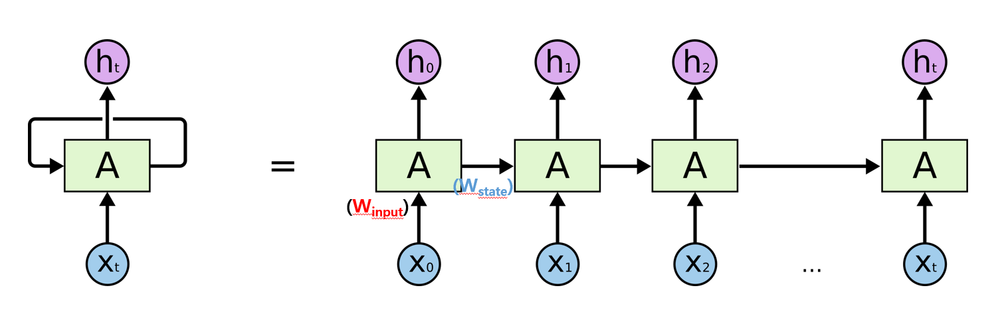
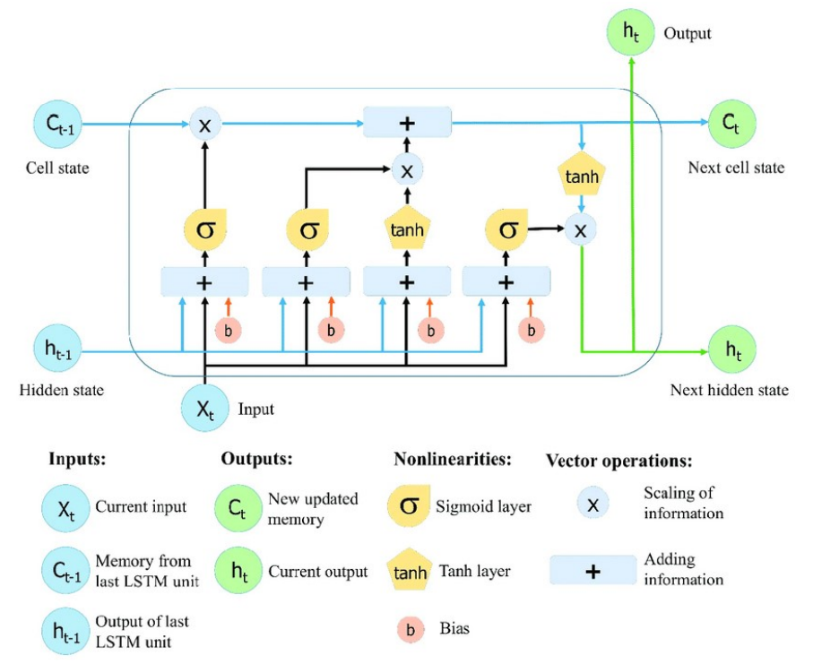
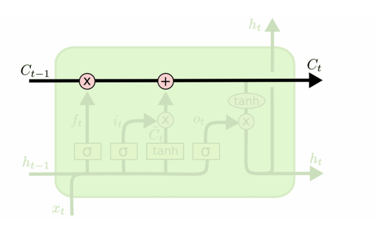
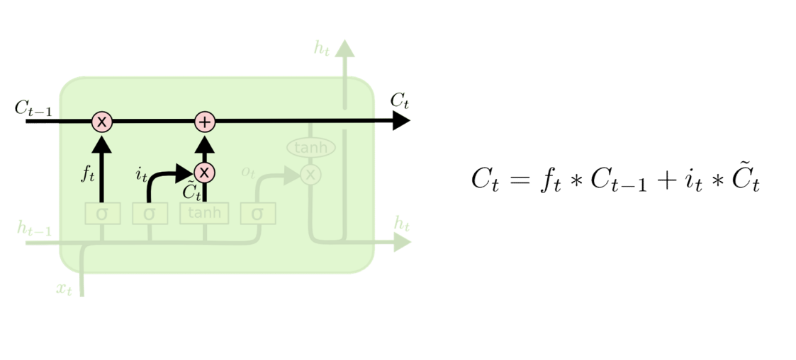
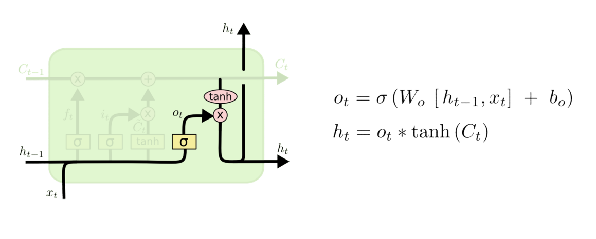
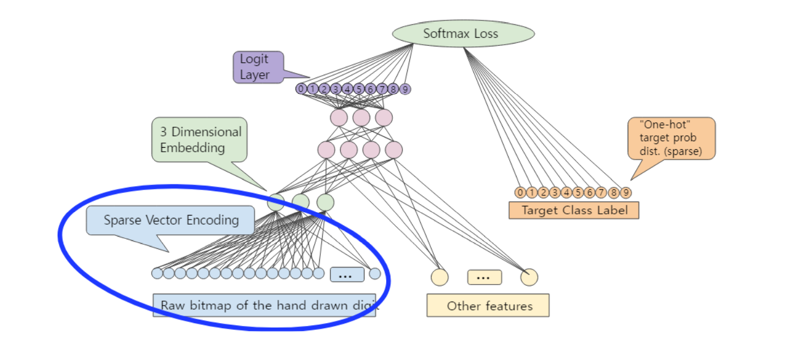

## 지도 학습(Supervised Learning)

### RNN(Recurrent Neural Network)

- Sequence Data의 표현법

  

- 일반화

  

- Sequence Data의 특징

  - 순서가 중요하다.
  - 샘플마다 길이가 다르다.
    - 순환 신경망은 은닉층에 순환 에지를 부여하여 가변 길이 수용
    - 길이가 τ인 데이터를 처리 하기 위해서는 은닉층이 τ번 나타나야 한다.
    - τ는 가변적이다.
  - 이전 데이터의 의존성
    - 이전에 나타난 결과를 저장하여 이후에 나타나는 데이터에 적용한다.
    - 주어 -> 동사
    - 23일의 주가 -> 24일의 주가

- 순환 신경망의 구조

  - 기능

    - 위에서 나타난 sequence data의 해석에 필요한 기능들이 필요하다.

    - 입력층, 은닉층, 출력층을 가진다.

    - 순환 에지(recurrent edge)

      

      

      

- RNN의 특징 가중치 공유

  - 매개변수는 서로 다른값이 아닌 같은 값을 공유한다. 즉, 동일한 네트워크가 시퀀스의 각 요소에 적용되는 구조
    - 학습시 추정할 매개변수의 수가 엄청 줄어든다.

- RNN의 종류

  

  

- RNN의 구조 예

  

  - 가중치 U의 크기는 입력 4개, 출력 6개 이므로 크기 6x4인 행렬
  
  - 가중치 V의 크기는 입력 6개, 출력 2개 이므로 크기 2x6인 행렬
  
  - 은닉층에서 은닉층으로의 가중치 W의 크기는 입력 6개, 출력 6개 이므로 크기가 6x6인 행렬
  
    
  
    

- RNN의 문제점

  

  - 만약 W(state) 값이 0.1라면? -> 4회 recurrent: 0.1^4 = 0.001(Gradient Vanishing) 금방 0에 수렴 => Recurrent state 값이 0에 수렴하여 전혀 네트워크에 영향을 못 줌
  - (Gradient Exploding: 무한대 NaN: Not a number)

- LSTM(Long-Short Term Memory)

  

  - Notation

    

  - Cell State

    

  - Forget & Input gate Layer

    

  - Cell state Update

    

  - Output gate Layer

    

- GRU

  

- RNN 활용

  - Word Embedding

    - Word -> Embedding -> Vector
    - 다양한 임베딩 방법들이 존재
    - 단어 수준 임베딩: Word2Vec, FastText
      - 단어 자체를 구분
    - 문장 수준 임베딩: Elmo, Bert, GPT
      - 문장의 앞뒤를 보고 파악할 수 있다. (문법을 이해함)
  
  - One-Hot Encoding
  
    - 임베딩을 위한 가장 쉬운 방법
  
      
  
    - 문제점: 원핫 인코딩은 행렬의 대부분이 "0"인 희소행렬(Sparse Matrix)이다.
  
      - 메모리 낭비 심함
      - 단어사이의 유사도를 찾기 어렵다.
  
    - 해결책: 단어 임베딩을 통해 Dense Matrix로 변경한다.
  
      
  
  - Keras Embedding
  
    
  
    - 임베딩 레이어를 통해 단어를 통과 시키면 밀집된 차원으로 변경 된다.
  
  - Bidirectional RNN
  
    
  
    - 양방향 RNN은 Sequential 데이터를 순서대로 처리한 다음 역순으로 처리하여 더 좋은 성능을 나타낸다.
      - 빨리 ____ 가고 싶다.
      - "빨리"를 통해 "집에"를 예측할 순 없지만, "가고 싶다."를 통해 "집에"를 예측 할 순 있다.
  
  - Stacked RNN
  
    
  
    - RNN 또는 Bidirection RNN을 여러 층을 쌓아서 Model 생성 가능
    - 이때, return_sequences=True를 이용해 출력의 단위를 맞춰줄 수 있다.
  
