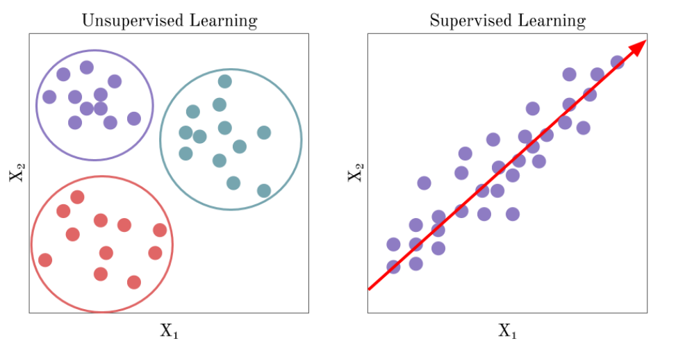
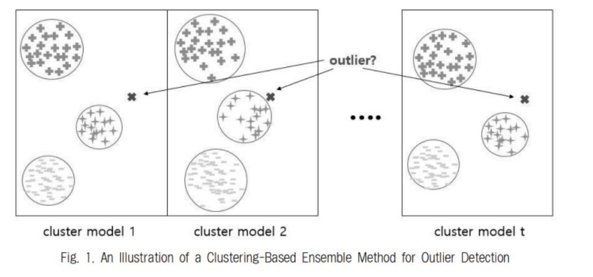

## 비지도 학습(Unsupervised Learning)

### 지도 학습과 비지도 학습 비교

- <u><b>지도 학습</b></u>

  - AI 에이전트가 레이블에 엑세스 할 수 있다.
  - 이를 사용해 일부 작업에서 성능을 향상 시킬 수 있다.

- <u><b>비지도 학습</b></u>

  - 레이블을 사용할 수 없다.

  - AI 에이전트의 작업이 명확히 정의되지 않으므로 모델의 성능을 명확히 측정할 수 없다. (성능을 측정할 기준이 없으므로)

  - 데이터를 분석하고 중요한 feature를 찾아낼 수 있다.

    

- 장/단점

  - <u><b>지도 학습</b></u>
    - 장점
      - 레이블이 충분히 확보되고 <b>명확하게 정의된 작업</b>에서 성능을 최적화 하는데 탁월하다.
      - 충분히 큰 데이터셋 + 적절한 Model + 컴퓨팅 파워 => 우수한 Model
      - Cost Function을 이용해 성능을 측정할 수 있다.
    - 단점
      - 레이블을 지정하는데 비용이 많이 든다. (수작업)
      - 사전에 학습한 레이블이 지정된 항목 이상의 지식을 밝혀내거나 일반화 하는데 한계가 있다.
      - 현실세계의 데이터는 대부분 레이블이 없다.
  - <u><b>비지도 학습</b></u>
    - 장점
      - 패턴을 알 수 없거나 끊임없이 변화하는 데이터, 레이블 데이터가 충분히 확보되지 않는 문제 영역에서는 비지도 학습이 장점을 보여준다.
      - 레이블이 아닌 데이터 자체의 내재된 구조를 학습하여 작동한다.
      - 이전에 다루기 어려웠던 문제를 해결하는데 도움이 되고 모델 훈련에 사용되는 과정 데이터와 미래에 발생할 데이터 모두에서 숨겨진 패턴을 찾는데 유리하다.
      - 개방적인 문제를 해결하거나 지식을 일반화 하는데 적합하다.
    - 단점
      - 명확하고 좁게 정의된 문제를 해결하는데는 지도 학습보다 덜 능숙하다.

### 비지도 학습을 사용한 문제점 해결

- <b>과대적합</b>

  - 머신러닝 알고리즘이 훈련 데이터에 지나치게 접한 함수를 학습하면 Valid Set, Test Set과 같은 새로운 Data에서 제대로 수행되지 않을 수 있다.
  - 비지도 학습을 <b>정규화기(regularizer)</b>로 사용하면 문제를 해결할 수 있다.
  - 비지도 기반 사전 학습은 데이터를 지도학습 알고리즘에 직접 대한하는 대신  비지도 사전 훈련을 통해 생성된 원본 입력 데이터의 새로운 표현을 제공할 수 있다.
    - 새로운 구조는 기존 데이터의 노이즈를 제거하고, 내재된 본질적인 구조를 포착할 수 있도록 도와준다

- <b>차원의 저주</b>

  - 차원이 증가할수록 데이터의 분포 분석 또는 모델추정에 필요한 샘플 데이터의 개수가 기하급수적으로 증가하게 되는데 이러한 어려움을 표현한 용어가 <u><b>차원의 저주</b></u>이다.
  - 결국 Feature의 수가 많을때 최적해를 구하는 함수 근사를 구하는 시간이 늘어나게 된다.
  - 비지도 학습은 차원 감소를 통해 원래의 피저 집합에서 가장 핵심적인 피처를 찾고 -> 중요한 정보를 보존 -> 차원 수를 적용 가능한 개수로 줄인 후 -> 지도 학습 알고리즘을 적용해 효율적으로 최적의 함수 근사를 찾아낼 수 있다.

- <b>피처 엔지니어링</b>

  - 적절한 피처를 통해 학습시켜야 Model이 새로운 데이터에 대해 좋은 결정을 내릴 수 있다.
  - 올바른 유형의 피처를 창의적으로 설계
  - 비지도 학습 알고리즘을 통해 적절한 유형의 피처 표현을 자동으로 학습하게 하여 추출할 수 있다.

- <b>이상치 탐지</b>

  

  - 비지도 학습은 왜곡된 이상치를 탐지할 수 있다.
