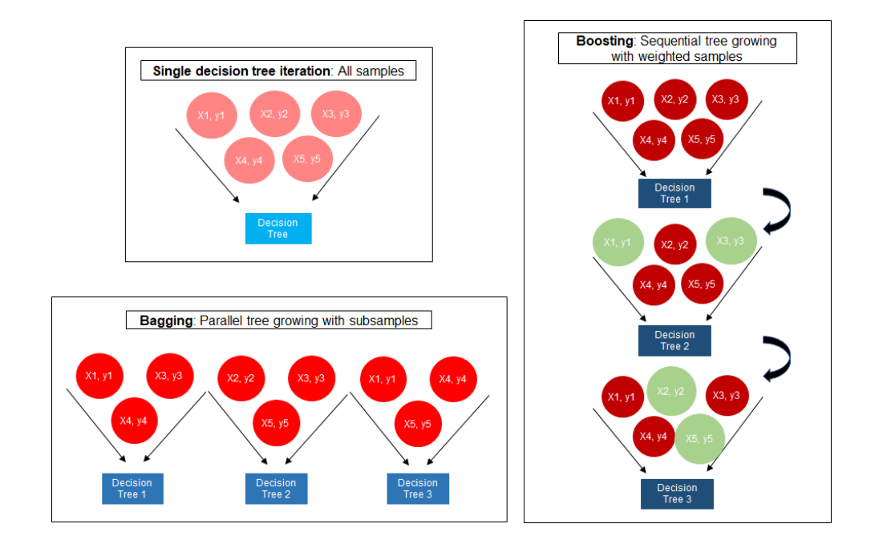
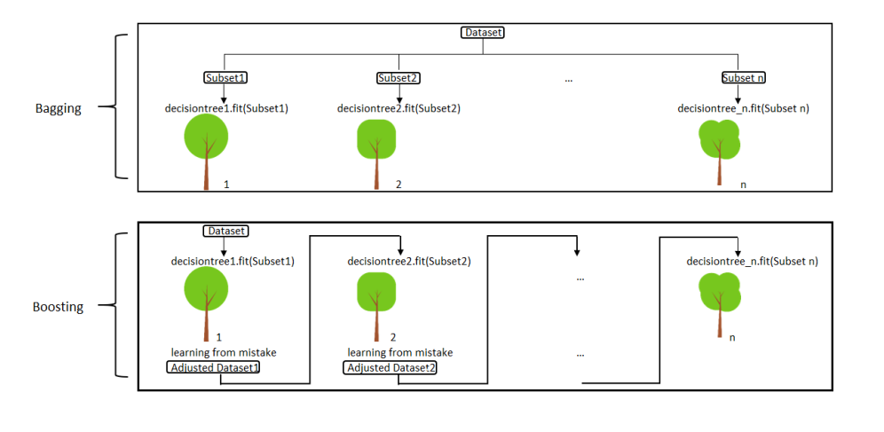
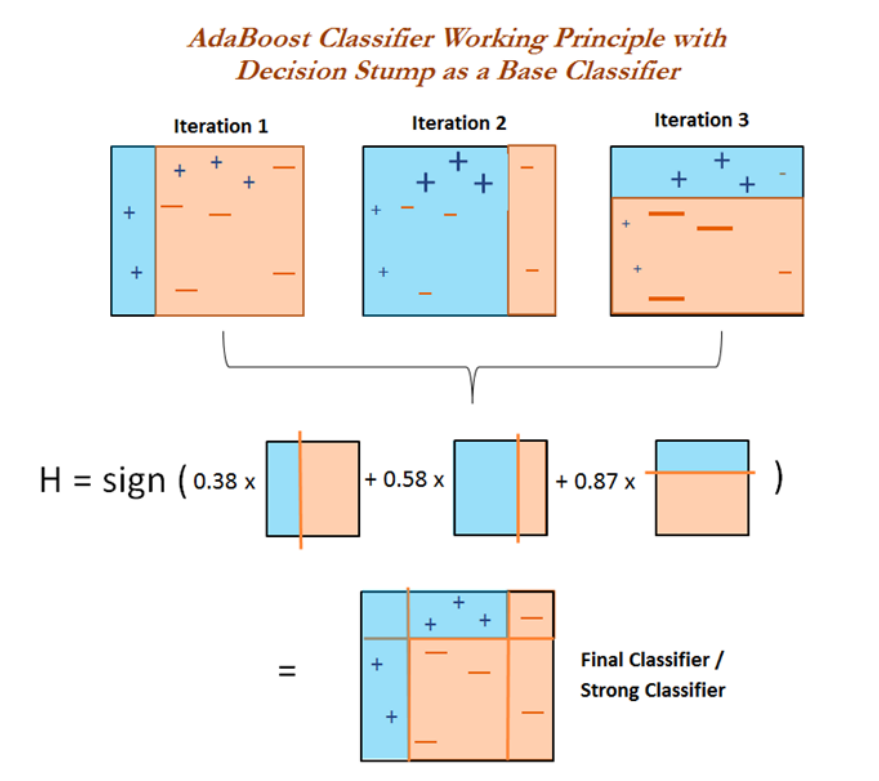
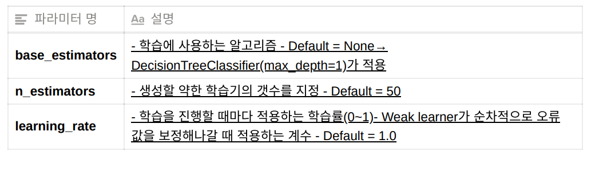

# Boosting

- 여거개의 Weak Learner를 학습/예측하며, 잘못 예측한 데이터에 가중치를 부여해 오류를 개선해 나가는 방법

- 순차적으로 값을 예측하여 결과를 도출한다.

- 가중치 Update 하는 방법을 이용해 앞의 Model을 보완해 나간다

  - Update한 가중치를 이용해 Sample을 다시 추출한다.

    

    

#### 종류

- Adaboost
- GradBoostMachine(GBM) --> XGBoost, LightGBM 으로 발전 (정형데이터 분류, 회귀모델에서 GBM 계열이 각광받는다.)

## AdaBoost

- 첫 번째 Weak Learner가 첫 번째 분류기준(D1)으로 +와 -를 분류

- 잘못 분류된 Sample Data에 대해 가중치를 부여(두 번째 그림에서 커진 + 표시)

- 두 번째 Weak Learner가 두 번째 분류기준(D2)으로 +와 -를 다시 분류

- 잘못 분류된 데이터에 대해 가중치를 부여 (세 번째 그림에서 커진 - 표시)

- 세 번째 Weak Learner가 세 번째 분류기준으로(D3) +와 -를 다시 분류해서 오류 데이터를 찾음

- 마지막으로 분류기들을 결합하여 최종 예측 수행

  