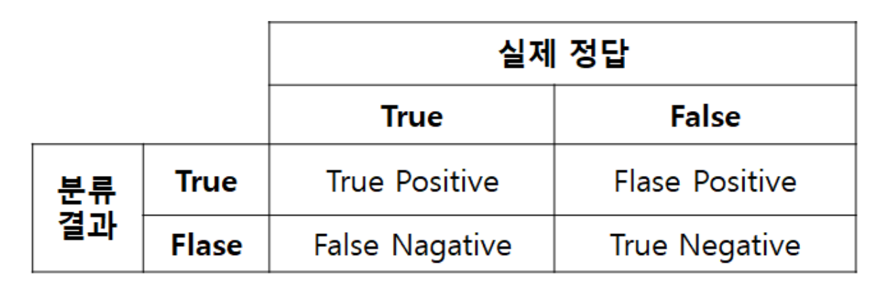
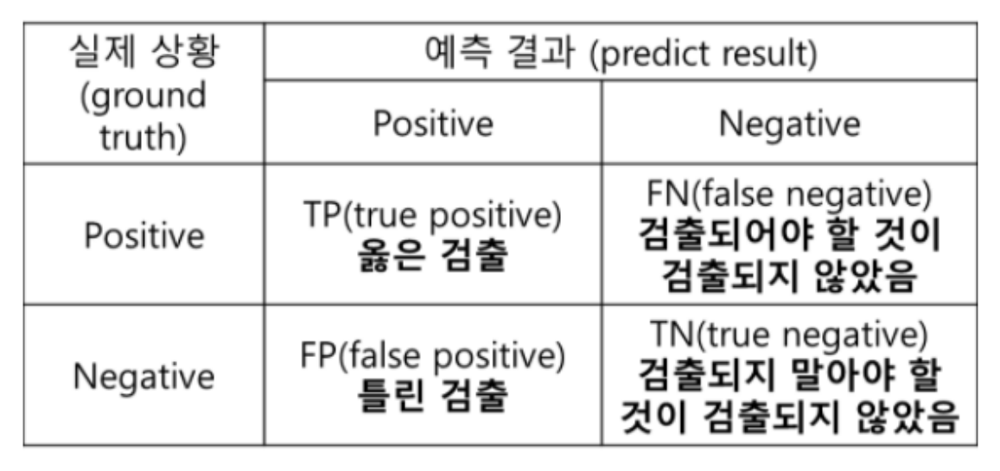
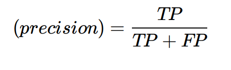
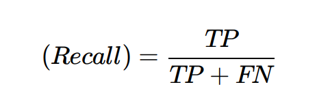
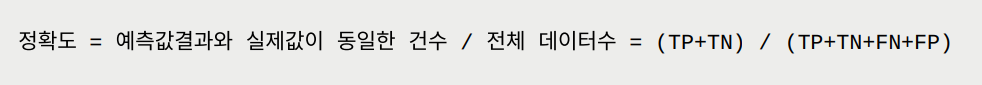
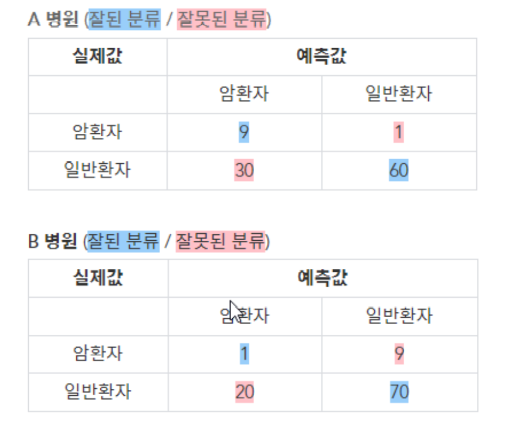
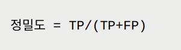
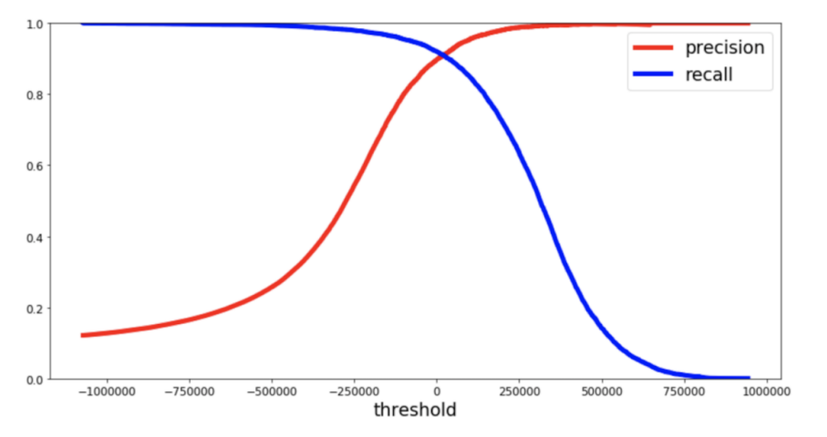
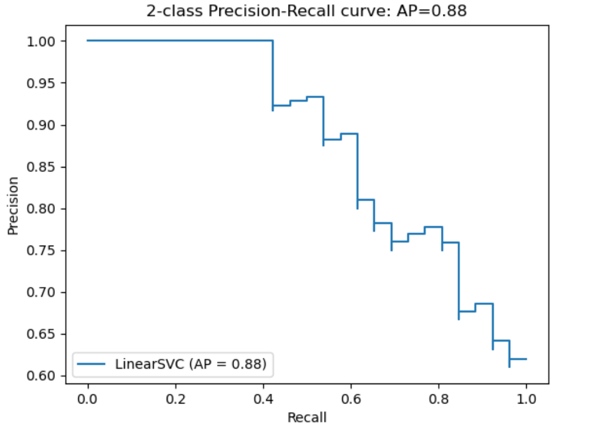
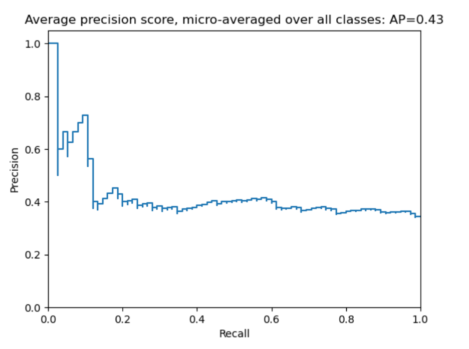

# Confusion Matrix

### Confusion Matrix(오차 행렬)

- <b>Precision(정밀도)</b>

  - 모델이 True라고 분류한 것 중에서 실제 True인 것의 비율

  - 맑다고 예측했는데 실제로 맑은날인 경우

  - 예측한 결과가 실제 결과와 얼마나 일치하는가

    

- <b>Recall(재현율)</b>

  - 실제 True인 것 중에서 모델이 True라고 예측한 것의 비율

  - 실제 맑은날 중에 모델이 맑다고 예측한 비율

    

  - Precision은 모델의 입장에서, 그리고 Recall은 실제 정답(data)의 입장에서 정답을 정답이라고 맞춘 경우

- <b>Accuracy(정확도)</b>

  - 모델이 입력된 데이터에 대해 얼마나 정확하게 예측하는지를 나타낸다.

    

  - 예)

    

    - A 병원의 정확도 = (9 + 60) / (9 + 60 + 1 + 30) = 0.69

    - B 병원의 정확도 = (1 + 70) / (1 + 70 + 9 + 20) = 0.71

      => <b>정확도는 B 병원이 높지만 암을 기준으로 하면 B가 더 안좋다.</b>

- <b>Precision(정밀도)</b>

  - 모델의 예측값이 얼마나 정확하게 예측됐는가를 나타내는 지표

  - "예"라고 예측했을때의 정답률

    

  - 예)

    - A 병원 암환자 정밀도 = 9 / (9 + 30) = 0.23

    - B 병원 암환자 정밀도 = 1 / (1 + 20) = 0.04

      => <b>정확도는 B 병원이 높지만 정밀도는 A 병원이 높다</b>

- <b>재현율  vs  정밀도</b>
  - 재현율과 정밀도는 사용하는 경우에 따라서 중요도가 다를 수 있다.
  - 재현율이 중요한 경우
    - 실제 Positive인 데이터를 Negative로 잘못 판단하면 안되는 경우
    - 병 진단 : 실제 양성인데 음성으로 판단하면 병을 더 키울 수 있다.
  - 정밀도가 더 중요한 경우
    - 실제 Negative인 데이터를 Positive로 잘못판단하면 안되는 경우
    - 스팸 메일 : 실제 스펨메일이 아닌데(Negative) 스펨메일(Positive)로 판단하는 경우 메일을 받지 못 할수 있다.

### Confidene Threshold

- Precision 곡선

  - Confidence Threshold 갑의 변화에 따라 정밀도-재현율은 변화한다.

    - Confidence Threshold 값이 낮을 수록 더 많은 예측 Bunding Box를 만들게 된다. (정밀도는 낮아지고 재현율은 높아짐)
    - Confidence Threshold 값이 높을 수록 신중하게 예측 Bunding Box 를 만들게 된다. (정밀도는 높아지고 재현율은 낮아짐)

  - Confidence Threshold 를 조정하면 정밀도 또는 재현율의 수치가 조정되고, 이는 서로 상보적이기 때문에 Trad-off가 이루어진다.

    

  - Recall 값이 변화에 따른 Precision 값을 나타낸 곡선을 정밀도 재현율 곡선이라 한다.

  - Precision 값의 평균을 AP 라고 하며, 면적값으로 계산 된다.

    

    