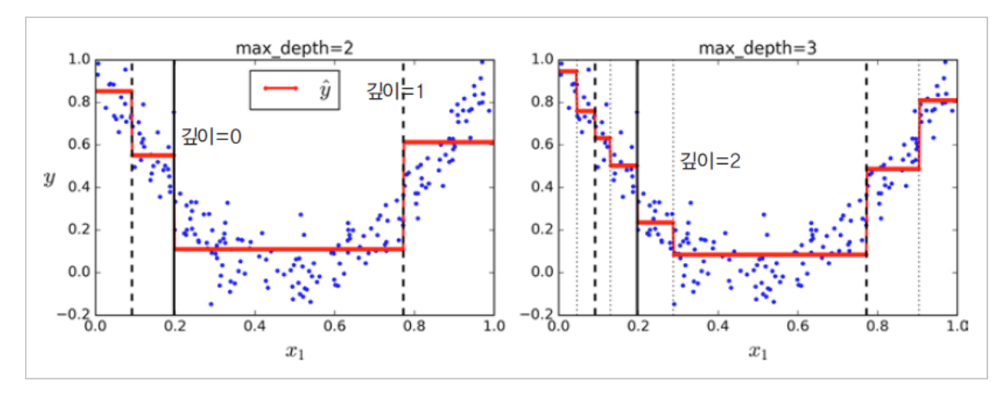
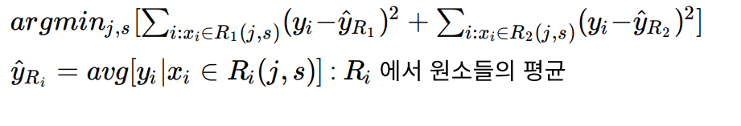

# Decision Tree

### Decision Tree 란?

- 분류, 회귀, 다중출력 작업이 가능한 머신러닝 알고리즘
- 데이터에 내제되어 있는 <b>패턴을 변수 조합으로 나타내는 예측/분류 모델을 나무의 형태</b>로 만드는 것
- 질문을 던져서 맞고 틀리는 것에 따라 <b>우리가 생각하고 있는 대상</b>을 좁혀나간다.

- 마지막 Node : Terminal Node

- 시작 Node : Root Node

- 예)

  

### 이진분할

- 이진분할 문제는 무언가를 균등하게 나누는게 목표이다.

- 새로운 모델  -->  분류 가능해야함

- 정해진 구역안에 새로운 데이터가 들어오면 어떻게 해야 할까?

  

- 5개의 부분집합으로 분류된다.

- 분할의 갯수 = 끝마디의 갯수

### Impurity

#### Cost Function

- 일반적인 모델에서의 Cost Function은 매우 간단하고 직관적

  

  - 차이를 나타내는 cost function은 분류모델에서 의미가 없다.

- <b>Impurity 추정</b>(분류모델에서의 <b>Cost Function</b>)
  - 분류모델에서의 cost function은 직관적이지는 않다.
  - 범주형 데이터이기 때문
    - 성공 or 실패
    - 사과, 배, 포도

#### purity

- 서로 다른 Target Data가 섞이지 않게 해야 한다.
- Decision Tree의 결과는 pure한 상황이어야 한다.
- 서로 다른 Target Data가 섞여 있다면 Impurity가 높다 라고 한다.

#### Goal

- Impurity를 작게  -->  최대한 pure한 상황
- Impurity Function을 이용해 측정할 수 있다.

## Impurity Function

- Entropy
- Gini Impurity
- Missclassification Error

#### Entropy

- p(k) : A영역에 속하는 record 중 K class에 속하는 record의 비율

  

#### Gini Impurity

- Impurity를 판단하는 기준은 Gini Impurity라고 한다.

  

#### Gini  vs  Entropy

- 기본적으로 지니 불순도가 사용되지만 criterion 매개변수를 "entropy"로 지정하여 엔트로피 불순도를 사용할 수 있음
- 엔트로피는 분자의 무질서함을 측정하는 열역학의 개념
  - 분자가 안정되고 질서 정연하면 엔트로피가 0에 가까움
  - 메시지의 평균 정보 양을 측정하는 새넌의 정보 이론: 모든 메시지가 동일할 때 엔트로피가 0
  - 머신러닝에서는 불순도의 측정 방법: 어떤 세트가 한 클래스의 샘플만 담고 있다면 엔트로피가 0
- 지니 불순도와 엔트로피 중 어떤 것을 사용해야 할까?
  - 실제로는 큰 차이가 없이 둘 다 비슷한 트리를 만듦
  - 지니 불순도가 조금 더 계산이 빠르기 때문에 기본값으로 좋음
  - 그러나 다른 트리가 만들어지는 경우 지니 불순도가 가장 빈도 높은 클래스를 한쪽 가지(branch)로 고립시키는 경향이 있는 반면 엔트로피는 조금 더 균형 잡힌 트리를 만듦

#### Information Gain

- IG = Information Gain
- IF = Information Function

### 트리가 어떻게 예측을 만들어내는지 살펴보기

- 새로 발견한 붓꽃의 품종을 분류하려 한다고 가정

- 노드의 sample 속성은 얼마나 많은 훈련 샘플이 적용되었는지 헤아린 것

- 노드의 gini 속성은 불순도(impurity)를 측정

  

- 꽃잎 길이 <= 2.45 : child node를 만들기 위한 규칙조건

  - Leaf(terminal node)에는 규칙 조건이 존재하지 않는다.
  - gini : Gini Impurity
    - 한 노드의 모든 샘플이 같은 클래스에 속해 있다면 이 노드를 순수(gini=0)하다고 표현. 예를 들어 깊이 1의 왼쪽 노드는 Iris-Setosa 훈련 샘플만 가지고 있으므로 순수 노드이고 gini 점수가 0.
  - sample : 현재 조건에 해당하는 data의 수
  - value : 각 class에 해당하는 data수
    - [0, 49, 5]  3개의 class로 분류되고 있으며 setosa 0개, versicolor 49개, virginixa 5개
  - class : value내에 가장 많은 data를 가진 결정값

## CART (Classification and Regression Trees)

- 사이킷런은 결정 트리를 훈련시키기 위해 (즉, 트리를 성장시키기 위해) CART 알고리즘을 사용

- CART 알고리즘은 지니계수로 불순도를 계산 한다.

  - ID3 : Entropy를 사요해 불순도를 계산

- CART 훈련 알고리즘

  - 먼저 훈련 세트를 하나의 특성 k의 임곗값 tk를 사용해 두 개의 서브셋으로 나눔(예를 들면 꽃잎의 길이 <= 2.45cm). 어떻게 k와 tk를 고를까? (크기에 따른 가중치가 적용된) 가장 순수한 서브셋으로 나눌 수 있는 (k, tk) 짝을 찾음. 이 알고리즘이 최소화해야 하는 비용함수는 다음과 같다.

    

- CART 알고리즘이 훈련 세트를 성공적으로 둘로 나누었다면 같은 방식으로 서브셋을 또 나누고 그 다음엔 서브셋을 나누고 이런 식으로 계속 반복.

- 이 과정은 (max_depth 매개변수로 정의된) 최대 깊이가 되면 중지하거나 불순도를 줄이는 분할을 찾을 수 없을 때 멈추게 됨

  

#### 주요 파라미터

- Max_depth
  - 트리의 최대 깊이
  - Default(none) 설정은 완전히 Class를 나눌때까지 depth를 키우며 분할
  - 깊이가 깊어질수록 Overfitting된다.
- Max_features
  - 최적의 분할을 위해 고려할 최대 Feature의 개수
  - Default(none)는 모든 Feature를 고려하여 분할 수행
  - sqrt, auto : root (전체 feature)의 개수만큼 Feature 선정
  - log : log(2)전체Feature
- min_sample_split
  - node 분할을 위한 최소 Sample data 개수
  - Overfitting 문제를 해결을 위해 사용
- min_sample_leaf
  - Leaf(terminal node)가 되기 위한 최소한의 Sample Data수
  - Overfitting 문제 해결을 위해 사용
- max_leaf_nodes
  - leaf(terminal node)의 최대 개수

#### 규제 매개변수

- 선형 모델은 데이터가 선형일 거라 가정

- 제한을 두지 않으면 트리가 훈련 데이터에 아주 가깝게 맞추려고 해서 대부분 과대적합되기 쉬움

- 주의

  - 선형 모델 같은 파라미터 모델은 미리 정의된 모델 파라미터 수를 가지므로 자유도가 제한되고 과대적합될 위험이 줄어들고 과소적합될 위험은 커짐

    

## Decision Tree Regression

#### 회귀 결정 트리를 만들어 살펴보기

- 사이킷런의 DecisionTreeRegressor를 사용해 잡음이 섞인 2차 함수 형태의 데이터셋에서 max_depth = 2

  

- 분류에서와 같이 회귀 작업에서도 결정 트리가 과대적합 되기 쉬움

- 규제가 없다면 (즉, 기본 매개변수를 사용하면) 예측은 확실히 훈련 세트에 아주 크게 과대적합 된다.

  

  - 규제가 없는 경우

    

#### 회귀 트리 학습

- 회귀 트리는 top-down으로 진행되며, greedy(탐욕) 방식으로 가장 좋은 가지를 찾아서 분기를 나누는 방식을 반복한다.

- 모든 변수 X(1), ...... , X(p)와 모든 가능한 cutpoint ss에 대해

  - RSS를 가장 많이 줄여주는 j와 s를 선택하게 된다. j와 s로 나뉜 구역(half-planes)은 다음과 같이 정의 가능하다.
    - j : 어떤 변수를 선택할 것인가
    - s : 변수를 나눌 기준은 무엇인가?
  - R1(j, s) = {x|x(j) < s}
  - R2(j, s) = {x|x(j) >= s}

  다음 수식을 최소화 시키는 j와 s를 구하는 식으로 첫 분기를 나눈다.

#### 손실함수

#### 문제점

- Terminal Node의 갯수가 늘어날수록 과적합 된다. (Low Bias, High Variance)
- 계층적 구조로 인해 Error 또는 Noise 발생시 다음 단계로 계속 전파되어 결과에 크게 영향을 미친다.

