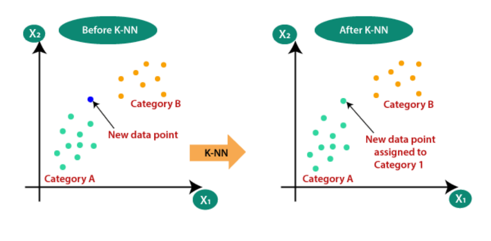
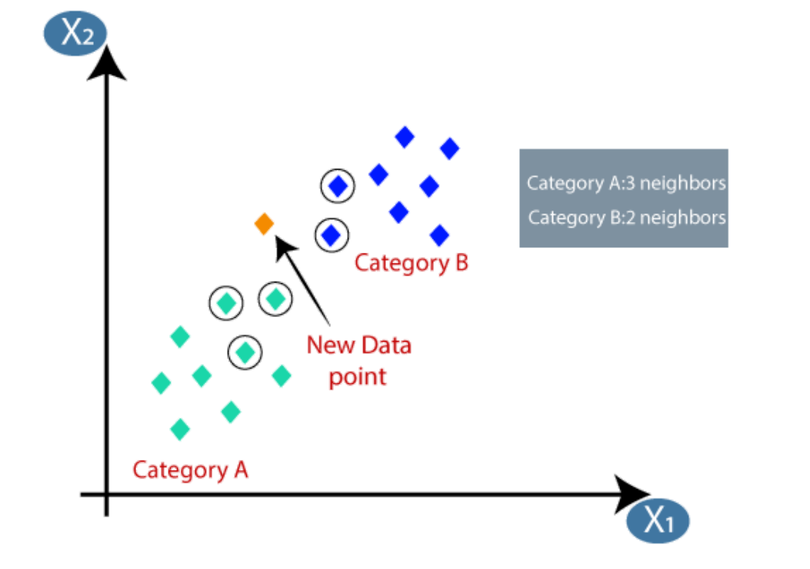
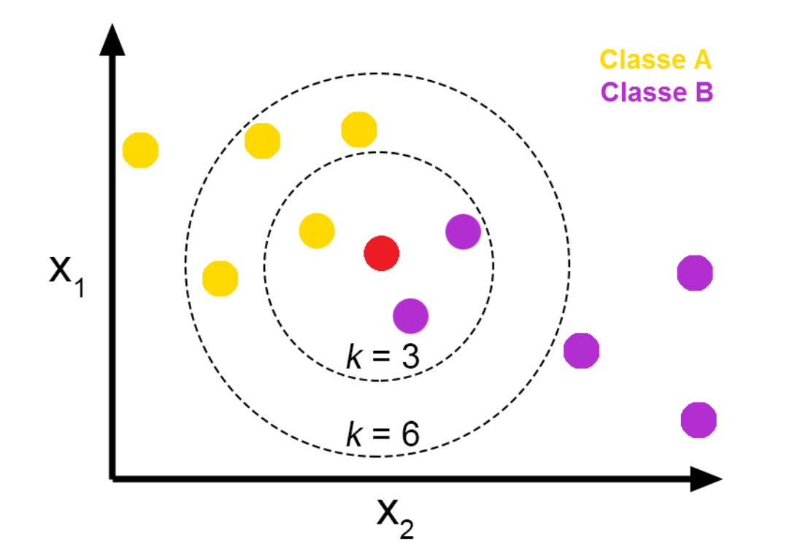
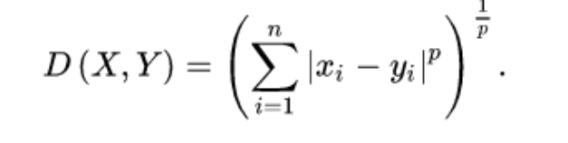
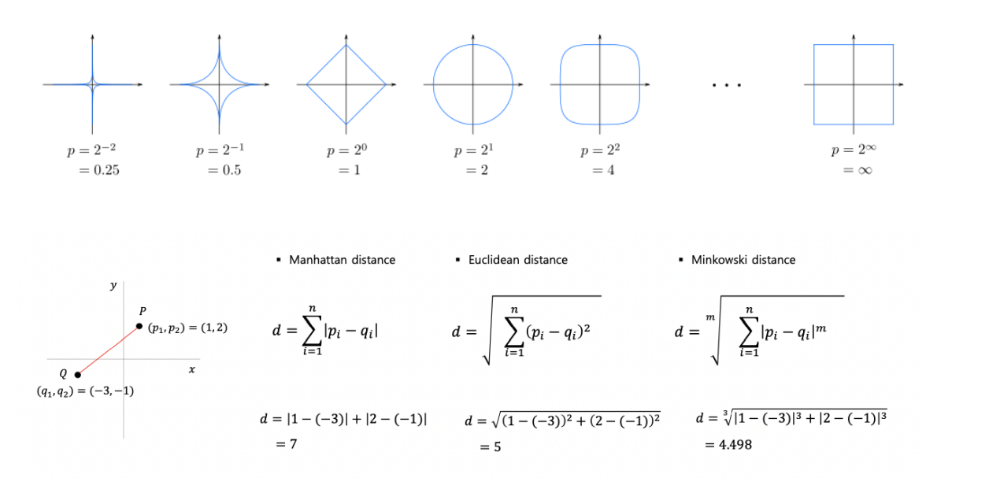

# KNN(K-Nearest Neighbor)

### 동작

1. New Data와 모든 Train Set사이의 거리 측정

2. 유클리드 거리가 가까운 순으로 K개의 점을 이웃으로 갖는다.

3. K개의 점들 중 가장 많이 속한 Class를 찾는다.

4. NewData를 새로운 Class에 할당한다

   - K = 5 NewData는 녹색으로 할당된다.

     

   - K 값에 따라 다른 Class로 할당된다.

     

### Minkowski 거리

- Minkowski 거리는 Manhattan 거리와 Euclidean 거리의 일반화

- p = 1일 때는 Manhattan 거리

- p = 2 일 때는 Euclidean 거리

- 1 < p < 2 일 때 Minkowski 거리는 7 ~ 5 사잇값이 나오고, p > 2 일 때는 5보다 작게 나온다.

- m이 커질수록 x 성분의 길이인 4에 가까워 진다.

  