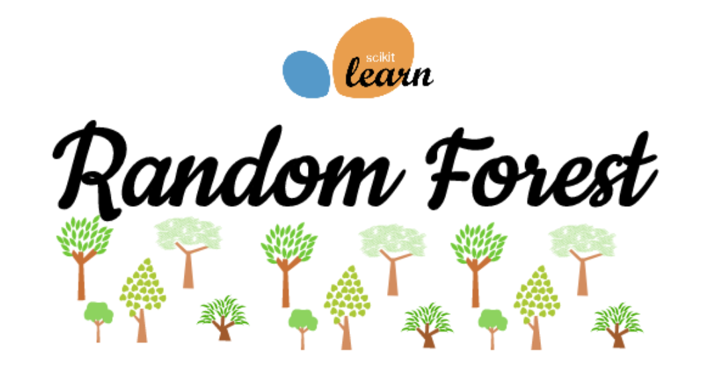
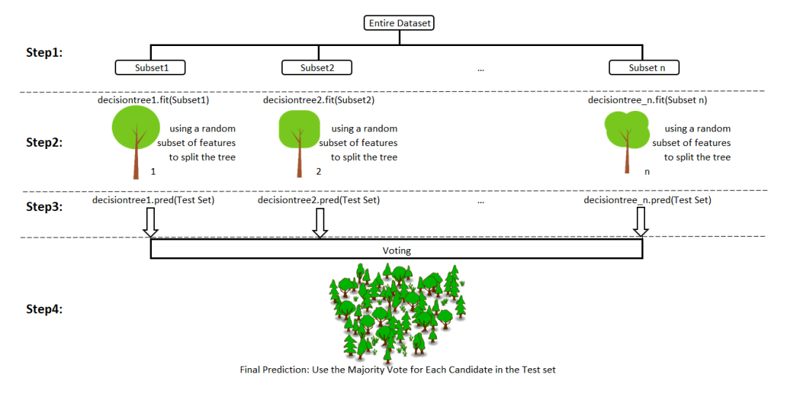
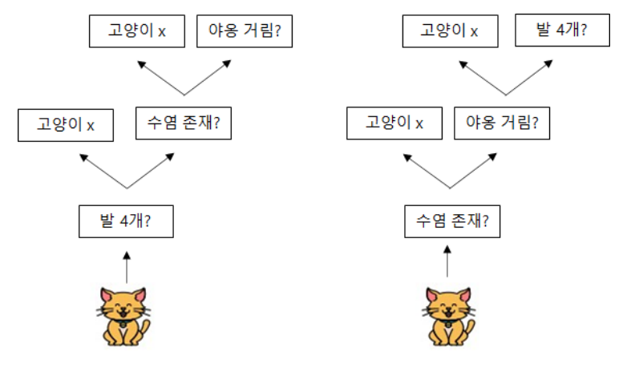
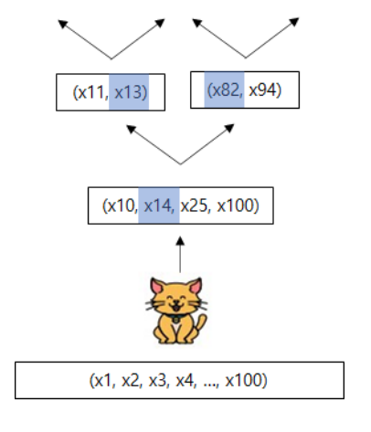
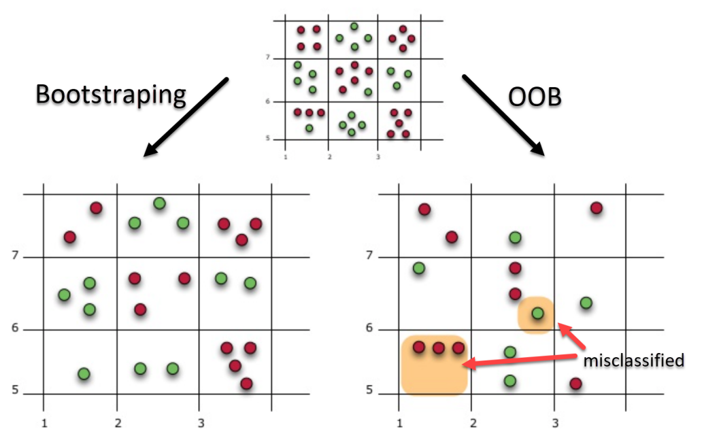
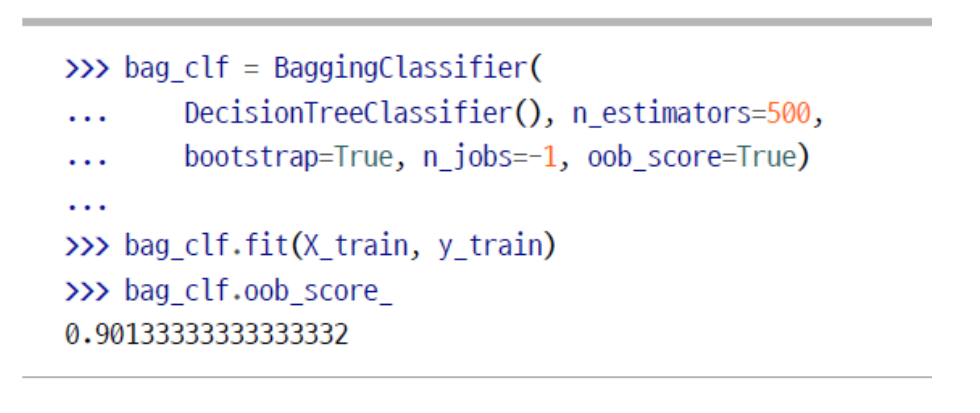

# RandomForest

- Bagging의 일종

  

- Data Sammpling : Bootstraping

- 학습객체 : Decision Tree

- aggregate : voting

  

## Decision Forest Model

- <b>다양성</b>과  <b>무작위성</b>을 통해 Decision Forest Model 의 문제점 해결
  - 여러개의 Training Data 생성을 통한 다양성 확보 --> <b>Bagging</b> (bootstrapping + aggregating)
  - Decision Tree Model 구죽시 무작위 변수선택을 이용한 무작위성 확보 --> Random SubSpace
- Bagging과 Random SubSpace를 통해서 각 Tree간의 상관관계를 줄여준다.
  - 개별적 Tree Model 생성
- Bagging 만 사용시 각 Tree Model 간의 상관관계가 높아지게 된다.
  - model 을 학습시키는 Data를 Random하게 선택해도 결국 그놈이 그놈
  - var(X + Y) = var(X) + var(Y) + corr(X, Y)이고, Data가 같은 이상 corr(X, Y)는 0이 아니다.

#### Random SubSpace

- 변수 : [발의 개수, 울음소리, 수염 존재, 꼬리 존재, ....] 다양한 변수가 존재함

- Decision Tree Model 에서는 <b>모든 Feature를 고려</b>하여 분기점을 생성

- Random Forest에서는 모든 Feature 중에서 Model에 사용될 <b>일부 Feature를 무작위로 선택</b> 한다.

  1. 분기점 생성시 모델 생성을 위한 입력변수를 무작위로 생성
  2. 무작위로 선택된 변수 중 분할 변수 선택 (전체 n, classfication root(n), regression n/3)
  3. Terminal Node가 될때 까지 반복

- 개별모델의 성능은 Decision Tree(all Feature) 보다 낮다. but 다양한 Feature에 최적화된 모델이기 때문에 다양한 모델을 이용해 최적의 결과를 도출해낼 수 있다.

  - 원맨팀 vs 훈련이 잘된 팀

    

    

#### 주요 Feature 선택

- oob 평가

  - DataSet에서 Bootstrapping을 통해 추출될 확률 63.2%

  - 나머지 36.8%을 통해서 tree의 성능을 평가 할 수 있다.

    

  - OOBE = (11/15) * 100 = 73.33%

  - 앙상블의 평가는 각 예측기의 oob 평가를 평균

  - 평가 점수 결과는 oob_score_ 변수에 저장되어 있다.

  

#### Feature Selection

- Feature를 섞어도 OOBE가 돌일하다면 중요한 Feature가 아니다.
- Feature를 섞을시 OOBE가 변경된다면 중요한 Feature다.
- model의 feature_importances_ 변수에 저장된다.

