# SVM (Support Vector Machine)

### 도입

- 아래와 같은 데이터 셋이 주어졌을때 어떻게 분류 해야 할까?

  - 하나의 선형모델을 찾고 서로다른 Class의 Sample을 분리한다.

  - 하지만 여러개의 선형모델이 존재한다면 어떤게 더 좋은 방법일까?

  - L(1), L(2), L(3) 중 어느 직선을 사용해야 할까?

    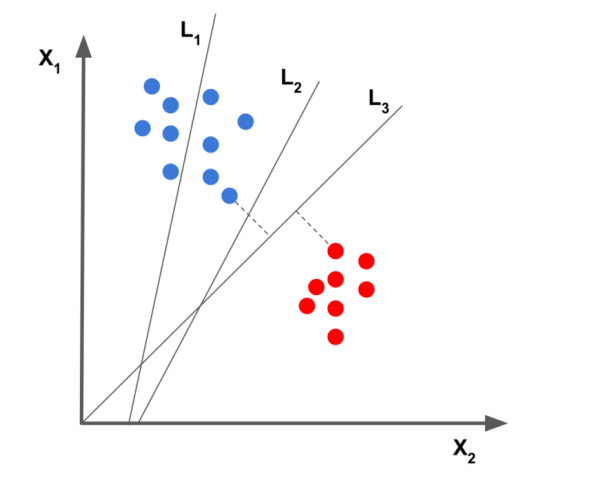

- Question

  - Model  -->   Training(&Generalization)시 데이터 예측에 대한 성능이 좋아져야 한다.
  - 하지만 Training Data에 대한 성능이 높아지면 Generalization 성능은 낮아지게 된다. 이를 해결 할 수 없을까?

### 분류문제

- 기본적인 분류문제 : 3차원, 분류, 선형

  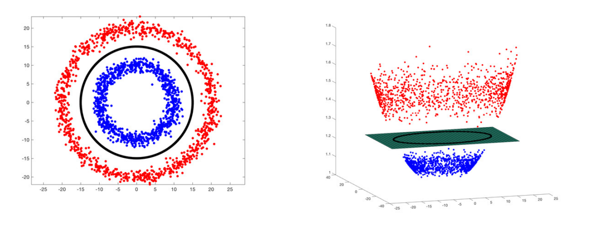

- 2차원에서 두 개의 클래스를 가장 잘 분류한 직선은 무엇일까?

  - 두 개의 Class를 나누는 평면은 무수히 많지만 어떻게 나눠야 최적화된 평며이 만들어 질까?

  - <b>좋음</b>의 기준은 무엇인가?

    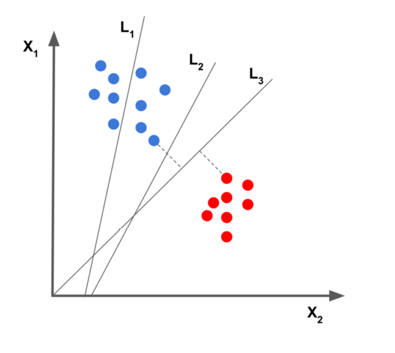

### Sample Space

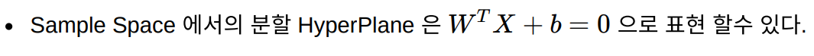

### 선형 SVM 분류

- 라지마진 분류 (maximizing margin over the training set)

  - SVM에서 <b>좋음</b>의 기준은 Margin 이다.
  - <b>Margin을 최대화</b> 시키는 Hyperplane을 찾는다.
  - Minimizing generalization error(=testing error)  ==> 좋은 예측 성능을 나타낸다.

- Margin 이란?

  - 각 class에서 가장 가까운 관측치 사이의 거리를 나타낸다.

  - Margin은 W(기울기)로 표현 가능

    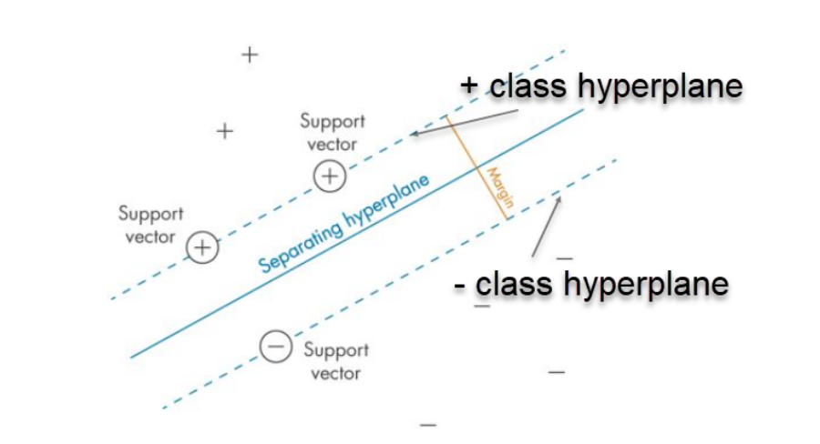

  - 경계에 위치한 샘플을 <b>서포트 벡터</b>라고 한다.

    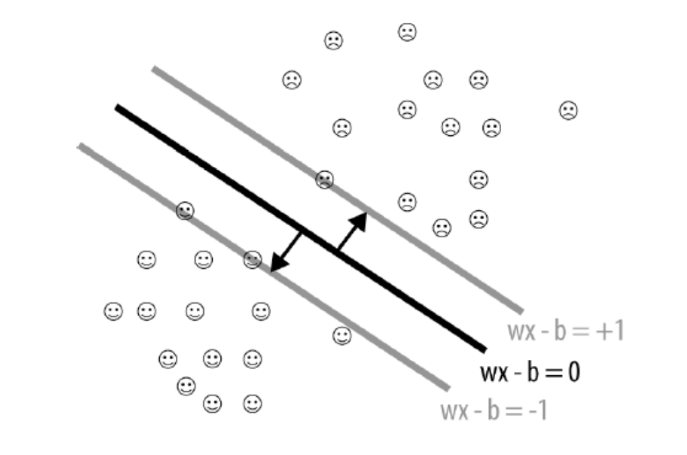

### 하드 마진  vs  소프트 마진

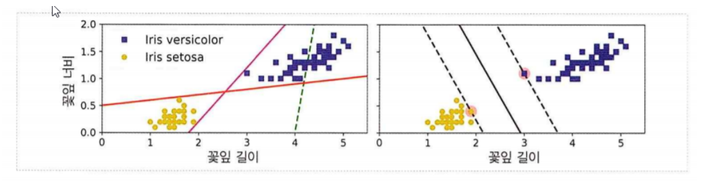

- 하드 마진 분류 : 모든 샘플이 쪽(오른 or 왼 or 위 or 아래)으로 올바르게 분류되어 있는 경우

  - 왼쪽 그래프 : 하드 마진을 찾을 수 없는 경우
  - 오른쪽 그래프 : 결정 경계에 이상치가 없어 결정경계가 매우 일반화 되어 있는 경우

  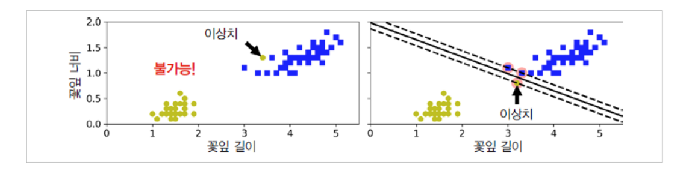

### 비선형 SVM 분류

- 비선형 데이터 셋을 다루는 방법

  - 더 높은 차원의 특성 공간으로 투영하여 특성공간 내에서 선형 분리 가능하게 만들 수 있다.

    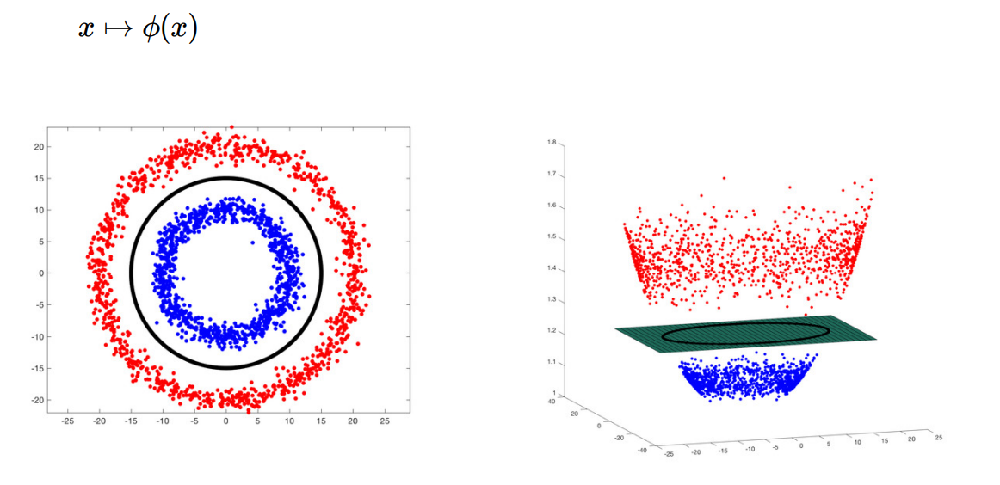

### 커널 함수

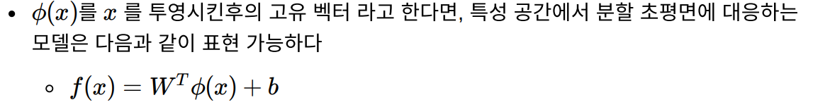

- 다항특성과 같은 특성을 더 추가하는 방법으로 해결 가능하다.

  - 다항식 커널

  - 유사도 특성

  - 가우시안 RBF 커널

  - 계산 복잡도

    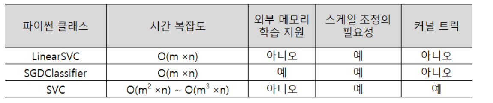

### 다항식 커널

- 다항식 특성을 추가하는 것은 간단하고 (SVM뿐만 아니라) 모든 머신러닝 알고리즘에서 잘 작동한다.

- 하지만 낮은 차수의 다항식은 매우 복잡한 데이터셋을 잘 표현하지 못하고 높은 차수의 다항식은 굉장히 많은 특성을 추가하므로 모델을 느리게 만든다.

  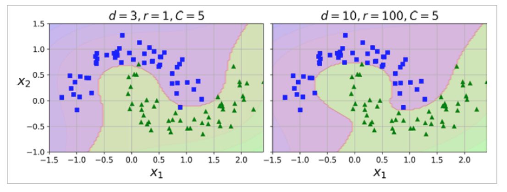

### 유사도 특성

- 비선형 특성을 다루는 또 다른 기법은 각 샘플이 특정 랜드마크(landmark)와 얼마나 닮았는지 측정하는 유사도 함수(similarity function)로 계산한 특성을 추가하는 것

  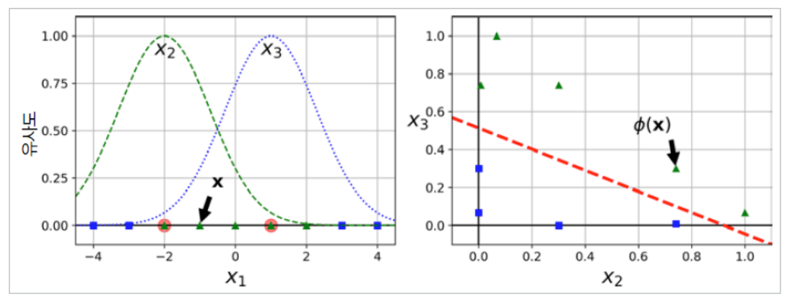

### 가우시안 RBF 커널

- PolynomialFeatures 변환기를 이용해 차원 지정하여 코드를 작성한다.

  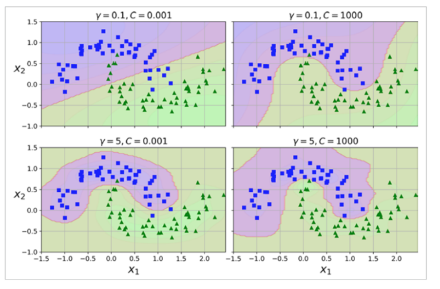

### 계산 복잡도

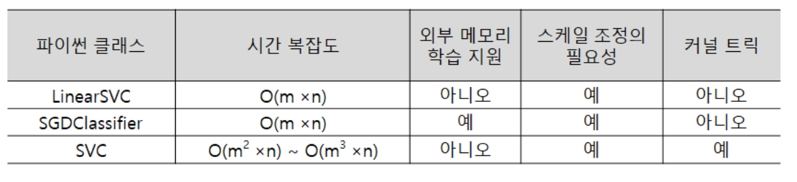

### SVM 회귀

- SVM은 선형, 비선형 분류 뿐만 아니라 선형, 비선형 회귀에도 사용할 수 있다.

- SVM을 회귀에 적용하는 방법은 기존 SVM의 방식을 반대로 적용하면 된다.

  - 마진 오류 안에서 두 클래스 간의 폭이 최대가 되도록한다.
  - SVM회귀는 제한된 마진오류(도로 밖의 샘플) 안에서 도로 안에 가능한 한 많은 샘플이 들어가도록 학습한다.

- 마진을 결정하고 최대한 Dataset이 많이 들어가게 만들어 준다.

  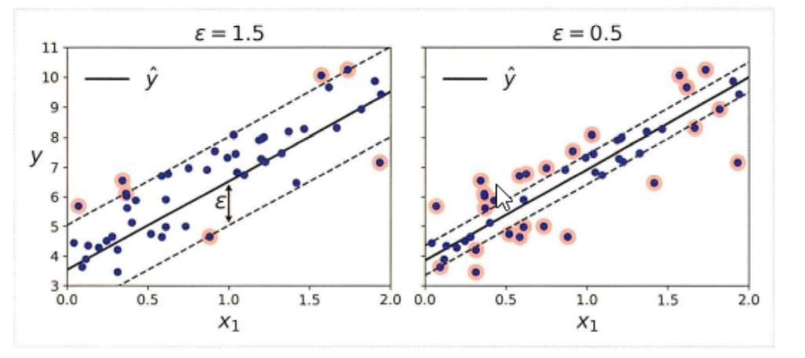

  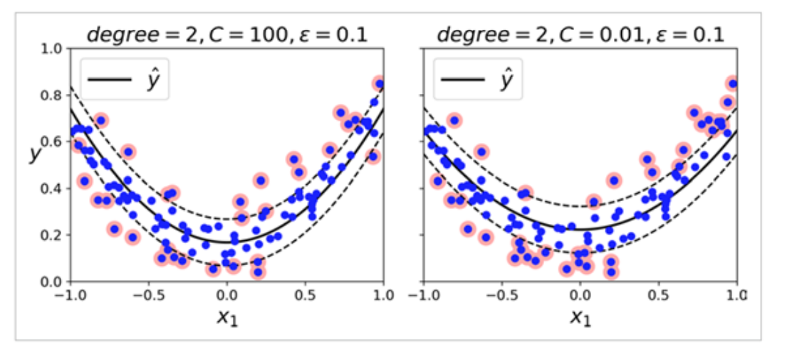