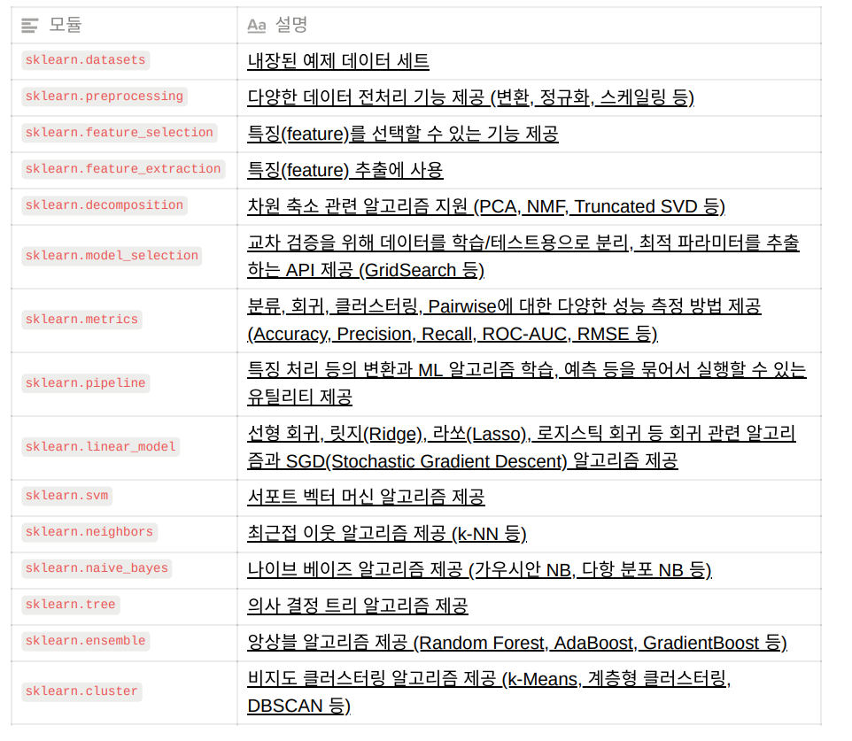
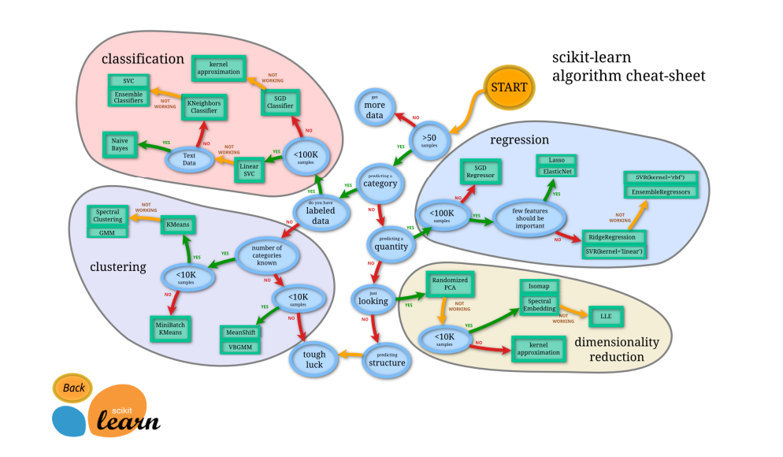
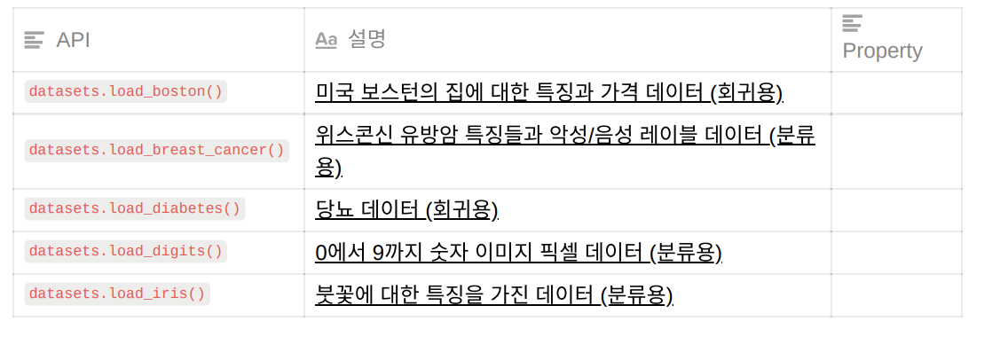
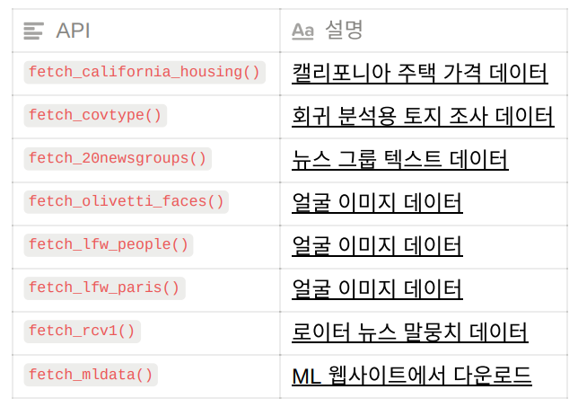

# Scikit-Learn(Sklearn)

- 머신러닝 분석 라이브 러리

- scikit-learn 주요 모듈

  

  

- API 사용 방법
  1. Scikit-Learn으로부터 적절한 분석기 클래스를 임포트해서 모델의 클래스 선택
  2. 클래스를 원하는 값으로 인스턴스화 해서 모델의 하이퍼파라미터 선택
  3. 데이터를 특징 배열과 대상 벡터로 배치
  4. 모델 인스턴스의 `fit()` 메서드를 호출해 모델을 데이터에 적합
  5. 모델을 새 데이터에 대해서 적용
     - 지도 학습: 대체로 `predict()` 메서드를 사용해 알려지지 않은 데이터에 대한 레이블 예측
     - 비지도 학습: 대체로 `transform()`이나 `predict()` 메서드를 사용해 데이터의 속성을 변환하거나 추론

- Example Data Set

  -  분류 또는 회귀용 데이터셋

    

  - 온라인 데이터셋

    

- Data Set 구조
  - 일반적으로 딕셔너리 형태로 구성
  - data: 특징 데이터 셋
  - target: 분류용은 레이블 값, 회귀용은 숫자 결과값 데이터
  - target_names: 개별 레이블의 이름 (분류용)
  - feature_names: 특징 이름
  - DESCR: 데이터 셋에 대한 설명과 각 특징 설명