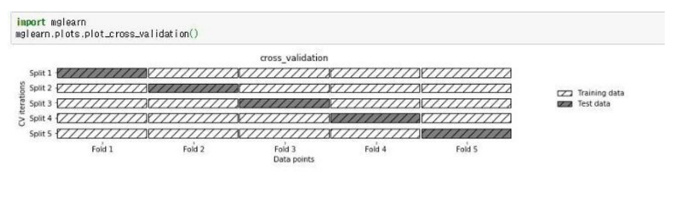
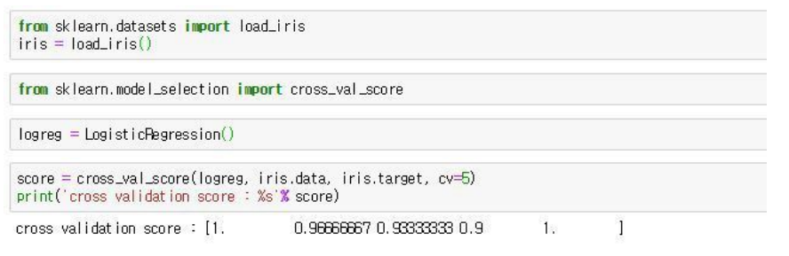
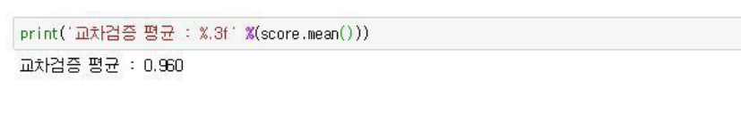
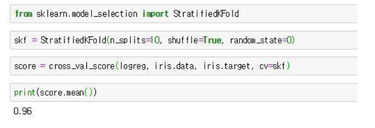
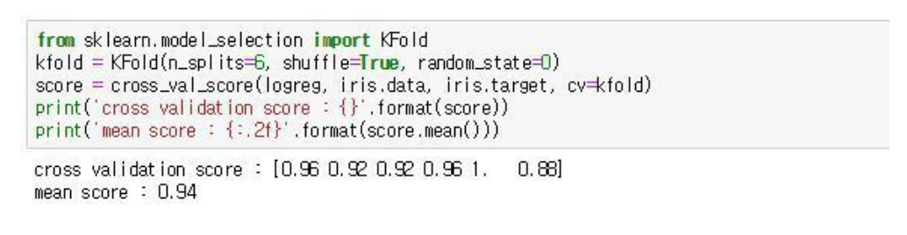
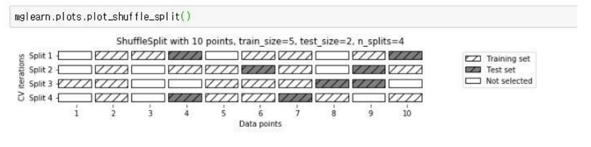
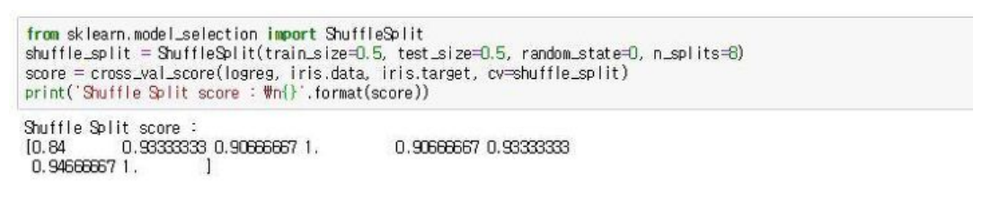

# 교차검증

### Model의 성능 측정

- Training Set
  - 모델 생성시 사용
- Validation Set
  - 모델 성능 확인
    - 모델이 제대로 만들어 지고 있는지
- Test Set
  - 모델 평가
    - 실제로 사용하기 전에 평가

### Validation Set

- Test Set과 달리 model 생성시 Model의 성능을 평가한다면 어떤점이 좋을까?
  - Overfitting을 방지할 수 있다.
  - Validation Set의 결과와 Training Set의 결과의 차이가 벌어지면 Overfitting 이므로
  - 결국 최적의 Parameter를 찾음
- Training 중간중간 Model의 성능을 확인 할 수 있다.
- 과정
  - Model1 --> 평가 (epoch1)
  - Model2 --> 평가 (epoch2)
  - ....
- 보통 6:2:2 또는 8:1:1로 나눈다.

### 종류

1. 단순 교차 검증 cross_val_score

   

   - k = 5일 때, 즉 데이터를 5개의 부분 집합으로 분할한 후, 각 분할마다 하나의 폴드를 테스트용으로 사용하고 나머지 4개의 폴드는 훈련용으로 쓴다. 이과정을 반복하여 각 분할마다 정확도를 측정한다.

   - sklearn에서는 교차검증을 위해 cross_val_score 함수를 제공한다.

     

     - <b>corss_val_score(모델 명, 훈련데이터, 타깃, cv) (※ cv는 폴드(fold)수)</b>

     - 기본 default는 3이고, 그림처럼 cv = 5를 해주면 '5-겹 교차검증'을 하라는 의미

     - 최종적으로 평균을 내어 정확도를 간단히 한다.

       

2. 계층별 k-겹 교차검증

   - 데이터가 편향되어 있을 경우(몰려있을 경우) 단순 k-겹 교차검증을 사용하면 성능 평가가 잘 되지 않을 수 있다.

   - 따라서 이럴 땐 <b>stratified k-fold cross-validation</b>을 사용한다.

   - 계층을 나누고 분할해서 뽑는다.

     

     - <b>StratifiedKFold(n_splits, shuffle, random_state)</b>
     - <b>n_splits</b>은 몇 개로 분할할지를 정하는 매개변수
     - <b>shuffle의 기본값 False 대신 True</b>를 넣으면 Fold를 나누기 전에 무작위로 섞는다.
     - <b>cross_val_score 함수의 cv 매개변수에 넣으면 된다.</b>

     

     ※ 참고

     일반적으로 회귀에는 기본 k-겹 교차검증을 사용하고, 분류에는 StratifiedKFold를 사용한다. 또한, cross_val_score 함수에는 K-Fold의 매개변수를 제어할 수 가 없으므로, 따로 K-Fold 객체를 만들고 매개변수를 조정한 다음에 cross_val_score의 cv 매개변수에 넣어야 한다.

3.  K-Fold 상세조정

   - cv 매개변수로 전달되는 것을 <b>'교차 검증 분할기'</b>라고 하는데, 이를 통해 데이터 분할을 좀 더 세밀하게 할 수 있다.

     

4. 임의분할 교차검증(shuffle split cross validation)

   

   - 임의분할 교차검증은 train set과 test set의 크기를 유연하게 조절해야 할 때 유용하다.

   - train_size와 test_size에 정수를 입력하면 해당 수 만큼 데이터포인트의 개수가 정해지며, 만일 실수를 입력하면 비율이 정해진다.

     

     