# Machin Learning / Deep Learning

- 인공지능이란?

  - 인공지능 또는 AI는 인간의 <b>학습능력, 추론능역, 지각능력, 그 외에 인공적으로 구현한 컴퓨터 프로그램</b> 또는 이를 포함한 컴퓨터 시스템이다. 하나의 인프라 기술이기도 하다.
  - 인간을 포함한 동물이 갖고 있는 지능 즉, natural intelligence와는 다른 개념

- 인공지능의 활용

  - 자연어 처리 - 번역 / 챗봇

    

  - 컴퓨터 비전 - 자율주행

    

  - GAN

    


### 머신러닝 / 딥러닝

- 인공지능(Artificial Intelligence)
  - 가장 넓은 의미에서의 인공지능으로서 인공적으로 구현한 모든 수준의 지능을 포괄
- 머신러닝(Machine Learning)
  - 구체적으로 프로그래밍하지 않아도 스스로 학습하여 임무를 수행할 수 있는 능력을 컴퓨터가 갖도록 구현하는 AI의 한 분야.
- 딥러닝(Deep Learning)
  - 데이터에 대한 다층적 표현과 추상화를 통해 학습하는 머신러닝의 기법.


#### 머신러닝이란?

- 환경(Environment, E)과의 상호작용을 통해서 축적되는 경험적인 데이터(Data, D)를 바탕으로 지식 즉 모델(Model, M)을 자동으로 구축하고 스스로 성능(Performance, P)을 향상하는 시스템(Mitchell, 1997)

  

- 기존의 프로그래밍과의 차이

  - New Data -> <b>규칙</b> -> 해답

  


#### 딥러닝이란?

- 딥 러닝은 **머신 러닝의 한 방법**으로, 학습 과정 동안 인공 신경망으로서 예시 데이터에서 얻은 일반적인 규칙을 독립적으로 구축(훈련)한다. 특히 머신 비전 분야에서 신경망은 일반적으로 데이터와 예제 데이터에 대한 사전 정의된 결과와 같은 지도 학습을 통해 학습된다.


#####  머신러닝과 딥러닝의 차이


### NEURAL NETWORK

- 문제의 종류
  - Classification
    - Binary Classification
      - 2종류의 output이 존재ㅏ형 이를 분류해야 하는 경우
      - 이진분류가 가능하다면 다중분류도 해결할 수 있다
  - Regression
    - 독립변수에 의한 종속변수의 값을 예측
    - Linear Regression을 응용하면 Classification 문제를 해결할 수 있다.
- 사람의 신경


### 신경망 

- 신경망의 예

  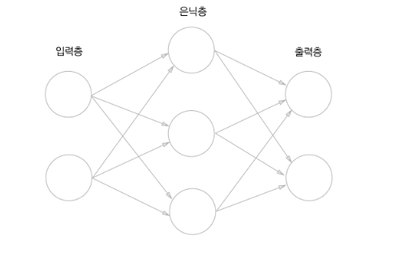

  - 은닉층의 뉴런은 사람 눈에는 보이지 않는다.
  - 위의 신경망은 모두 3층으로 구성되었지만, 가중치를 갖는 층은 2개 뿐이므로 '2층 신경망'이라고도 한다.


### 퍼셉트론

- 퍼셉트론이란?

  - 퍼셉트론은 다수의 신호를 입력받아 하나의 신호를 출력한다.

  - 신호: 전류나 강물처럼 흐름이 있는것 이라고 상상하면 좋음

    > 전류가 전선을 타고 흐르는 전자를 내보내듯, <b>퍼셉트론 신호도 흐름을 만들고 정보를 앞으로 전달</b>

  - 신호는 0(안흐른다, 거짓) 또는 1(흐른다, 참)로 나타냄

    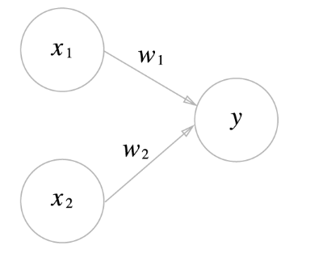

    - x: 입력신호
    - y: 출력신호
    - w: 가중치
    - 원: 뉴런(or 노드)
      1. 입력신호가 뉴런에 보내질 때는 각각 고유한 **가중치**가 곱해진다
      2. 뉴런에서 보내온 신호의 총합이 정해진 한계를 넘어설 떄만 1을 출력한다. (=뉴런이 활성화 된다. 임계값을 넘었다.)
    - 위의 그림은 x1과 x2라는 두 신호를 입력받아 y를 출력하는 퍼셉트론
    - 이를 수식으로 변경하면 다음과 같이 표현 가능

    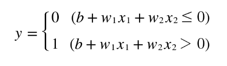

    - <b>`b`</b>: 뉴런이 얼마나 쉽게 활성화 되느냐를 제어하는 편향(<b>`bias`</b>)
    - <b>`w1, w2`</b>: 각 신호의 영향력을 제어하는 가중치 매개변수.
    - 편향을 표기하여 퍼셉트론을 표기하면 다음과 같이 나타냄

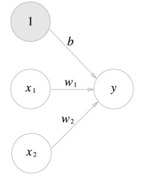

- 가중치가 b이고 입력이 1인 뉴런
- 위 퍼셉트론의 동작은 x1,x2,1 이라는 3개의 신호가 뉴런에 입력되어, 각 신호에 가중치를 곱한후, 다음 뉴런에 전달된다.
- 다음 뉴런들에서는 이 신호의 값을 더하여, 그 합이 0을 넘으면 1을 출력, 그렇지 않으면 0을 출력한다.


### 단순한 논리 회로

- <b>`AND 게이트`</b>

  - AND 게이트는 입력이 둘이고 출력은 하나.

  - 다음과 같은 진리표를 갖고 있음

    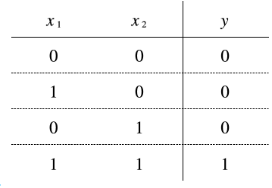


### 활성화 함수(Activation Function)

- 입력 신호의 총합을 출력신호로 변환하는 함수

- '활성화' 라는 이름이 말해주듯 활성화 함수는 입력 신호의 총합이 활성화를 일으키는지 정하는 역할

- 계산 과정

  1. 가중치가 달린 입력 신호와 편향의 총합을 계산. 이를 a라고 한다.

     

  2.  a를 h() 함수에 넣어 y라는 값을 출력한다.

     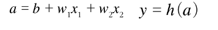

- 활성화 함수는 임계값을 경계로 출력이 바뀌는데, 이런 함수를 <b>`계단함수`</b>라 한다.


#### 활성화 함수 종류

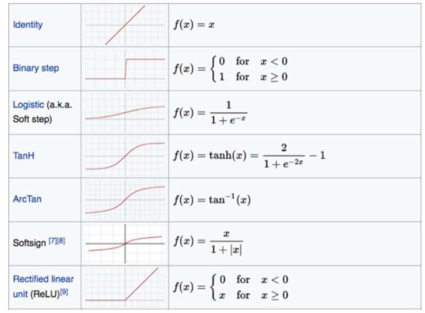


##### 1. 시그모이드 함수(sigmoid function)

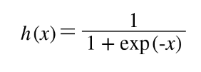

- exp(-x)=e^(-x)

- e는 자연상수로 2.7182... 을 값을 갖는 실수

- 신경망에서는 활성화 함수로 시그모이드 함수를 이용하여 신호를 변환, 그 변환된 신호를 다음 뉴런에게 전달한다.

- 계단 함수 구현

  - 입력이 0을 넘기면 1을 출력

  - 이외에는 0을 출력

    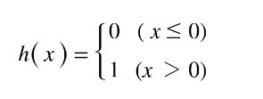

  ```python
  def step_function(x):
      if x > 0:
          return 1
      else:
          return 0
  ```

  - 위와 같은 함수로 구현한 결과의 문제점은 인수 x를 실수만 받아들인다는  것
  - 실수인수를 넣을순 있지만 넘파이 배열을 인수로 넣을 수는 없다

  ※ 넘파이 배열도 사용가능할 수 있도록 구현

  1. numpy배열에 부등호 연산을 수행하면 각각 부등호 연산을 수행한 bool 배열이 생성된다.
  2. 그 값을 별도로 저장한다.
  3. bool type을 int형으로 변경 해준다.

  ```python
  import numpy as np
  x_1 = np.array([-1.0, 1.0, -2.0, 0.5])
  y_1 = x_1 > 0
  print(y_1)
  print(type(y_1))
  print(y_1.astype(np.int))
  type(y_1.astype(np.int)[0])
  
  '''
  결과값
  [False  True False  True]
  <class 'numpy.ndarray'>
  [0 1 0 1]
  numpy.int32
  '''
  ```

  ```python
  import numpy as np
  def step_function_1(x):
      y = x >0
      return y.astype(np.int)
  
  x_2=np.array([-1.0,1.0,-2.0])
  y_2=step_function_1(x_2)
  
  import numpy as np
  import matplotlib.pylab as plt
  x_3 = np.arange(-5.0,5.0,0.1) #-5.0에서 5.0 전까지 0.1 간격의 넘파이 배열을 생성
  y_3 = step_function_1(x_3)
  plt.plot(x_3,y_3)
  plt.ylim(-0.1,1.1)
  plt.show()
  ```

  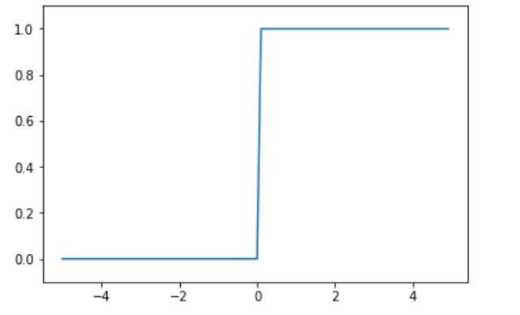

- 시그모이드 함수 구현

  ```python
  def sigmoid(x):
      return 1/(1+np.exp(-x))	# 브로드 캐스트 기능을 이용해 모두에게 적용
  ```

  ```python
  x_4=x_3
  y_4=sigmoid(x_4)
  plt.plot(x_4,y_4)
  plt.ylim(-0.1,1.1)
  plt.show()
  ```

  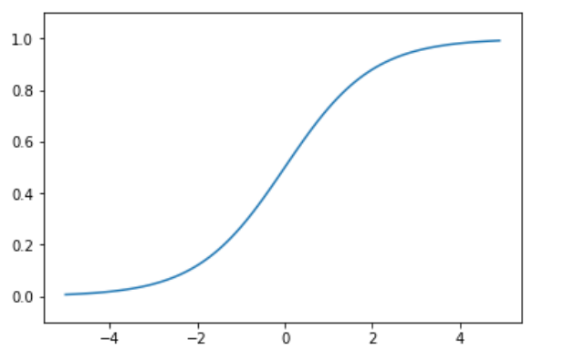

- 시그모이드 함수와 계단 함수 비교

  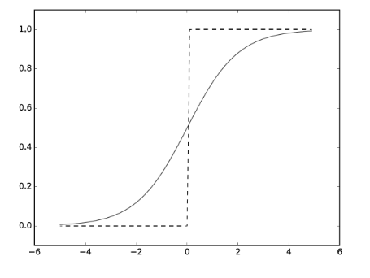

  - 가장 직관적인 차이는 <b>매끄러움</b>의 차이
    - 시그모이드 함수는 부드러운 곡선이며, 입력에 따라 출력이 연속적으로 변경
    - 계단함수는 0을 경계로 출력이 갑자기 바뀌어 버린다.
    - 시그모이드 함수의 매끈함이 신경망 학습에 중요한 역할을 차지하고 있다.
    - 퍼셉트론(계단함수): 0혹은 1이 흐른다.
    - 신경망(시그모이드함수): 연속적인 실수
    - 두 함수 모두 출력은 0 ~ 1

##### 2. tanh 함수

- sigmoid function을 보완하고자 나온 함수

- 입력신호를 (-1, 1) 사이의 값으로 normalization 해준다.

  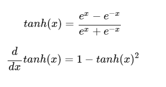


##### 3. ReLU 함수

- 시그모이드 함수를 이용해 신경망을 구성했지만 최근에는 <b>ReLU(Rectified Linear Unit)</b> 함수를 주로 이용

  - ReLU 함수는 입력이 0을 넘으면 그 입력을 그대로 출력
  - 0 이하이면 0을 출력하는 함수

  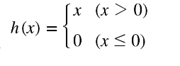


### 출력계층

- 학습되는 Data Set의 Label 값에 따라 출력 계층의 차원이 결정됨

- 출력 계층의 종류

  - 항등함수

    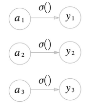

  - 소프트 맥스

    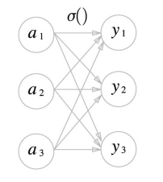


### 손실함수 (Loss Function)

- <b>손실함수</b>란 신경망 성능의 <u><b>'나쁨'</b></u>을 나타내는 지표로, 현재의 신경망이 훈련 데이터를 얼마나 잘 처리하지 <u><b>'못'</b></u>하는냐를 나타낸다.

- <b>비용함수(Cost Function)</b>이라고도 불린다.

- 손실함수 종류

  1. MSE

     - 가장 많이 쓰이는 손실함수

       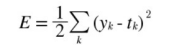

       - 
