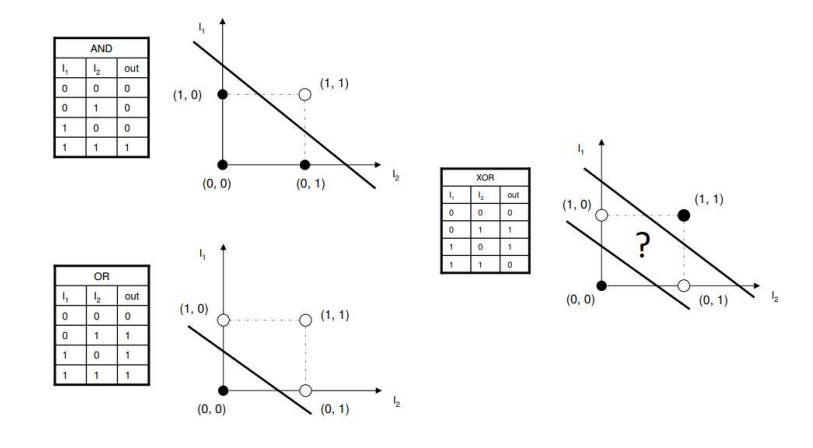

# Machin Learning / Deep Learning

- 인공지능이란?

  - 인공지능 또는 AI는 인간의 <b>학습능력, 추론능역, 지각능력, 그 외에 인공적으로 구현한 컴퓨터 프로그램</b> 또는 이를 포함한 컴퓨터 시스템이다. 하나의 인프라 기술이기도 하다.
  - 인간을 포함한 동물이 갖고 있는 지능 즉, natural intelligence와는 다른 개념

- 인공지능의 활용

  - 자연어 처리 - 번역 / 챗봇

    

  - 컴퓨터 비전 - 자율주행

    

  - GAN

    

### 머신러닝 / 딥러닝

- 인공지능(Artificial Intelligence)
  - 가장 넓은 의미에서의 인공지능으로서 인공적으로 구현한 모든 수준의 지능을 포괄
- 머신러닝(Machine Learning)
  - 구체적으로 프로그래밍하지 않아도 스스로 학습하여 임무를 수행할 수 있는 능력을 컴퓨터가 갖도록 구현하는 AI의 한 분야.
- 딥러닝(Deep Learning)
  - 데이터에 대한 다층적 표현과 추상화를 통해 학습하는 머신러닝의 기법.

#### 머신러닝이란?

- 환경(Environment, E)과의 상호작용을 통해서 축적되는 경험적인 데이터(Data, D)를 바탕으로 지식 즉 모델(Model, M)을 자동으로 구축하고 스스로 성능(Performance, P)을 향상하는 시스템(Mitchell, 1997)

  

- 기존의 프로그래밍과의 차이

  - New Data -> <b>규칙</b> -> 해답

  

#####  머신러닝과 딥러닝의 차이

### NEURAL NETWORK

- 문제의 종류
  - Classification
    - Binary Classification
      - 2종류의 output이 존재ㅏ형 이를 분류해야 하는 경우
      - 이진분류가 가능하다면 다중분류도 해결할 수 있다
  - Regression
    - 독립변수에 의한 종속변수의 값을 예측
    - Linear Regression을 응용하면 Classification 문제를 해결할 수 있다.
- 사람의 신경

#### 퍼셉트론이란?

- 퍼셉트론(perceptron)은 프랑크 로젠블라트(Frank Rosenblatt)가 1957년에 고안한 알고리즘
- 신경망(딥러닝)의 기원이 되는 알고리즘
- 다수의 신호(흐름이 있는)를 입력으로 받아 하나의 신호를 출력한다.
- x1과 x2는 입력신호, y는 출력신호, w1과 w2는 가중치(weight)를 의미
- 원을 <b>뉴런</b> 또는 <b>노드</b>라고 부른다.
- 입력 신호가 뉴런에 보내질 때는 각각 고유한 <b>가중치</b>가 곱해진다(w1x1, w2x2).
- 뉴런에서 전달 받은 신호의 총합이 임계값 θ를 넘을 때먼 1을 출력

### 단순한 논리 회로

#### AND, OR, NAND

