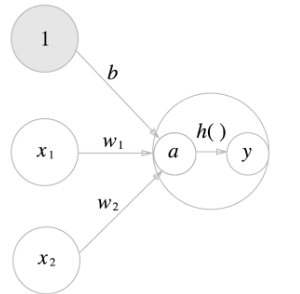

# Machin Learning / Deep Learning

- 인공지능이란?

  - 인공지능 또는 AI는 인간의 <b>학습능력, 추론능역, 지각능력, 그 외에 인공적으로 구현한 컴퓨터 프로그램</b> 또는 이를 포함한 컴퓨터 시스템이다. 하나의 인프라 기술이기도 하다.
  - 인간을 포함한 동물이 갖고 있는 지능 즉, natural intelligence와는 다른 개념

- 인공지능의 활용

  - 자연어 처리 - 번역 / 챗봇

    

  - 컴퓨터 비전 - 자율주행

    

  - GAN

    

### 머신러닝 / 딥러닝

- 인공지능(Artificial Intelligence)
  - 가장 넓은 의미에서의 인공지능으로서 인공적으로 구현한 모든 수준의 지능을 포괄
- 머신러닝(Machine Learning)
  - 구체적으로 프로그래밍하지 않아도 스스로 학습하여 임무를 수행할 수 있는 능력을 컴퓨터가 갖도록 구현하는 AI의 한 분야.
- 딥러닝(Deep Learning)
  - 데이터에 대한 다층적 표현과 추상화를 통해 학습하는 머신러닝의 기법.

#### 머신러닝이란?

- 환경(Environment, E)과의 상호작용을 통해서 축적되는 경험적인 데이터(Data, D)를 바탕으로 지식 즉 모델(Model, M)을 자동으로 구축하고 스스로 성능(Performance, P)을 향상하는 시스템(Mitchell, 1997)

  

- 기존의 프로그래밍과의 차이

  - New Data -> <b>규칙</b> -> 해답

  

#####  머신러닝과 딥러닝의 차이

### NEURAL NETWORK

- 문제의 종류
  - Classification
    - Binary Classification
      - 2종류의 output이 존재ㅏ형 이를 분류해야 하는 경우
      - 이진분류가 가능하다면 다중분류도 해결할 수 있다
  - Regression
    - 독립변수에 의한 종속변수의 값을 예측
    - Linear Regression을 응용하면 Classification 문제를 해결할 수 있다.
- 사람의 신경

### 신경망 

- 신경망의 예

  

  - 은닉층의 뉴런은 사람 눈에는 보이지 않는다.
  - 위의 신경망은 모두 3층으로 구성되었지만, 가중치를 갖는 층은 2개 뿐이므로 '2층 신경망'이라고도 한다.

### 퍼셉트론

- 퍼셉트론이란?

  - 퍼셉트론은 다수의 신호를 입력받아 하나의 신호를 출력한다.

  - 신호: 전류나 강물처럼 흐름이 있는것 이라고 상상하면 좋음

    > 전류가 전선을 타고 흐르는 전자를 내보내듯, <b>퍼셉트론 신호도 흐름을 만들고 정보를 앞으로 전달</b>

  - 신호는 0(안흐른다, 거짓) 또는 1(흐른다, 참)로 나타냄

    

    - x: 입력신호
    - y: 출력신호
    - w: 가중치
    - 원: 뉴런(or 노드)
      1. 입력신호가 뉴런에 보내질 때는 각각 고유한 **가중치**가 곱해진다
      2. 뉴런에서 보내온 신호의 총합이 정해진 한계를 넘어설 떄만 1을 출력한다. (=뉴런이 활성화 된다. 임계값을 넘었다.)
    - 위의 그림은 x1과 x2라는 두 신호를 입력받아 y를 출력하는 퍼셉트론
    - 이를 수식으로 변경하면 다음과 같이 표현 가능

    

    - <b>`b`</b>: 뉴런이 얼마나 쉽게 활성화 되느냐를 제어하는 편향(<b>`bias`</b>)
    - <b>`w1, w2`</b>: 각 신호의 영향력을 제어하는 가중치 매개변수.
    - 편향을 표기하여 퍼셉트론을 표기하면 다음과 같이 나타냄

- 가중치가 b이고 입력이 1인 뉴런
- 위 퍼셉트론의 동작은 x1,x2,1 이라는 3개의 신호가 뉴런에 입력되어, 각 신호에 가중치를 곱한후, 다음 뉴런에 전달된다.
- 다음 뉴런들에서는 이 신호의 값을 더하여, 그 합이 0을 넘으면 1을 출력, 그렇지 않으면 0을 출력한다.

### 단순한 논리 회로

- <b>`AND 게이트`</b>

  - AND 게이트는 입력이 둘이고 출력은 하나.

  - 다음과 같은 진리표를 갖고 있음

    

### 활성화 함수(Activation Function)

- 입력 신호의 총합을 출력신호로 변환하는 함수

- '활성화' 라는 이름이 말해주듯 활성화 함수는 입력 신호의 총합이 활성화를 일으키는지 정하는 역할

- 계산 과정

  1. 가중치가 달린 입력 신호와 편향의 총합을 계산. 이를 a라고 한다.

     

  2.  a를 h() 함수에 넣어 y라는 값을 출력한다.

     

- 활성화 함수는 임계값을 경계로 출력이 바뀌는데, 이런 함수를 <b>`계단함수`</b>라 한다.

#### 활성화 함수 종류

##### 1. 시그모이드 함수(sigmoid function)

