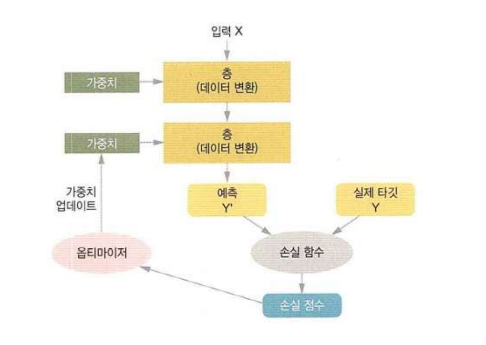

# DL(Deep Learning)

### Tensorflow


- <b>텐서플로(Tensorflow)</b>는 다양한 작업에 대해 데이터 흐름 프로그래밍을 위한 오픈소스 소프트웨어 라이브러리이다.
- 인공 신경망 같은 기계학습 응용프로그램 및 <b>딥러닝(Deep Learning)</b>에 사용된다.


### 신경망의 구조

- 신경망 훈련에 관련된 요소들

  - 네트워크를 구성하는 층(layer)

  - 입력 데이터(data)와 그에 상응하는 타겟 데이터(label)

  - 학습에 사용할 피드백 신호를 정의하는 손실 함수

  - 학습 진행 방식을 결정하는 옵티마이저

    

- <b>Layer</b>

  - 하나 이상의 텐서를 입력으로 받아 하나 이상의 텐서를 출력하는 데이터 처리 모듈
  - 대부분 <b>가중치</b>라는 상태를 가진다.
  - 가중치는 확률적 경사 하강법에 의해 학습 되는 하나 이상의 텐서이며 여기에 네트워크가 학습한 <b>정보</b>가 담겨있다.
  - Layer 종류
    - 완전 연결층 (Fully Connected Layer)
    - 밀집층 (Dense Layer)
    - 순환층 (Recurrent Layer)
    - 합성곱층 (Convolution Layer)
  - 예)

  ```python
  from tensorflow.keras import layers
  layer = layers.Dense(32, input_shape=(784, )
  ```
  - 첫 번째 차원이 784인 2D 텐서만 입력으로 받는 층
  - 이 층은 첫 번째 차원 크기가 32로 변화된 텐서를 출력할 것이다.
  - 따라서 32차원의 벡터를 입력으로 받는 하위 층이 연결 되어야 한다.
  - 하지만 케라스(keras)에서는 모델에 추가된 층을 자동으로 <b>상위 층의 크기에 맞추어</b> 주기 때문에 호환성을 걱정하지 않아도 된다.


- Dense Layer

  - Dense Layer는 다음과 같이 입력과 출력이 모두 연결된 Layer이다.

    

- Loss Function

  - 훈련하는 동안 최소화 될 값
  - 종류
    - 회귀 타입에 쓰이는 손실함수
      1. MSE: Regression 문제
      2. MAE
      3. MSLE
      4. MAPE
      5. KLD
      6. Poisson
      7. Logcosh
      8. Cosine Similarity
      9. Huber
      10. CTC(Connection Temporal Classification): 시퀀스 학습
    - 분류에 쓰이는 손실함수
      1. Binary cross-entropy: 2개의 class
      2. Categorical cross-entropy: n개의 class
      3. Sparse categorical cross-entropy
      4. Hinge
      5. Squared Hinge
      6. Categorical Hinge


