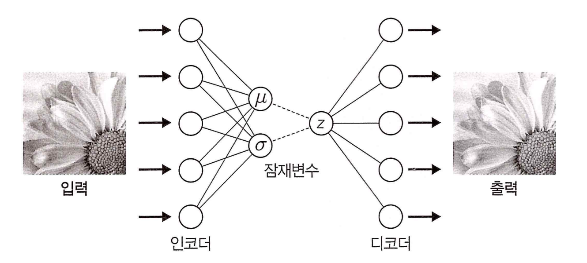
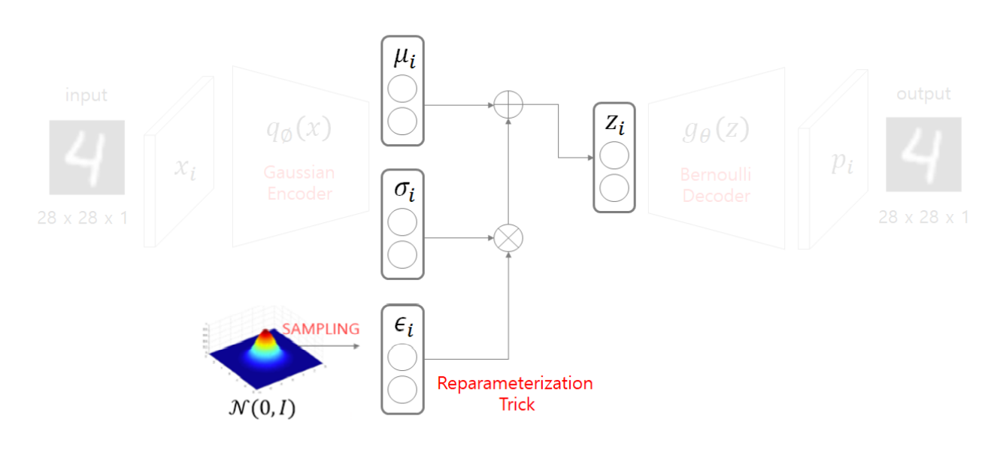

## 비지도 학습(Unsupervised Learning)

### VAE(Variational AutoEncoder)

- 도입

  - Auto Encoder의 목적을 생각하고 Manifold에서 새로운 Data를 생성

- 목적

  - Manifold Learning을 통해 Feature의 차원을 줄이는게 목적이다.

  - Manifold 위에 찍힌 점을 찍는다면 어떻게 될까?

    - 데이터를 새로 생성할 수 있지 않을까?
    - 실제 결과는 제대로된 데이터가 생성되진 않는다.
    - Laten Space는 입력 데이터들에 대한 특징 정보들을 함축하고 있는데, 그렇다면 데이터를 생성할 순 없을까?

    

    

- Generative Model

  - Goal: Data Set에 존재할만한 Data를 생성해 낸다.
  - 종류
    - Variation AutoEncoder
    - Generative Adversarial Network

- Density Estimation

  - 데이터를 제대로 생성해내지 못한 이유를 생각해보자.

    - 데이터 자체의 Density(밀도)가 많이 떨어진다.
    - 해결법: 데이터의 밀도를 추정하면 됨

  - Unsupervised Learning: DataSet이 존재하면 DataSet의 밀도를 추정하여 확률 밀도 함수를 만든다. 물론, <b>함수 자체를 알 수 없다.</b>

  - 확률 밀도 함수(pdf) 생성 -> Data Set의 분포를 알 수 있다.

    

    

    

- Variational Autoencoder

  

  - 학습 데이터의 분포를 따르는 새로운 데이터를 만드는 AutoEncoder 기반의 생성 모델
  - AE는 Encoder를 이용해 차원을 축소하기 위한 목적
  - VAE는 Decoder를 이용해 새로운 Data를 생성하기 위한 Model

- Variational(변분법) Method

  - 어떤 함수 p(x)의 극점을 찾는 문제에서 해당 함수를 직접 다루는 것이 쉽지 않을 때, 쉽게 다룰 수 있는 다른 함수 q(x)로 대체해 이를 최적화 하여, p(x)에 대한 근사적인 해를 구하는 방법

  - HOW?

    

    

    - 단계1. Encoder

      

      

    - 단계2. Reparameterization Trick (Sampling)

      

      

      - 새로운 Data를 생성하기 위해 Sampling을 통해 Decoding 해준다.

      - Sampling을 위해 Data의 평균과 분산을 학습한다.

      - Sampling 없이 추론한 경우

        

      - Reparameterized form

        

        - 우리가 추정하고 싶은 확률 분포

          

          - Sampling 결과를 backpropagation 할 수 없다.

        - reparmeterization trick을 통해 추정할 식

          

          

          - 정규분포에서 z(i)를 샘플링 하는것과 ε을 정규분포에서 샘플링하고 그 값을 분산과 곱하고 평균을 더하는것은 같은 분포를 갖는다.

    - 단계3. Decoder

      

      

      - p(i)의 값을 Bernoulli 시행의 결과로 가정했기 때문에 activation function은 sigmoid로 설정 준다.

    - Loss Function

      

      - Loss Function은 Reconstruction Error와 Regularization 두가지를 고려해야 한다.
        - Reconstruction Error : input data와 output data에 대한 손실함수이다.
          - Decoder의 결과가 Bernoulli 분포를 따른다고 가정하였으므로 확률값으로 손실함수를 계산할 수 있는 cross entropy를 사용
        - Regularization : 원래 Data가 갖고있는 True 분포에 근사하기 위한 loss function
          - True pdf와 Approximated pdf 두 확률 분포간의 차이를 계산하기 위해 <u><b>Kullback–Leibler divergence</b></u> 방식을 사용한다.

- 참고

  

  

  

  - 확률분포 학습에 따른 새로운 Data 출력

    

    

    

