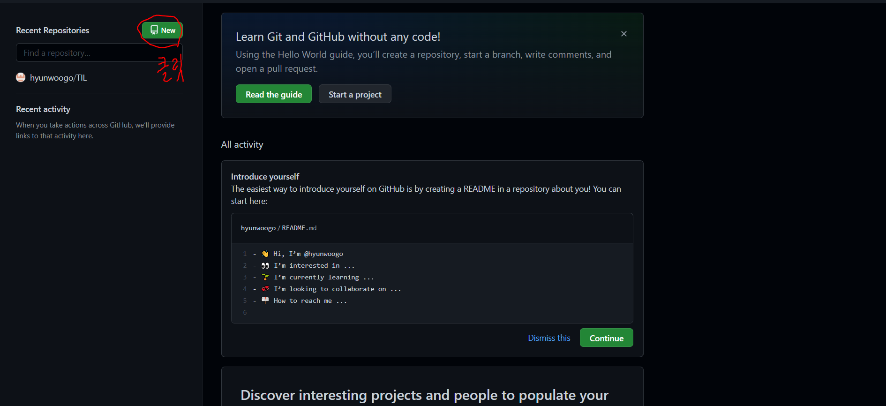
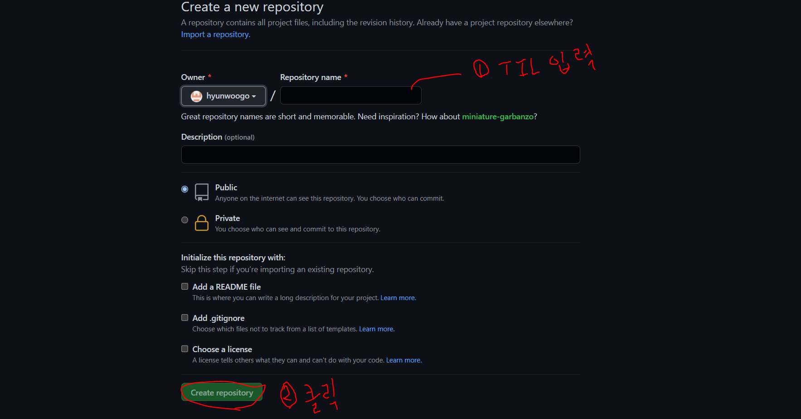

# 2일차 정리

## 1. 1일차 복습

### 1. CLI

- 커맨드라인 명령어

### 2. 마크다운

- 마크다운과 마크업
- 마크다운 역할
- 마크다운 문법
  - 제목
  - 목록
  - 강조
  - 코드
  - 링크
  - 이미지
  - 구분선
  - 표
  - 인용문

### 3. GIT(버전관리 프로그램) 기초

-  GIT의 3공간
  - 분장실, 무대, 사진 촬영본
  - Working Directory, Staging Area, Commits
- GIT 명령
- GIT 초기 설정

### 4. TIL

- `Today I Learned`


---

## GITHUB

### 1. GITHUB 가입

1. [githun 사이트 링크](https://github.com/)
2. TIL repository 생성(remote)

- 
- 
3. TIL repository 연걸(remote-local)

   - local `TLI` repository에서 `bash`를 키고 아래 코드를 입력

     ```bash
     git remote add origin https://github.com/hyunwoogo/TIL.git	# 연결
     git remote -v	# 연결확인
     
     ## git remote rm [이름][경로]를 통해 연결을 해제 할 수도 있음 
     ```

4.  README.md 파일 만들기

   - local `TLI` repository에서 `bash`를 키고 아래 코드를 입력

     ``` bash
     touch README.md
     ```
### 2. init 부터 push까지(상향식)

```bash
git init
git add 파일명	# 수정 후 커밋할 파일 추가해줌
git status	# 현재 상태 확인
git commit -m "메시지"		# 커밋을 하는 과정 메시지에 커밋하는 이유 기술
git log --oneline	# 커밋 확인
git push origin master	# local에 있는 커밋된 파일을 origin의 master branch remote로 push해줌

## 연결부분 : git remote add origin https://github.com/hyunwoogo/TIL.git 은 위에서 해주어서 따로 해주지 않음
```

``` bash
### README.md push해주는 예제
git add README.md
git status
git commit -m "README.md"
git log --oneline
git push origin master

##참고 git add . : 현재위치에 있는 모는 파일을 SA(Staging Area)로 올린다(수정된것만)
```


### 3. .gitignore

- 개념 : 해당 Repository 자체를 commit하여도 github에 의해 버전관리가 되지 않는 것

  - ex) 은행계좌정보, 개인정보, ....

  1. `.gitignore`파일 생성

     ```bash
     touch .gitignore
     ```

  2.  `.gitignore`파일에 ignore할 운영체제, 프로그래밍 언어 등을 입력

     - ex) JupyterNotebook, Python

     ```bash
     
     # Created by https://www.toptal.com/developers/gitignore/api/jupyternotebooks,python
     # Edit at https://www.toptal.com/developers/gitignore?templates=jupyternotebooks,python
     
     ### JupyterNotebooks ###
     # gitignore template for Jupyter Notebooks
     # website: http://jupyter.org/
     
     .ipynb_checkpoints
     */.ipynb_checkpoints/*
     
     # IPython
     profile_default/
     ipython_config.py
     
     # Remove previous ipynb_checkpoints
     #   git rm -r .ipynb_checkpoints/
     
     ### Python ###
     # Byte-compiled / optimized / DLL files
     __pycache__/
     *.py[cod]
     *$py.class
     
     # C extensions
     *.so
     
     # Distribution / packaging
     .Python
     build/
     develop-eggs/
     dist/
     downloads/
     eggs/
     .eggs/
     lib/
     lib64/
     parts/
     sdist/
     var/
     wheels/
     share/python-wheels/
     *.egg-info/
     .installed.cfg
     *.egg
     MANIFEST
     
     # PyInstaller
     #  Usually these files are written by a python script from a template
     #  before PyInstaller builds the exe, so as to inject date/other infos into it.
     *.manifest
     *.spec
     
     # Installer logs
     pip-log.txt
     pip-delete-this-directory.txt
     
     # Unit test / coverage reports
     htmlcov/
     .tox/
     .nox/
     .coverage
     .coverage.*
     .cache
     nosetests.xml
     coverage.xml
     *.cover
     *.py,cover
     .hypothesis/
     .pytest_cache/
     cover/
     
     # Translations
     *.mo
     *.pot
     
     # Django stuff:
     *.log
     local_settings.py
     db.sqlite3
     db.sqlite3-journal
     
     # Flask stuff:
     instance/
     .webassets-cache
     
     # Scrapy stuff:
     .scrapy
     
     # Sphinx documentation
     docs/_build/
     
     # PyBuilder
     .pybuilder/
     target/
     
     # Jupyter Notebook
     
     # IPython
     
     # pyenv
     #   For a library or package, you might want to ignore these files since the code is
     #   intended to run in multiple environments; otherwise, check them in:
     # .python-version
     
     # pipenv
     #   According to pypa/pipenv#598, it is recommended to include Pipfile.lock in version control.
     #   However, in case of collaboration, if having platform-specific dependencies or dependencies
     #   having no cross-platform support, pipenv may install dependencies that don't work, or not
     #   install all needed dependencies.
     #Pipfile.lock
     
     # poetry
     #   Similar to Pipfile.lock, it is generally recommended to include poetry.lock in version control.
     #   This is especially recommended for binary packages to ensure reproducibility, and is more
     #   commonly ignored for libraries.
     #   https://python-poetry.org/docs/basic-usage/#commit-your-poetrylock-file-to-version-control
     #poetry.lock
     
     # PEP 582; used by e.g. github.com/David-OConnor/pyflow
     __pypackages__/
     
     # Celery stuff
     celerybeat-schedule
     celerybeat.pid
     
     # SageMath parsed files
     *.sage.py
     
     # Environments
     .env
     .venv
     env/
     venv/
     ENV/
     env.bak/
     venv.bak/
     
     # Spyder project settings
     .spyderproject
     .spyproject
     
     # Rope project settings
     .ropeproject
     
     # mkdocs documentation
     /site
     
     # mypy
     .mypy_cache/
     .dmypy.json
     dmypy.json
     
     # Pyre type checker
     .pyre/
     
     # pytype static type analyzer
     .pytype/
     
     # Cython debug symbols
     cython_debug/
     
     # PyCharm
     #  JetBrains specific template is maintainted in a separate JetBrains.gitignore that can
     #  be found at https://github.com/github/gitignore/blob/main/Global/JetBrains.gitignore
     #  and can be added to the global gitignore or merged into this file.  For a more nuclear
     #  option (not recommended) you can uncomment the following to ignore the entire idea folder.
     #.idea/
     
     # End of https://www.toptal.com/developers/gitignore/api/jupyternotebooks,python
     ```

  3.  저장 후 다시 push 절차까지

     ```bash
     git add .gitignore
     git commit -m "add .gitignore"
     git push origin master
     ```

     - [.gitignore 사이트](https://www.toptal.com/developers/gitignore) : 접속하여 자신이 원하는 gitignore 코드 생성 가능


### 4.  clone, pull(하향식)

1. clone

   - remote에 있는것을 그대로 ***복제***해서 local로 가져옴(이미 가져온것은 remote에서 업데이트하면 갱신 X)

     ```bash
     git clone [url][폴더명]
     ```

2. pull

   - push의 반대 개념, remote에서 local 로 가져옴

     ```bash
     git pull origin master
     ```

3. conflict 만들기

   - remote(github) 웹페이지에서 수정하고 local에서 수정후 commit하려 하면 reject 오류가 남

   - 먼저 pull을 수행한 다음 수정본 중 어떤것(github에서 수정한 것/ local에서 수정한 것/ 둘다 반영/ 두개 비교)을 반영할것인지 선택 후 파일을 저장하고 아래의 코드 입력

     ```bash
     git add .
     git commit -m "메시지(fix conflict)"
     git push origin master
     ```

     
