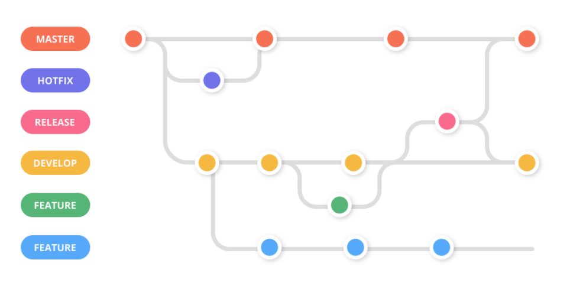
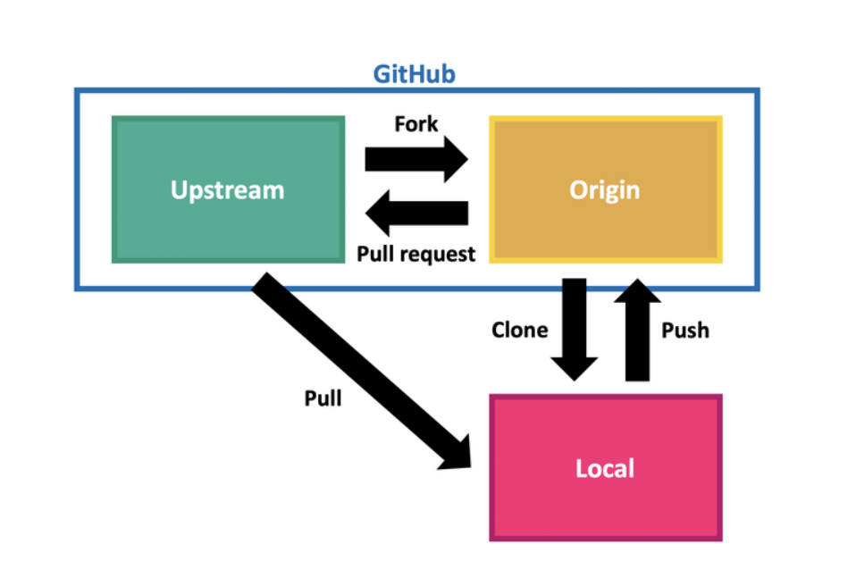

### Branch

- 독립적인 공간
- master와 같은 내용을 가지고 뻗어나옴
- 완전히 작업을 완료한 후에 master로 추가된다. (merge)
- 상용, 배포, 서비스 운영 중인 master에서 작업할 수 없기 때문에 사용한다.

1. git branch

- 브랜치 조회, 생성, 삭제 관련 명령어

```bash
# 브랜치 목록 확인
git branch

# 브랜치 생성
git branch 신규브랜치명

# 브랜치 삭제
git branch -d 브랜치명	# merge하지 않은 브랜치는 이 명령어로 삭제 되지 X
git branch -D 브랜치명	# 강제삭제 옵션
```

2. git switch

- 다른 브랜치로 이동하는 명령어

```bash
# 브랜치 이동
git switch 이동할 브랜치 명

# 브랜치 생성 후 이동
git switch -c 브랜치명
```

3. git merge

```bash
# 브랜치 병합
git branch merge 브랜치명

# 주의! 내가 기준으로 가지고 있을 브랜치에 위치
# master에서 하위 브랜치들을 merge 해야함
```

4. git diff

```bash
git diff 해쉬값 해쉬값
# 해쉬값들 사이에 바뀐것 확인 가능
```


---

- 브랜치 사용 예제

1. 브랜치 생성 후 삭제

```bash
git switch -c test	# test 브랜치 생성 후 test 브랜치로 이동
git branch	# 브랜치 확인
git switch master
git branch -d test	# test 브랜치 삭제

# test 브랜치에서 작없 한것이 없기 때문에 바로 삭제 가능
```

2. 브랜치 생성 후 작업

```bash
mkdir git_branch_practice	# 폴더생성
cd git_branch_practice	# 생성한 폴더로 이동
touch README.md		# README파일 생성
git init
git add .	# 변경된 사항들 모두 추가
git commit -m "initial README.md-master"

# README.md에 다시 내용 작성 후 저장
git add . 
git commit -m "update README.md-master"


git branch	# 브랜치 목록 확인
git branch hotfix	# hotfix 브랜치 생성
git switch hotfix	# hotfix 브랜치로 이동

touch a.txt	# 새파일 생성

git add.
git status
git commit -m "update README-hotfix"
git switch master	# hotfix에서 작성한것들이 모두 사라짐
					# 다시 hotfix 브랜치로 들어가면 표시됨
					
git log --oneline --all --graph	# 지금까지 commit작업 한것들이 순서도 처럼 나옴
git log --online	# 현재 head로 지정되어 있는 브랜치를 보기 위함

```

---

### Branch 실습 (놀이공원 어트랙션 만들어 보기)

- bash에서 아래 코드 선행 작업

```bash
git log --global core.editor "code --wait"	
# commit 뒤에 -m옵션 적어주지 않아됨
# vscode 상에서 commit 메시지 쓰기 위해 설정
# vim -> vscode로 코어 에디터를 바꿔준것
# wait 옵션 : 내가 종료하기 전 까지 기다리라고 명령한것

git config --global --list	# 명령이 잘 되었는지 확인
```

- vscode에서 본 학습 진행

1. 파일 만든후 README.md에 내용 입력

```bash
mkdir attraction	# user에 새 디렉토리 생성
touch README.md

# 놀이공원 어트랙션
- 바이킹
```

2.  add -> commit(vscode에서)

```bash
git add . 
git commit	
# vscode commit_deitmsg 창에 commit 메시지 "first commit" 입력
# 저장 후 창끄기
```

3. README.md에 내용 추가 입력

```bash
# 아틀란티스 입력
# t익스프레스
```

4.  add -> commit

```bash
git add .
git commit -m "second commit"
# README.md 파일에 t익스프레스 입력
git add .
git commit	# vscode에 commit 메시지 "third commit" 입력

```

5. 하위 브랜치 "water" 생성

```bash
git switch -c water	# water 브랜치 생성후 water 브랜치로 이동
```

6. water 브랜치에 내용입력 후 commit

```bash
# water 브랜치에 후룸라이드 입력
git add . 
git commit -m "first commit_water"
# water 브랜치에 아마존 익스프레스 입력
git add . 
git commit -m "second commit_water"
# water 브랜치에 아쿠아리움 입력
git add . 
git commit -m "third commit_water"

```

7. water브랜치를 master에 병합

```bash
git switch master	# master브랜치로 이동
git merge water		# master브랜치에 water브랜치 합치기
git branch -d water	# 병합 마친 water브랜치 삭제

```


---

### merge confilct 예제

- merge confilct를 일부러 낸 후 해결하는 과정까지

1. 실습할 디렉토리 생성부터 commit까지

```bash
mkdir merge_practice
git init
touch README.md

# "master에서 마스터에서 작성1" 작성 후 저장

git add .
git commit
# vscode에 commit 메시지 "first commit-master"입력
```

2. 새로운 프랜치 생성 후 commit까지

```bash
git branch test
git branch	# 브랜치 목록 확인
git switch test

# "테스트에서 작성 1" 작성 후 저장
git add .
git commit -m "first commit-test"

```

3. 다시 master브랜치로 돌아가 내용 입력 후 commit까지

```bash
git switch master

# "마스터에서 작성 2" 입력 후 저장
git add .
git commit
# vscode에 commit 메시지 "second commit-master"
git merge test	# conflict 발생
```

4. 해결 방법

```bash
# 4가지 선택지 중 3번째 both 선택 후 저장
git add .
git commit -m "fix conflict"
```

---

### Workflow

- 워크 플로우의 종류

  1. Feature Branch Workflow (작업 권한(소유권)이 있는 상태)

     > - user(팀원)이 바로 clone을 써서 복제 가능
     > - 각각의 해야하는 업무를 branch를 만들어 거기서 수정 후 push
     > - 팀장이 GitHub에서 검토 후 (Pull Request) mater로 병합한 뒤 브랜치들 모두 삭제
     > - 다시 user 들이 remote에 master를 pull한 뒤 각자 작업하던 branch 삭제
     > - 다시 업무에 대한 branch 만들고 작업
     >
     > 그림 예제
     >
     > 
  
  2. Forking Workflow (작업 권한(소유권)이 없는 상태)
  
     > - 다른 사람의 원본을 내 remote로 복제해서 옴 (fork를 찍듯 푹 찍어서 옴)
     > - 내 local에 다시 clone해옴
     > - git remote add upstream [원본 URL]
     > - 기능 추가를 위해 local 에서 branch 생성 및 기능 구현
     > - 기능 구현 후 원격 저장소에 branch 반영
     > - 권한이 없기 때문에 Pull Request를 원본으로 보냄
     > - 승인을 받으면 나의 remote에 branch 삭제
     > - 원본으로 부터 master를 pull 당겨옴
     > - 원래 branch 삭제하고 다른 기능 구현을 위해 새로운 branch 생성
     >
     > 그림 예제
     >
     > 
