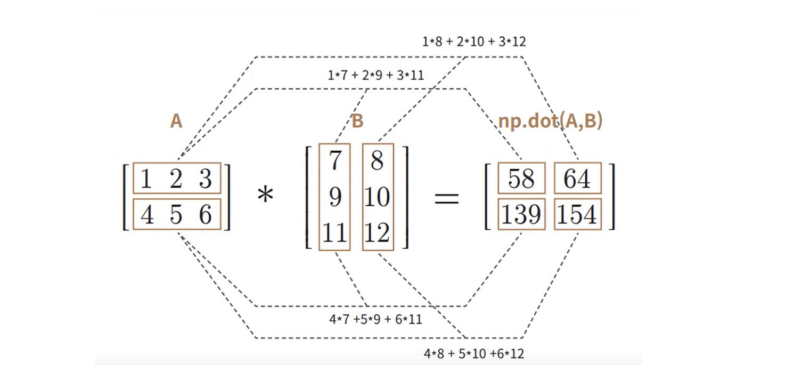

# NUMPY

- `Numerial Python`
- 산술 계산을 위한 패키지
  - 다차원 배열인 `ndarray` 는 빠른 배열 계산을 제공
  - 반복문을 작성할 필요 없이 전체 데이터 배열을 빠르게 계산할 수 있는 표준 수학 함수
  - 선형대수, 난수 생성시, 푸리에 변환 등 가능
- 일반적인 산술 데이터 처리를 위한 기본 라이브러리 제공
  - 연산 처리 후 통계나 분석데이터를 처리하기 위해선 `Pandas`를 사용
- 파이썬 산술 계산 영역에서 중요한 위치를 차지하는 이유 중 하나는 대용량 데이터 배열을 효율적으로 다룰 수 있도록 설계되어 있기 때문
- `Numpy` 사용 예제

```python
import numpy as np	# 보통 np로 많이 씀

my_arr = np.arange(1000000)
my_list = list(range(1000000))
```

- 1차원 배열 생성

```python
print(type(my_arr))		# <class 'numpy.ndarray'>
print(type(my_list))	# # <class 'list'>
```

```python
# 타입 뿐만 아니라 출력 했을때 모양이 비슷한듯 다름
print(my_arr)	# [ 0 1 2 3 ... 999999 ]
print(my_list)	# [0, 1, 2, 3, ..., 999999]

# array는 띄어쓰기로만 구분 list는 쉼표(,)로 구분
```

- 다차원 배열 객체

  - `Numpy`는 `ndarray` 라고 하는 N차원 배열 객체를 사용

    - 1차원 : `Vector`
    - 2차원 : `Matrix`
    - 3차원 : `Tensors`

    

- `ndarray`

  - `ndarray` 형태(shape)와 차원

  - | array                  | 차원   | shape  |
    | ---------------------- | ------ | ------ |
    | [1 2 3]                | 1 차원 | (3, )  |
    | ([1 2 3]<br />[4 5 6]) | 2 차원 | (2, 3) |

    - `ndarray`의 shape은 `ndarray.shape` 속성으로, 차원은 `ndarray.ndim` 속성으로 알 수 있음

  - `ndarray` 생성하기 예제(list -> array)

  ```python
  import numpy as np
  
  data1 = [5, 7, 8, 1, 4]
  type(data1)		# list
  arr1 = np.array(data1)
  type(arr1)		# numpy.ndarray
  print(arr1)		# [5 7 8 1 4]
  ```

  - 2차원 배열 생성 예제

  ```python
  import numpy as np
  
  arr1 = np.array([[1, 2, 3], [4, 5, 6]])		# 2차원을 할때 대괄호('[]')를 한 번 더 써줘야 댐
  print(arr1)
  '''
  <출력값>
  [[1 2 3]
  [4 5 6]]
  '''
  ```

  - `ndarray 타입(type)`
  
    - `ndarray` 내의 데이터값은 `숫자형`, `문자열`, `불(bool)` 등이 가능
    - 숫자형의 경우 `int(8bit, 16bit, 32bit)`, `unsigned int형(8bit, 16bit, 32bit)`, `float형(16bit, 32bit, 64bit, 128bit)`, 그리고 이보다 더 큰 숫자값이나 정밀도를 위해 `complex 타입`도 제공
    - ndarray 내의 데이터 타입은 그 연산의 특성상 같은 데이터 타입만 가능
    - 한 개의 ndarray객체에 int와 float가 함께 있을 수 없음
    - ndarray내 데이터 타입은 ndarray.dtype으로 확인 가능
  
  - `ndarray` 타입(type) 변환
  
    - `astype()`을 이용하여 변환
      - 변경을 원하는 타입을 `astype(X)`에 인자로 입력
      - 대용량 데이터를 `ndarray`로 만들 때 메모리를 절약하기 위해 자주 사용
      - 0, 1, 2와 같이 크지 않는 범위의 숫자를 위해서 64bit float형보다는 8bit 또는 16bit의 int 형으로 변환하는 것이 훨씬 메모리를 절약
    - 대용량 데이터를 다룰 시 메모리 절약을 위해서 형변환을 특히 고려
  
  - `axis축`
  
    - `ndarray의 shape`은 행, 열, 높이 단위로 부여되는 것이 아니라 `axis0, axis1, axis2`와 같이 `axis` 단위로 부여
  
    
  
  - `ndarray`를 편리하게 생성하기 - `arrange`, `zeros`, `ones`
  
    - 특정 크기와 차원을 가진 ndarray를 연속값이나 0 또는 1로 초기화 생성해야 할 경우 `arrange()`, `zeros()`, `ones()`를 이용해 쉽게 ndarray 생성 가능
  
    ```python
    import numpy as np
    
    np.arrange(10)	# [0 1 2 3 4 5 6 7 8 9]
    np.zeros((3, 2), dtype = 'int32')
    '''
    [[0 0]
    [0 0]
    [0 0]]
    '''
    
    np.ones((3, 2))
    '''
    [[1. 1.]
    [1. 1.]
    [1. 1.]]
    '''
    ```
  
  - `reshape()`
  
    - `reshape()`는 ndarray를 특정 차원 및 형태로 변환
    - 변환 형태를 함수 인자로 부여
  
    
  
    ```python
    import numpy as np
    
    array1 = np.arrange(10)	# 0 ~ 9 를 인자로 하는 array인 array1을 생성
    array1.reshape(2, 5)	# 2행 5열 형태로 reshape함수를 써서 바꿈
    
    print(array1)
    '''
    [[0 1 2 3 4]
    [5 6 7 8 9]]
    '''
    ```
  
    - `reshape()`는 reshape(-1, 1), reshape(-1, )와 같은 형식으로 변환 요구되는 경우가 많음
    - 주로 머신러닝 API의 인자로 1차원 ndarray를 명확하게 2차원 ndarray로 변환하여 입력하기를 원하거나, 또는 반대의 경우가 있을 경우 reshape()를 이용하여 ndarray의 형태를 변환 시켜주는데 사용
  
    ```python
    import numpy as np
    
    array1 = np.arange(5)
    array1 = array1.reshape(-1, 1)
    
    print(array1)
    '''
    [[0]
    [1]
    [2]
    [3]
    [4]]
    '''
    ```
  
    
  
- `numpy 배열`의 산술 연산

  - `numpy 배열`은 반복문을 작성하지 않고 데이터를 일괄 처리할 수 있음
    - `벡터화`라고 부름

  ```python
  import numpy as np
  
  arr1 = np.array([[1, 2, 3],
                  [4, 5, 6]])
  
  # 요소곱
  print(arr1 * arr1)
  '''
  [[1 4 9]
  [16 25 36]]
  '''
  
  # 요소합
  print(arr1 + arr1)
  '''
  [[2 4 6]
  [8 10 12]]
  '''
  
  # 나눗셈
  print(1 / arr1)
  '''
  [[1. 0.5 0.333333]
  [0.25 0.2 0.16666667]]
  '''
  
  # bool(비교 연산)
  print(arr1 >= arr1)
  '''
  [[True True True]
  [True True True]]
  '''
  
  # 행렬곱
  print(np.doy(arr1, np.transpose(arr1)))
  '''
  [[14 32]
  [32 77]]
  '''
  ```

- 배열 `인덱싱 / 슬라이싱`

  - `numpy`배열은 `순차적(sequential)`데이터이기 때문에 인덱싱과 슬라이싱 가능

  

  - ndarray의 데이터 세트 선택하기 - **2차원 ndarray**

  

  
  
  - ndarray의 데이터 세트 선택하기 - **팬시 인덱싱**
  
  
  
  
  
  - ndarray의 데이터 세트 선택하기 - **불린 인덱싱**
  
    - 조건 필터링과 검색을 동시 가능
  
    - ndarray내의 값이 5보다 큰 ndarray를 추출(예제)
  
      - array1d = np.arange(start = 1, stop = 10)
  
      
  
  - 배열 인덱싱 / 슬라이싱 예제
  
  ```python
  import numpy as np
  
  arr1 = np.arange(10)
  print(arr1)		# [0 1 2 3 4 5 6 7 8 9]
  
  print(arr1[5])
  
  print(arr1[5:8])	# arr1의 5번 ~ 7번
  ```
  
- 배열의 정렬 - `sort()`

  - `np.sort()`
    - 원 행렬은 그대로 유지한 채 원 행렬의 정렬된 행렬을 반환
  - `ndarray.sort()`
    - 원 행렬 자체를 정렬한 형태로 변환하며 반환 값은 **`None`**
  - 기본적으로 `오름차순`으로 정렬
  - 내림차순으로 정렬하기 위해서는 `[::-1]` 적용
  - 2차원 배열에서 `axis` 기반의 `sort()`

  

- 배열의 정렬 - `argsort()`

  - 원본 행렬 정렬 시 정렬된 행렬의 원래 인덱스를 필요로 할 때 `np.argsort()`를 이용
  - 정렬 행렬의 원본 행렬 인덱스 값을 `ndarray` 형으로 반환

  

- 행렬곱

  - np.dot(A, B)

  

- 전치 행렬 - `np.transpose()`

  - 2차원 이상 배열을 행과 열을 바꾸기 위해 사용
  - 1차원 배열은 행과 열 바꾸기 불가능

  

  - 예제

  ```python
  import numpy as np
  
  arr = np.arange(15).reshape(3, 5)
  print(arr)
  '''
  [[0 1 2 3 4]
  [5 6 7 8 9]
  [10 11 12 13 14]]
  '''
  
  # 배열이름.transpose() = 배열이름.T = np.transpose(배열이름)
  
  print(arr.T)
  '''
  [[0 5 10]
  [1 6 11]
  [2 7 12]
  [3 8 13]
  [4 9 14]]
  '''
  
  ```

  

