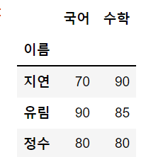

# 판다스(PANDAS)

- 파이썬에서 데이터 처리를 위해 존재하는 라이브러리
- 서로 다른 형식을 갖는 여러 종류의 데이터를 컴퓨터가 이해할 수 있도록 동일한 형식을 갖는 구조로 통합할 필요가 있음
- 일반적으로 대부분 데이터 셋은 행(Row) X 열(Column)로 구성된 2차원 데이터로 구성
- 행과 열의 2차원 데이터가 인기 있는 이유는 인간이 가장 이해하기 쉬운 데이터 구조이면서 효과적으로 데이터를 담을 수 있는 구조이기 때문
- 2차원 데이터를 효율적으로 가공/처리할 수 있는 다양한 기능을 제공
- 판다스는 시리즈(Series)와 데이터프레임(DataFrame)이라는 데이터 형식을 제공
- 판다스 주요 구성 요소 - `DataFrame`, `Series`, `Index`


---

### 1. 시리즈(Series)

- 데이터가 순차적으로 나열된 `1차원 배열(열벡터)`
- `인덱스(index)`는 `데이터 값(value)`과 일대일 대응
- 시리즈의 인덱스는 데이터 값의 위치를 나타내는 이름표(주소) 역할
- `딕셔너리`와 시리즈의 구조가 비슷하기 때문에 딕셔너리를 시리즈로 변환하는 방법을 많이 사용
- `PANDAS`의 내장 함수인 `Series()` 사용
  - 딕셔너리를 함수의 인자로 전달
- 딕셔너리를 시리즈로 변환하는 예제

```python
# 판다스 import
import pandas as pd

# key:value 를 쌍으로 갖는 딕셔너리를 생성, 변수 dict_data에 저장
dict_data = {'a' : 1, 'b' : 2, 'c' : 3}

# 판다스 Series() 함수로 딕셔너리를 시리즈로 변환, 변수 sr에 저장
sr = pd.Series(dict_data)

# sr의 자료형 출력
print(type(sr))  # <class 'pandas.core.series.Series'>

# 변수 sr에 저장되어 있는 시리즈 객체 출력
print(sr)
'''
a	1
b	2
c	3
dtype: int64
'''
```

> - 시리즈 객체 출력 시 인덱스 'a', 'b', 'c'는 왼쪽에 표시
> - 인덱스와 짝을 이루는 데이터 값 1, 2, 3은 오른쪽에 표시
> - 시리즈를 구성하는 데이터 값의 자료형은 정수형(int64)
> - `"as pd"`는 판다스를 `"pd"`라는 약칭으로 부르겠다는 뜻
> - 인덱스는 자기와 짝을 이루는 데이터 값의 순서와 주소를 저장
> - 인덱스를 활용하여 데이터 값의 탐색, 정렬, 선택, 결합 등 데이터의 조작을 쉽게 할 수 있음

- 리스트를 시리즈로 변환하는 예제

```python
import pandas as pd

# 리스트 생성, 변수 list_data에 저장
list_data = ['2022-02-21', 3.14, '홍길동', 100, True]
sr = pd.Series(list_data)

print(sr)

# 결과값
'''
0    2022-02-21
1          3.14
2           홍길동
3           100
4          True
dtype: object
'''
```

> - 인덱스를 별도로 정의하지 않았기 때문에 디폴트로 정수형 위치 인덱스(0, 1, 2, 3, 4)가 자동 적용
> - 시리즈를 구성하는 원소 데이터 값의 자료형은 문자열(object)
>   - 숫자와 문자열이 데이터에 혼합되어 있을 경우 자료형이 문자열로 표기
> - 리스트와 판다스의 시리즈는 둘 다 동일하게 인덱스를 소유
>   - 리스트는 정수형 위치 인덱스만 존재
>   - ex) list_data[0]
> - 시리즈는 정수형 위치 인덱스와 인덱스 이름 둘 다 존재
>   - ex1) sr[o]
>   - ex2) sr['날짜']
> - 시리즈의 index/values 속성을 이용하여 데이터 값 따로 선택 가능

- 시리즈의 인덱스와 데이터를 따로 확인하는 예제

```python
import pandas as pd

list_data = ["2022-02-21", 3.14, "홍길동", 100, True]
sr = pd.Series(list_data)

# 인덱스 배열은 변수 idx에 저장, 데이터 값 배열은 변수 val에 저장
idx = sr.index
val = sr.values
print(idx)
print(val)

print(type(val))

'''
출력값

RangeIndex(start=0, stop=5, step=1)
['2022-02-21' 3.14 '홍길동' 100 True]
<class 'numpy.ndarray'>
'''
```

> - 인덱스는 0 ~ 4 범위의 정수를 갖는 RangeIndex 객체로 출력
> - 데이터 값은 1차원 배열 형태(array)로 출력


### 2. 데이터 프레임(DataFrame)

- 2차원 배열

- 여러 개의 열벡터(시리즈)들이 같은 행 인덱스를 기준으로 결합된 2차원 벡터 또는 행렬(matrix)

- 행과 열을 나타내기 위해서는 행 인덱스와 열 이름 두가지 종류의 주소를 사용

  - 열은 공통의 속성을 갖는 일련의 데이터의 집합
  - 행은 공통적이고 다양한 속성 데이터들의 모음인 레코드(record)

- 데이터프레임 만들기 전 생각해보기

  1.  데이터프레임을 만들기 위해서는 같은 길이의 1차원 배열(Series)이 여러개 필요

  2.  딕셔너리 값에 해당하는 각 리스트가 시리즈 배열로 변환되어 데이터 프레임의 열이 됨

  3.  딕셔너리 키는 각 시리즈의 이름으로 변환되어 데이터프레임의 열 이름이 됨

  4. 데이터프레임을 만들 때는 판다스 DataFrame() 함수를 사용

     <u><b>`딕셔너리 -> 데이터프레임 변환: pandas.DataFrame(딕셔너리 객체)`</b></u>

- 딕셔너리 -> 데이터프레임 변환 예제

```python
import pandas as pd

# key:value를 쌍으로 갖는 딕셔너리를 생성, 변수 dict_data에 저장
dict_data = {'c0': [1, 2, 3], 'c1' : [4, 5, 6], 'c2' : [7, 8, 9], 'c3' : [10, 11, 12], 'c4' : [13, 14, 15]}

# 판다스 DataFrame() 함수로 딕셔너리를 데이터프레임으로 변환, 변수 df에 저장
df = pd.DataFrame(dict_data)

print(type(df))	# <class 'pandas.core.frame.DataFrame'>

print(df)
'''
   c0  c1  c2  c3  c4
0   1   4   7  10  13
1   2   5   8  11  14
2   3   6   9  12  15
'''
```

- 행 인덱스/열 이름 설정

  - 2차원 배열 -> 데이터프레임 변환할 때 행 인덱스와 열 이름 속성을 사용자가 직접 지정 가능

    <u><b>`행 인덱스, 열 이름 설정: pandas.DataFrame(2차원 배열, index=행 인덱스 배열, columns=열 인덱스 배열)`</b></u>

- 행 인덱스 / 열 이름 설정 예제

```python
import pandas as pd

# 행 인덱스 / 열 이름을 지정하여 데이터프레임 만들기
df = pd.DataFrame([[22, '남', '인천대'], [21, '여', '경기대'], [20, '남', '부산대']],
                  index=['규석', '영신', '성민'],
                  columns=['나이', '성별', '학교'])

print(df)
'''
    나이 성별   학교
규석  22  남  인천대
영신  21  여  경기대
성민  20  남  부산대
'''


print(df.index)		# Index(['규석', '영신', '성민'], dtype='object')
print(df.columns)	# Index(['나이', '성별', '학교'], dtype='object')
```

- 행 인덱스 / 열 이름 변경

  <u><b>`행 인덱스 변경: DataFrame 객체.index = 새로운 행 인덱스 배열`</b></u>

  <u><b>`열 이름 변경: DataFrame 객체.columns = 새로운 열 이름 배열`</b></u>

- 행 인덱스 / 열 이름 변경 예제

```python
import pandas as pd

# 행 인덱스 / 열 이름을 지정하여 데이터프레임 만들기
df = pd.DataFrame([[22, '남', '인천대'], [21, '여', '경기대'], [20, '남', '부산대']],
                  index=['규석', '영신', '성민'],
                  columns=['나이', '성별', '학교'])

df.index = ['준서', '지연', '성철']
df.columns = ['연령', '남녀', '소속']

print(df)

'''
    연령 남녀   소속
준서  22  남  인천대
지연  21  여  경기대
성철  20  남  부산대
'''

print(df.index)		# Index(['준서', '지연', '성철'], dtype='object')
print(df.columns)	# Index(['연령', '남녀', '소속'], dtype='object')
```


- `rename()` 함수를 사용하여 행 인덱스 / 열 이름 변경 가능

  <u><b>`행 인덱스 변경: DataFrame 객체.rename(index={기존 인덱스:새 인덱스, ...})`</b></u>

  <u><b>`열 이름 변경: DataFrame 객체.rename(columns={기존 열 이름:새 열 이름, ...})`</b></u>

  

- 행 인덱스 / 열 이름 변경 예제(rename)

```python
import pandas as pd

# 행 인덱스 / 열 이름을 지정하여 데이터프레임 만들기
df = pd.DataFrame([[22, '남', '인천대'], [21, '여', '경기대'], [20, '남', '부산대']],
                  index=['규석', '영신', '성민'],
                  columns=['나이', '성별', '학교'])

df.rename(index={'규석':'준서', '영신':'지연', '성민':'성철'}, inplace = True)
df.rename(columns={'나이':'연령', '성별':'남녀', '학교':'소속'}, inplace = True)

print(df)
'''
    연령 남녀   소속
준서  22  남  인천대
지연  21  여  경기대
성철  20  남  부산대
'''
```

> - inplace = True 를 쓰지 않으면 기존 객체가 변경되지 않음(기존 객체에 반영하기 위해 필수적으로 써줘야 됨)


- 행 / 열 삭제
  - 행 / 열 삭제 시 drop() 함수 사용
  - 행을 삭제할 때 축(axis) 옵션으로 axis=0 혹은 입력 X
  - 열을 삭제할 때 축(axis) 옵션으로 axis=1

행 / 열 삭제 예제

- 행 삭제 예제

```python
import pandas as pd

exam_data = {'국어' : [70, 90, 80], '수학' : [90, 85, 80], '영어' : [100, 80, 90], '음악' : [70, 90, 100]}
df = pd.DataFrame(exam_data, index=['인서', '형준', '소진'])

# 데이터프레임 df를 복제하여 변수 df2에 저장.
df2 = df

# 데이터프레임 df를 복제하여 변수 df3에 저장.
df3 = df

# df2의 1개 행(row) 제거
df2.drop(['인서'], axis = 0)
```


```python
# df2의 2개 행(row) 제거
df3.drop(['형준', '소진'], axis = 0)
```


- 열 삭제 예제

```python
import pandas as pd

exam_data = {'국어' : [70, 90, 80], '수학' : [90, 85, 80], '영어' : [100, 80, 90], '음악' : [70, 90, 100]}
df = pd.DataFrame(exam_data, index=['민혜', '재헌', '숙현'])

# 데이터프레임 df를 복제하여 변수 df2에 저장.
df2 = df

# 데이터프레임 df를 복제하여 변수 df3에 저장.
df3 = df

# df2의 1개 열(column) 삭제
df2.drop('국어', axis = 1)
```


```python
# df3의 2개 열(column) 삭제
df3.drop(['영어', '음악'], axis = 1)
```


- 행 선택
  - 인덱스 이름을 기준으로 행을 선택할 시 loc 이용
    - 범위 지정 시 범위 끝 포함
  - 정수형 위치 인덱스를 기준으로 행을 선택할 시 iloc 이용
    - 범위 지정 시 범위 끝 미포함
- 행 선택 예제

```python
import pandas as pd

exam_data = {'국어' : [70, 90, 80], '수학' : [90, 85, 80], '영어' : [100, 80, 90], '음악' : [70, 90, 100]}
df = pd.DataFrame(exam_data, index=['인서', '연정', '린하'])

# 행 인덱스 이름을 사용하여 행 1개 선택
label1 = df.loc['인서']
position1 = df.iloc[0]

print(label1)
'''
국어     70
수학     90
영어    100
음악     70
Name: 인서, dtype: int64
'''

print(position1)
'''
국어     70
수학     90
영어    100
음악     70
Name: 인서, dtype: int64
'''

print(type(position1))	# <class 'pandas.core.series.Series'>
```

> - 행 1개 선택시 시리즈 형태로 출력

```python
import pandas as pd

exam_data = {'국어' : [70, 90, 80], '수학' : [90, 85, 80], '영어' : [100, 80, 90], '음악' : [70, 90, 100]}
df = pd.DataFrame(exam_data, index=['인서', '연정', '린하'])

# 행 인덱스 이름을 사용하여 행 2개 선택
label2 = df.loc[['연정', '린하']]
position2 = df.iloc[[1, 2]]

print(label2)
'''
    국어  수학  영어   음악
연정  90  85  80   90
린하  80  80  90  100
'''

print(position2)
'''
    국어  수학  영어   음악
연정  90  85  80   90
린하  80  80  90  100
'''

print(type(position2))	# <class 'pandas.core.frame.DataFrame'>
```

> - 행 2개 이상 선택 시 데이터프레임 형태로 출력


- 열 선택
  - 열은 정수형 위치 인덱스라는 개념이 존재 X
- 열 선택 예제

```python
import pandas as pd

exam_data = {'국어' : [70, 90, 80], '수학' : [90, 85, 80], '영어' : [100, 80, 90], '음악' : [70, 90, 100]}
df = pd.DataFrame(exam_data, index=['요셉', '성훈', '동호'])

# '수학' 점수 데이터만 선택(열 선택)
math = df['수학']
print(math)
'''
요셉    90
성훈    85
동호    80
Name: 수학, dtype: int64
'''

# '영어' 점수 데이터만 선택(열 선택)
english = df.영어
print(english)
'''
요셉    100
성훈     80
동호     90
Name: 영어, dtype: int64
'''

# 열 두 개 선택
kor_music = df[['국어', '음악']]
print(kor_music)
'''
    국어   음악
요셉  70   70
성훈  90   90
동호  80  100
'''
```


- 원소 선택
  - 데이터프레임의 행 인덱스와 열 이름을 [행, 열] 형식의 2차원 좌표로 입력하여 원소 위치를 지정
    - <u><b>`인덱스 이름: DataFrame객체.loc[행 인덱스 이름, 열 이름]`</b></u>
    - <u><b>`정수 위치 인덱스: DataFrame객체.iloc[행 번호, 열 번호]`</b></u>
      - loc와 iloc는 행 때문에 사용
- 원소 선택 예제

```python
import pandas as pd

exam_data = {'이름' : ['용준', '수빈', '재영'],
             '국어' : [70, 90, 80],
             '수학' : [90, 85, 80], 
             '영어' : [100, 80, 90], 
             '음악' : [70, 90, 100]}
df = pd.DataFrame(exam_data)

print(df)
'''
   이름  국어  수학   영어   음악
0  용준  70  90  100   70
1  수빈  90  85   80   90
2  재영  80  80   90  100
'''

# '이름' 열을 새로운 인덱스로 지정, df 객체에 변경 사항 저장
df.set_index('이름', inplace = True)
print(df)
'''
    국어  수학   영어   음악
이름                  
용준  70  90  100   70
수빈  90  85   80   90
재영  80  80   90  100
'''

# 데이터프레임 df의 특정 원소 1개 선택('용준'의 '영어' 점수)
a = df.loc['용준', '영어']
print(a)	# 100

# 데이터프레임 df의 특정 원소 1개 선택('용준'의 '영어' 점수)
b = df.iloc[0, 2]
print(b)	# 100

# 데이터프레임 df의 특정 원소 2개 선택('수빈'의 '국어', '수학' 점수)
c = df.loc['수빈', ['국어', '수학']]
print(c)
'''
국어    90
수학    85
Name: 수빈, dtype: int64
'''

# 데이터프레임 df의 특정 원소 2개 선택('수빈'의 '국어', '수학' 점수)
d = df.iloc[1, [0, 1]]
print(d)
'''
국어    90
수학    85
Name: 수빈, dtype: int64
'''

# 데이터프레임 df의 특정 원소 2개 선택('수빈'의 '국어', '수학' 점수)
e = df.loc['수빈', '국어':'수학']
print(e)
'''
국어    90
수학    85
Name: 수빈, dtype: int64
'''

# 데이터프레임 df의 특정 원소 2개 선택('수빈'의 '국어', '수학' 점수)
f = df.iloc[1, 0:2]
print(f)
'''
국어    90
수학    85
Name: 수빈, dtype: int64
'''
```


- 행 인덱스의 이름을 바꿀 경우 index.rename() 함수 사용

```python
df.index.rename('성명', inplace = True)
```

- 직접 지정한 행 인덱스를 해제할 경우 reset_index() 사용

```python
df.reset_index('이름', inplace = True)
```


- 열 추가
  - <u><b>`DataFrame객체['추가하려는 열 이름'] = 데이터 값`</b></u>

- 열 추가 예제

```python
import pandas as pd

exam_data = {'이름' : ['건국', '예진', '원준'],
             '국어' : [70, 90, 80],
             '수학' : [90, 85, 80], 
             '영어' : [100, 80, 90], 
             '음악' : [70, 90, 100]}
df = pd.DataFrame(exam_data)

# 데이터프레임 df에 '체육' 점수 열(column) 추가
df['체육'] = [80, 70, 75]

print(df)
'''
   이름  국어  수학   영어   음악  체육
0  건국  70  90  100   70  80
1  예진  90  85   80   90  70
2  원준  80  80   90  100  75
'''
```

- 열을 중간에 추가하고 싶을 경우 insert() 함수 사용

```python
df.insert(3, "과학", [90, 80, 85])

print(df)
'''
   이름  국어  수학  과학   영어   음악  체육
0  건국  70  90  90  100   70  80
1  예진  90  85  80   80   90  70
2  원준  80  80  85   90  100  75
'''
```


- 행 추가
  - 추가하려는 행 이름과 데이터 값을 loc 인덱서를 사용하여 입력
    - <u><b>`DataFrame 객체.loc['새로운 행 이름'] = 데이터 값`</b></u>

- 행 추가 예제

```python
import pandas as pd

exam_data = {'이름' : ['재윤', '상범', '수지'],
             '국어' : [70, 90, 80],
             '수학' : [90, 85, 80], 
             '영어' : [100, 80, 90], 
             '음악' : [70, 90, 100]}
df = pd.DataFrame(exam_data)

print(df)
'''
   이름  국어  수학   영어   음악
0  재윤  70  90  100   70
1  상범  90  85   80   90
2  수지  80  80   90  100
'''

# 새로운 행(row) 추가 - 같은 원소 값 입력
df.loc[3] = 0
print(df)
'''
print(df)
print(df)
   이름  국어  수학   영어   음악
0  재윤  70  90  100   70
1  상범  90  85   80   90
2  수지  80  80   90  100
3   0   0   0    0    0
'''

# 새로운 행(row) 추가 - 원소 값 여러 개의 배열 입력
df.loc[4] = ['한결', 100, 75, 85, 80]
print(df)
'''
print(df)
print(df)
   이름   국어  수학   영어   음악
0  재윤   70  90  100   70
1  상범   90  85   80   90
2  수지   80  80   90  100
3   0    0   0    0    0
4  한결  100  75   85   80
'''

# 새로운 행(row) 추가 - 기존 행 복사
df.loc[5] = df.loc[3]
print(df)
'''
   이름   국어  수학   영어   음악
0  재윤   70  90  100   70
1  상범   90  85   80   90
2  수지   80  80   90  100
3   0    0   0    0    0
4  한결  100  75   85   80
5   0    0   0    0    0
'''
```

- 행을 중간에 추가하고 싶을 경우 append() 함수 사용(기존 행 + 새로운 행 + 기존 행)

```python
import pandas as pd

exam_data = {'이름' : ['재윤', '상범', '수지'],
             '국어' : [70, 90, 80],
             '수학' : [90, 85, 80], 
             '영어' : [100, 80, 90], 
             '음악' : [70, 90, 100]}
df = pd.DataFrame(exam_data)
df.loc[4] = ['한결', 100, 75, 85, 80]

print(df)
'''
   이름   국어  수학   영어   음악
0  재윤   70  90  100   70
1  상범   90  85   80   90
2  수지   80  80   90  100
4  한결  100  75   85   80
'''

label = df.iloc[:3]
label2 = df.iloc[3]

print(label)
print(label2)
'''
   이름  국어  수학   영어   음악
0  재윤  70  90  100   70
1  상범  90  85   80   90
2  수지  80  80   90  100
이름     한결
국어    100
수학     75
영어     85
음악     80
Name: 4, dtype: object
'''

exam_data2 = {'이름' : '수빈',
             '국어' : 90,
             '수학' : 100, 
             '영어' : 80, 
             '음악' : 85}

df = label.append(exam_data2, ignore_index=True).append(label2, ignore_index=True)
print(df)
'''
   이름   국어   수학   영어   음악
0  재윤   70   90  100   70
1  상범   90   85   80   90
2  수지   80   80   90  100
3  수빈   90  100   80   85
4  한결  100   75   85   80
'''
```


- 원소 값 변경
  - <u><b>`DataFrame 객체의 일부분 또는 원소를 선택 = 새로운 값`</b></u>

- 원소 값 변경 예제

```python
import pandas as pd

exam_data = {'이름' : ['예진', '지우', '진석'],
             '국어' : [70, 90, 80],
             '수학' : [90, 85, 80], 
             '영어' : [100, 80, 90], 
             '음악' : [70, 90, 100]}
df = pd.DataFrame(exam_data)

df.set_index('이름', inplace = True)

print(df)
'''
    국어  수학   영어   음악
이름                  
예진  70  90  100   70
지우  90  85   80   90
진석  80  80   90  100
'''

# 데이터프레임 df의 특정 원소를 변경('예진'의 '음악' 점수)
df.iloc[0, 3] = 80

print(df)
'''
    국어  수학   영어   음악
이름                  
예진  70  90  100   80
지우  90  85   80   90
진석  80  80   90  100
'''

# 데이터프레임 df의 특정 원소를 변경('예진'의 '음악' 점수)
df.iloc[0][3] = 90

print(df)
'''
    국어  수학   영어   음악
이름                  
예진  70  90  100   90
지우  90  85   80   90
진석  80  80   90  100
'''

# 데이터프레임 df의 원소 여러 개 변경('지우'의 '수학', '영어' 점수)
df.loc['지우', ['수학', '영어']] = 100

print(df)
'''
    국어   수학   영어   음악
이름                   
예진  70   90  100   90
지우  90  100  100   90
진석  80   80   90  100
'''
```


- 행, 열의 위치 바꾸기
  - 선형대수학의 전치행렬과 같은 개념
    - <u><b>`행, 열 바꾸기: DataFrame 객체.transpose() or DataFrame 객체.T`</b></u>

- 행, 열의 위치 바꾸기 예제

```python
import pandas as pd

exam_data = {'이름' : ['지연', '유림', '정수'],
             '국어' : [70, 90, 80],
             '수학' : [90, 85, 80], 
             '영어' : [100, 80, 90], 
             '음악' : [70, 90, 100]}
df = pd.DataFrame(exam_data)

df.set_index('이름', inplace = True)

print(df)
'''
    국어  수학   영어   음악
이름                  
지연  70  90  100   70
유림  90  85   80   90
정수  80  80   90  100
'''

# 데이터프레임 df를 전치하기
df = df.transpose()
print(df)
'''
이름   지연  유림   정수
국어   70  90   80
수학   90  85   80
영어  100  80   90
음악   70  90  100
'''

# 데이터프레임 df를 다시 전치하기
df = df.T
print(df)
'''
    국어  수학   영어   음악
이름                  
지연  70  90  100   70
유림  90  85   80   90
정수  80  80   90  100
'''
```


- 행 인덱스에 NaN 이 있을 경우 제거 방법

```python
import pandas as pd

exam_data = {'이름' : ['지연', '유림', '정수'],
             '국어' : [70, 90, 80],
             '수학' : [90, 85, 80], 
             '영어' : [100, 80, 90], 
             '음악' : [70, 90, 100]}
df = pd.DataFrame(exam_data)

df.set_index('이름', inplace = True)

df.loc['7', ['영어','음악','과학']] = 80, 85, 90
df.reset_index('이름', inplace = True)

print(df)
'''
      국어    수학     영어     음악    과학
이름                                
지연  70.0  90.0  100.0   70.0   NaN
유림  90.0  85.0   80.0   90.0   NaN
정수  80.0  80.0   90.0  100.0   NaN
7    NaN   NaN   80.0   85.0  90.0
'''

df.drop(3, inplace=True)
print(df)
'''
   이름    국어    수학     영어     음악  과학
0  지연  70.0  90.0  100.0   70.0 NaN
1  유림  90.0  85.0   80.0   90.0 NaN
2  정수  80.0  80.0   90.0  100.0 NaN
'''
```

- 연속적인 원소 뽑은 후 단일 원소 뽑기

```python
import pandas as pd

exam_data = {'이름' : ['지연', '유림', '정수'],
             '국어' : [70, 90, 80],
             '수학' : [90, 85, 80], 
             '영어' : [100, 80, 90], 
             '음악' : [70, 90, 100]}
df = pd.DataFrame(exam_data)

df.set_index('이름', inplace=True)

df.loc[['지연', '유림', '정수'], ['국어', '수학']]
```

