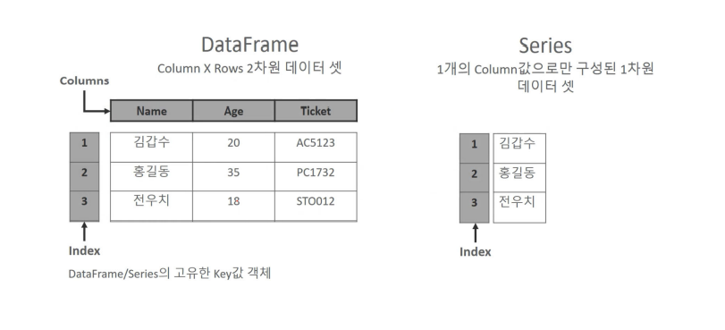

# 판다스(PANDAS)

- 파이썬에서 데이터 처리를 위해 존재하는 라이브러리
- 서로 다른 형식을 갖는 여러 종류의 데이터를 컴퓨터가 이해할 수 있도록 동일한 형식을 갖는 구조로 통합할 필요가 있음
- 일반적으로 대부분 데이터 셋은 행(Row) X 열(Column)로 구성된 2차원 데이터로 구성
- 행과 열의 2차원 데이터가 인기 있는 이유는 인간이 가장 이해하기 쉬운 데이터 구조이면서 효과적으로 데이터를 담을 수 있는 구조이기 때문
- 2차원 데이터를 효율적으로 가공/처리할 수 있는 다양한 기능을 제공
- 판다스는 시리즈(Series)와 데이터프레임(DataFrame)이라는 데이터 형식을 제공
- 판다스 주요 구성 요소 - `DataFrame`, `Series`, `Index`



---

### 1. 시리즈(Series)

- 데이터가 순차적으로 나열된 `1차원 배열(열벡터)`
- `인덱스(index)`는 `데이터 값(value)`과 일대일 대응
- 시리즈의 인덱스는 데이터 값의 위치를 나타내는 이름표(주소) 역할
- `딕셔너리`와 시리즈의 구조가 비슷하기 때문에 딕셔너리를 시리즈로 변환하는 방법을 많이 사용
- `PANDAS`의 내장 함수인 `Series()` 사용
  - 딕셔너리를 함수의 인자로 전달
- 딕셔너리를 시리즈로 변환하는 예제

```python
# 판다스 import
import pandas as pd

# key:value 를 쌍으로 갖는 딕셔너리를 생성, 변수 dict_data에 저장
dict_data = {'a' : 1, 'b' : 2, 'c' : 3}

# 판다스 Series() 함수로 딕셔너리를 시리즈로 변환, 변수 sr에 저장
sr = pd.Series(dict_data)

# sr의 자료형 출력
print(type(sr))  # <class 'pandas.core.series.Series'>

# 변수 sr에 저장되어 있는 시리즈 객체 출력
print(sr)
'''
a	1
b	2
c	3
dtype: int64
'''
```

> - 시리즈 객체 출력 시 인덱스 'a', 'b', 'c'는 왼쪽에 표시
> - 인덱스와 짝을 이루는 데이터 값 1, 2, 3은 오른쪽에 표시
> - 시리즈를 구성하는 데이터 값의 자료형은 정수형(int64)
> - `"as pd"`는 판다스를 `"pd"`라는 약칭으로 부르겠다는 뜻