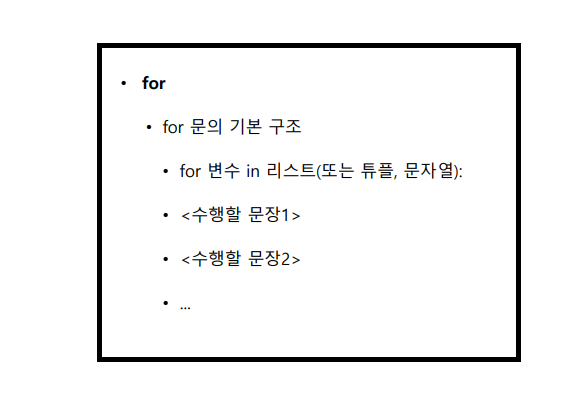

# 제어문

### 1. if문

- 프로그래에서 조건을 판단하여 해당 조건에 맞는 상황을 수행하는 데 쓰이는 것이  `if문`

- if가 참일 경우 수행될 문장은 `들여쓰기(tab)`를 하거나 `4칸` 을 띄운다(`if블록`).

  - 들여쓰기와 스페이스로 띄우는 것을 혼합해서 쓰면 에러가 날 수도 있으니 주의!!

- `if문` 기본구조

  

- 조건문을 테스트 해서 참이면 `if문` 바로 다음의 문장(if 블록)들을 수행

- 조건문이 거짓이면 else문 다음의 문장(else블록)들을 수행

- else문은 if문 없이 독립적으로 사용 불가

- `if문`  예제

```python
money = True
if money:	# money가 True기 때문에 if 문 실행
    print("택시를 타고 가라")
else:
    print("걸어 가라")
    
# "택시를 타고 가라" 출력
```

- pass

  - 조건문을 판단하고 참 거짓에 따라 행동을 정의 할 때 아무런 일도 하지 않게끔 설정할때 사용 

  - pass문 사용 예제

  ```python
  pocket = ['paper', 'money', 'cellphone']
  if 'money' in pocket:
      pass
  else:
      print("카드를 꺼내라")
      
  # pass로 인해 아무것도 출력하지 않음
  ```

- elif

  - if와 else만으로는 다양한 조건을 판단하기 어려운 경우가 발생
  - 다양한 조건을 만들기 위해 사용
  - elif  구조

  

  - elif 구문 예제

  ```python
  # 1. elif를 사용 X
  pocket = ['paper', 'card', 'cellphone']
  if 'money' in pocket:
      print("택시를 타고 가라")
  else:
      if card:
          print("택시를 타고 가라")
      else:
          print("걸어가라")
          
          
  # 1. elif를 사용
  pocket = ['paper', 'card', 'cellphone']
  if 'money' in pocket:
      print("택시를 타고 가라")
  elif card:
      print("택시를 타고 가라")
  else:
      print("걸어가라")
  ```


- 한 줄 if문 예제

```python
pocket = ['paper', 'money', 'celphone']
if 'money' in pocker: pass
else: print("카드를 꺼내라")	
# pass로 인해서 출력 X
```


---

### 2. while 문

- 반복해서 문장을 수행해야 할 경우 while문을 사용
- `while(조건문)` 에서 조건문이 False 될 때까지 반복
- `while문` 기본구조


- `while문` 예제

```python
treeHit = 0
while treeHit < 10:		# treeHit이 10보다 작으면 계속 반복(0 ~ 9 총 10번 반복)
    treeHit = treeHit + 1
    print("나무를 %d번 찍었습니다." %treeHit)
    if treeHit == 10:
        print("나무 넘어갑니다.")
```

- while 강제로 빠져나가기( `break` ) 

  - break 사용 예제

  ```python
  coffee = 10
  money = 300
  while money:	# money가 True(0이 아닌 수)이면 계속 반복
      print("돈을 받았으니 커피를 줍니다.")
      coffee = coffee - 1
      print("남은 커피의 양은 %d 입니다." %coffee)
      if not coffee:	# coffee가 False(0)이면 아래 구문 수행
          print("커피가 다 떨어졌습니다. 판매를 중지합니다.")
          break
  ```

- while문 처음으로 되돌아가기 예제(  `continue` )

  - continue 사용 예제

  ```python
  a = 0
  while a < 10:
      a = a +1
      if a % 2 == 0:	# 2로 나누었을때 나머지가 0 (= 짝수)
          continue	# 다시 while문 처음으로 돌아감(밑에 print문을 수행 X)
      print(a)
  ```


----

### 3. for 문

- while처럼 반복수행을 할때 쓰는 제어문
- 리스트의 첫 번째 요소부터 마지막 요소까지 차례로 변수에 대입하여 수행할 문장을 수행
- `for문` 기본 구조



- `for문` 기본 예제

```python
test_list = ['one', 'two', 'three']
for i in test_list:		# 변수 i에 test_list의 요소들이 하나씩 들어가며 수행
    print(i)
    
'''
출력문 :
one
two
three
'''
```

- `for문` 변형 예제 1

```python
test_list = ['one', 'two', 'three']
for i in test_list:		# 리스트의 요소가 3개이기 때문에 밑에 출력문을 3번 반복 수행
    print("say")
    print("hello")
    
'''
출력문 :
say
hello
say
hello
say
hello
'''
```

- `for문` 변형 예제 2

```python
a = [(1, 2), (3, 4), (5, 6)]
for (first, last) in a:		# 리스트 요소들(리스트 내 튜플)이 차례대로 들어감
    print(first + last)
    
'''
출력문 :
3
7
11
'''
```


- `for문` 응용 예제

```python
marks = [90, 25, 67, 45, 80]
number = 0
for mark in marks:		# marks의 요소들이 차례대로 mark로 들어감
    number = number + 1		# 1번부터 시작하기 위해서 먼저 1을 더해줌
    if mark >= 60:
        print("%d번 학생은 합격입니다." % number)
    else:
        print("%d번 힉생은 불합격입니다." % number)
        
'''
출력문 :
1번 학생은 합격입니다.
2번 학생은 불합격입니다.
3번 학생은 합격입니다.
4번 학생은 불합격입니다.
5번 학생은 합격입니다.
'''
```

- `for문` 예제(continue)

```python
marks = [90, 25, 67, 45, 80]
number = 0
for mark in marks:		# marks의 요소들이 차례대로 mark로 들어감
    number = number + 1		# 1번부터 시작하기 위해서 먼저 1을 더해줌
    if mark < 60:
        continue		# 60점이 안되면 다시 반복문 처음으로		
    print("%d번 학생은 합격입니다." %number)		# 합격한 학생만 출력됨
```

- range

  - 숫자 리스트를 자동으로 만들어 주는 함수
  - `for문` 과 함께 주로 사용
  - `range()` 예제

  ```python
  a = range(10)
  print(a)	# range(0, 10) 출력(0부터 시작하여 10 전까지의 의미)
  
  print(list(a))	# [0, 1, 2, 3, 4, 5, 6, 7, 8, 9] 출력
  
  a = range(1, 11)	# 1부터 11전까지 범위
  print(list(a))		# [1, 2, 3, 4, 5, 6, 7, 8, 9, 10] 출력
  ```

  - `range()` 를 이용한 `for문` 예제

  ```python
  marks = [90, 25, 67, 45, 80]
  for number in range(len(makrs)):	# len(marks) 는 marks의 길이, 즉 요소 갯수
      if marks[number] < 60:
          continue
      print("%d 번 학생 축하합니다. 합격입니다." % (number + 1))
  ```

  - `for문` 실습 예제(range)

  ```python
  for i in range(2, 10):	# 2부터 10전까지 범위에서 반복
      for j in range(1, 10):	# 1부터 10전까지 범위에서 반복
          print(i * j)
      print(' ')	# 줄바꿈 용도
      
  # 구구단 2단부터 9단까지 각단들사이에 줄바꿈을 하며 출력됨
  ```

  ```python
  for i in range(2, 10):	# 2부터 10전까지 범위에서 반복
      for j in range(1, 10):	# 1부터 10전까지 범위에서 반복
          print(i * j, end = ' ')	# end는 출력을 완료한뒤 내용을 입력 기본값은 줄바꿈 여기선 띄어쓰기(' ')로 설정
      print(' ')	# 줄바꿈 용도
      
  # 앞 코드처럼 구구단 2단부터 9단까지 출력하지만 같은 단은 한 줄로 출력
  ```

  - 7 * 7에서 stop하고 싶은 경우

  ```python
  for i in range(2, 10):
      for j in range(1, 10):
          print(i * j, end = ' ')
          if i == 7 and j == 7:
              break
      print(' ')	줄바꿈
      if i == 7:
          break
  ```

- 리스트 안에 `for문` 포함하기 예제

```python
a = [1, 2, 3, 4]
result = []
for num in a:
    result.append(num * 3)
print(result)	# [3, 6, 9, 12] 출력

a = [1, 2, 3, 4]
result = [num*3 for num in a]
print(result)	# [3, 6, 9, 12] 출력
```

- 리스트 안에 `for문` 포함하기 예제(if 조건문)

```python
a = [1, 2, 3, 4]
result = []
for num in a:
    if num % 2 == 0:
        result.append(num * 3)
print(result)	# [6, 12] 출력


a = [1, 2, 3, 4]
result = [num * 3 for num in a if num % 2 == 0]
print(result)	# [6, 12] 출력

```

- `for문` 에서 if, else 한 줄에 포함하기 예제
  - `if ~ else` 구문을 `for문`과 함께 한 줄에서 포함시키기 위해서는 `for문` 앞에 위치해야 함

```python
a = [1, 2, 3, 4]
result = [num * 3 for num in a if num % 2 == 0]
result2 = [num * 4 for num in a if num % 2 == 1]
print(result)	# [6, 12] 출력
print(result2)	# [4, 12] 출력

a = [1, 2, 3, 4]
result = [num * 3 if num > 1 else 0 for num in a]
print(result)	# [0, 6, 9, 12] 출력

a = [1, 2, 3, 4]
result = [num * 3 for num in a if num > 1 else 0]
print(result)	# Error메시지 뜸
```

