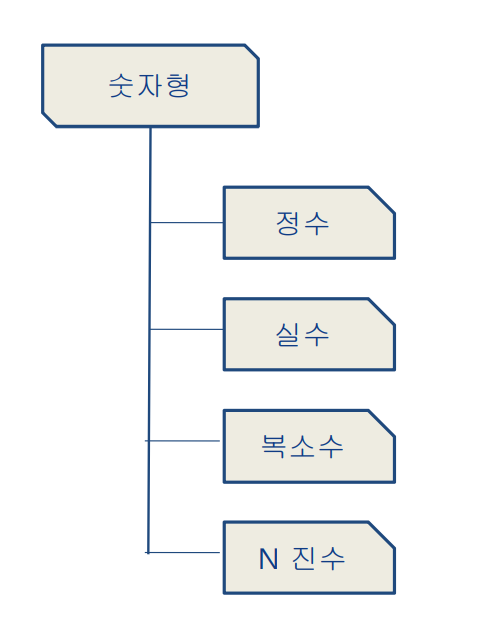
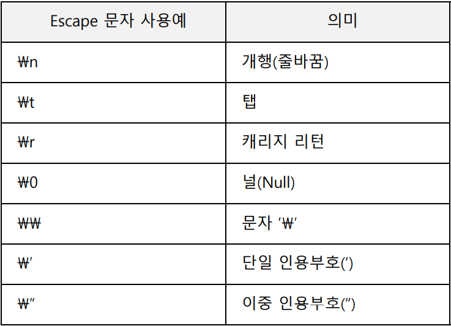
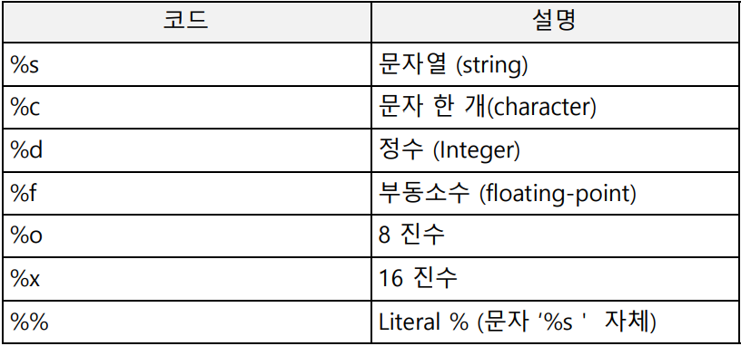

### 1. 기본 자료형

1. 정수
   - 정수는 int로 나타냄


- 정수 확인 예제

```python
a = 123
print(type(a))	# type을 써서 자료형을 알 수 있다
				# <class 'int'> 출력
```


2. 부동소수점(실수)
   - 부동소수점(실수)는 float으로 나타냄

- 부동소수점(실수) 확인 예제

```python
b = -1.23
print(type(b))	# <class 'float'> 출력
```

3. 문자열
   - 문자열은 str로 나타냄

- 문자열 확인 예제

```bash
a = 'python'
print(type(a))	# <class 'str'> 출력
```

4. 2/8/16 진수
   - 2진수는 bin, 8진수는 oct, 16진수는 hex 로 표현


- 2/8/16 진수 확인 예제

```python
print(bin(255))	# "0b11111111" 출력
print(oct(255)) # "0o377" 출력
print(hex(255)) # "0xff" 출력
```

- 기본 자료형 참고 그림




---

### 2. 연산

#### 숫자 연산

1. 사칙연산

- 사칙연산 예제

```python
a = 3
b = 4

print(a + b)	# 7출력
print(a - b)	# -1출력
print(a * b)	# 12출력
print(a / b)	# 0.75출력
```


2. 제곱연산

- 제곱연산 예제

```python
a = 3
b = 4

print(a ** b)	# 81출력(3^4 결과)
```


3.  몫을 반환하는 연산자

- 몫 반환 연산 예제

```bash
a = 7
b = 3

print(a//b)	# 2를 출력
```


4. 나머지를 반환하는 % 연산자

- 나머지 반환 연산 예제

```python
a = 7
b = 3

print(a%b)	# 1을 출력
```


#### 문자열 제어

1. 문자열에 큰따옴표(") 포함시키기

- 예제1

```python
say = '"Python is very easy." he says'

# 작은 따옴표(') 안에 큰따옴표로 묶어줌

```

- 예제2

```python
say2 = "\"Python is very easy.\" he says"

# 문자열 큰따옴표(")안에 내용의 처음과 끝을 백슬래시(\)로 묶어줌

```


2. 특수 기호 표기 예제
   - 특수 기호의 역할을 하지 못하게 하고 싶을때 앞에 백슬래시(\\)를 넣어줌

```python
money = "10000\￦"
print(money)	# '10000￦'으로 출력
```


3. 여러줄의 문자열을 변수에 대입하고 싶은 경우

- 방법 1 (줄을 바꾸기 위한 이스케이프 문자 사용)

```python
multiline = "Life is short \n You need python"
print(multline)


# 출력값
'''Life is short
You need python''' 
```

- 방법 2 (연속된 작은 따옴표 세 개 or 큰 따옴표 세 개 사용)

```python
multiline = """
Life is short
You need python
"""
```

- 이스케이프 문자 종류




4. 문자열 합치기

- 예제

```python
head = "Python"
tail = " is fun!"
print(head + tail)	# Python is fun! 으로 출력
```


5. 문자열 곱하기

- 예제

```python
a = "Python"
print(a*2)	# "PythonPython" 출력
```

- 응용 예제

```python
print("=" * 30)
print("My Program")
print("=" * 30)

# 출력값
#==============================
#My Program
#==============================
```


6. 문자열 길이 구하기, 인덱싱, 슬라이싱

- 길이 구하기 예제

```python
a = "Life is too short"
print(len(a))	# 17출력
```

- 문자열 인덱싱

  - 인덱싱이란 무엇인가를 '가리킨다'는 의미

  - 인덱싱이란 위치를 생각하면 된다.
  - 파이썬에서 인덱싱 번호는 **0번** 부터 시작
  - 공백도 문자열 인덱싱에서 자리를 차지한다.

```python
a = "Life is too short, You need Python"	# 총 34개의 인덱싱이 생김(0~33)

print(a[10])	# "o" 출력
print(a[-10])	# -로 시작하는 것은 뒤에서 부터 시작(0이아닌 -1부터 시작)
				# "e" 출력
```

- 문자열 슬라이싱

  - 슬라이싱은 무엇인가를 '잘라낸다'

  - 슬라이싱은 인덱싱 번호를 연속하여 뽑을때 사용
  - ex) a[1:5] : 1부터 시작하여 5전 까지 뽑는다.(마지막에 오는 수는 들어가지 않음)

```python
a = "Life is too short, You need Python"
print(a[0:4])	# 0번자리 부터 3번자리까지 "Life" 출력
print(a[:4])	# 위 코드와 같은 의미 처음부터 시작한다는것을 생략으로도 사용
print(a[10:])	# 10번자리 부터 끝까지 다뽑기
				# o short, You need Python 출력
```

- 인덱싱을 사용하여 문자열 바꾸기 예제

```python
a = "Pithon"
a[:1] + "y" + a[2:]

# 'Python' 출력
```


7.  문자열 포매팅

- 숫자 바로 대입

```python
print("I eat %d apples" % 3)

# I eat 3 apples 출력
```

- 문자열 바로 대입

```python
print("I eat %s apples" % "three")

# I eat three apples 출력
```

- 숫자 값을 나타내는 변수로 대입

```python
number = 3
print("I eat %d apples" % number)
```

- 2개 이상의 값을 대입

```python
number = 3
day = "three"
print("I eat %d apples, so I was sick for %s days" % (number, day))

# I eat 3 apples, so I was sick for three days 출력
```

- 문자열 포맷 코드



- format() 함수를 이용한 포매팅

  - 기본예제

   ```python
   print("{} {} {}".format(11, 22, 33))	# "11 22 33" 출력
   ```

  - 순서를 이용한 포매팅 예제

  ```python
  number = 3
  day = "three"
  print("I eat {1} apples, so I was sick for {0} days".format(number, day))
  # 첫 번째 {}에서 1번자리(day)를 호출하고 두 번째 {}에서 0번자리(number)를 호출
  # "I eat three apples, so I was sick for 3 days" 출력
  ```

  - 변수 이름을 이용한 포매팅 예제

  ```python
  print("I eat {number} apples, so I was sick for {day} days".format(number=10, days=3))
  # "I eat 10 apples, so I was sick for 3 days" 출력
  ```

- f문자열 포매팅

  - 예제

  ```python
  name = "홍길동"
  age = 19
  print(f"나의 이름은 {name}입니다. 나이는 {age}입니다.")
  
  # "나의 이름은 홍길동입니다. 나이는 19입니다" 출력
  
  name = "홍길동"
  age = 19
  print(f"나의 이름은 {name}입니다. 나이는 {age+1}입니다.")
  
  # "나의 이름은 홍길동입니다. 나이는 20입니다" 출력
  
  ```

  


8. 문자열 표현(정렬/공백/소수점 자리수)

- 정렬/공백 예제

```python
print("%s" % "hi")	# "hi" 출력

print("%10s" % "hi")	# 자리수를 10칸을 만들어 오른쪽자리부터 "hi"가 들어가고 남겨진 자리수는 공백으로 채움 : "        hi" 출력

print("%-10s" %"hi")	# 위 처럼 10자리를 만든 후 왼쪽자리부터 문자열이 들어감('-' 부호 유무 차이) : "hi        " 출력

```

- 문자열 공백 지우기(stirip)

```python
# strip() 함수를 사용해 문자열 공백을 지울수 있음

a = "  hi  "
print(a.strip())	# "hi" 출력

# 왼쪽만 지우고 싶을때
a = "  hi  "
print(a.lstrip())	# "hi  " 출력

# 오른쪽만 지우고 싶을때
a = "  hi  "
print(a.rstrip())	# "  hi" 출력
```


9. 문자열 갯수 세기/ 위치 알려주기/ 삽입/ 대,소문자 바꾸기/ 나누기

- 문자열 갯수 세기(count)

```python
a = "hobby"
print(a.count("b"))	# 2출력
```

- 문자열 위치 알려주기

  - 첫 번째 방법(find)

  ```python
  a = "Python is the best choice"
  print(a.find("b"))	# 문자열 중 b가 처음 나온 위치를 반환
  					# 14 출력
  ```

  ```python
  a = "Python is the best choice"
  print(a.find("ㅓ"))	# -1 출력(위에 문자열에 존재하지 않으면 -1 출력)
  ```

  - 두 번째 방법(index)

  ```python
  a = "Life is too short"
  print(a.index("t"))	# 8 출력
  ```

  ```python
  a = "Life is too short"
  print(a.index("j"))	# 에러 발생
  					# find와 index의 가장 큰 차이점은 문자열에 문자가 없을 경우 index는 에러 발생 find는 -1 출력
  ```

- 문자열 삽입(join)

  - join() 함수의 입력으로 리스트 사용 가능

```python
a = " , "
print(a.join(abcd))	# "a , b , c , d" 출력

a = ":"
print(a.join("a", "b", "c", "d"))	# "a:b:c:d" 출력
```


- 문자열 대, 소문자 바꾸기(upper, lower)

  - 소문자 -> 대문자 (upper)

  ```python
  a = "hi"
  print(a.upper())	# "HI"출력
  ```

  - 대문자 -> 소문자 (lower)

  ```python
  a = "HI"
  print(a.lower())
  ```


- 문자열 나누기(split)

  - split() 함수는 괄호 안에 아무것도 넣어 주지 않을 경우 공백을 기준으로 나눔
  - split() 함수의 괄호 안에 특정 값이 있는 경우 그 값을 기준으로 나눔
  - 예제

  ```python
  a = "Life is too short"
  print(a.split())
  
  # ['Life', 'is', 'too', 'short'](리스트형태)로 출력
  ```

  ```python
  b = "a:b:c:d"
  print(b.split(":"))
  
  # ['a', 'b', 'c', 'd']로 출력
  ```

  


