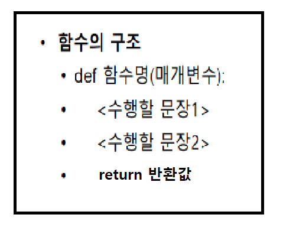
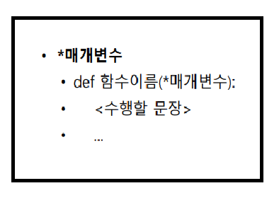

# 함수

- 함수는 반복적으로 사용하기 위해 생성한다.
- 코드의 일정부분이 별도의 논리적 개념으로 분리되는 것이 가능할 때, 함수로 코드를 분리
  - `return` 키워드는 계산한 결과값을 함수로 호출할 곳으로 돌려주는 역할
- 함수의 선언은 `def`로 시작하고 콜론(:)으로 끝냄
- `def`는 함수를 만들 때 사용하는 예약어
- 함수명은 함수를 만드는 사람이 임의로 만들 수 있음
- 함수명 뒤 괄호 안의 매개변수는 이 함수에 입력으로 전달되는 값을 받는 변수
- 함수의 시작과 끝은 코드의 들여쓰기로 구분
- 시작과 끝을 명시해 줄 필요가 없다
- 함수의 기본 구조



- 함수 만들기 예제

```python
def sum(a, b):
    a + b    
print(sum(1, 2))	# return 값이 없기 때문에 None이 출력

def sum2(a, b):
    return a + b
print(sum2(1, 2))	# 3출력
```

> `return`
>
> - `return` 없이 함수를 정의하면 함수를 호출한 측에 아무 값도 전달하지 않음
>   - `None` 객체를 전달
>   - `None` 객체란 파이썬 내장 객체로써 아무 값도 없음을 표현하는객체

- 함수 만들기 예제 2
  - 함수는 다른 함수를 호출할 수 있음

```python
def add(a, b):
    return a + b
    
def addabs(a, b):
    c = add(a, b)
    return abs(c)

print(addabs(-3, -7))		# 10 출력
```

- 함수 만들기 예제 3
  - `return` 값이 여러 값일 경우, 그 값들을 튜플로 구성하여 전달

```python
def swap(a, b):
    return b, a

print(swap(10, 20))	 # (20, 10) 출력
print(type(swap(10, 20)))	# <class 'tuple'> 출력
```

> ※ 매개변수와 인수
>
> - 매개변수는 함수에 입력으로 전달된 값을 받는 변수
>
> - 인수는 함수를 호출하 때 전달하는 입력값
>
>   ```python
>   def sum(a, b):	# a, b는 매개변수
>       return a + b
>       
>   print(sum(3, 4))	# 3, 4는 인수
>   ```

- 입력값이 없고 결과값이 있는 함수 예제

```python
def say():
    return 'hi'

say()	# 'hi' 출력

a = say()
print(a)	# hi 출력
```

- 입력값이 있고 결과 값이 없는 함수 예제

```python
def sum(a, b):
    print("%d와 %d의 합은 %d입니다." %(a, b, a+b))

sum(3, 4)	# "3와 4의 합은 7입니다" 출력

a = sum(3, 4)
print(a)	# None 출력

# sum() 함수를 호출 할 시 결과가 출력되나 결과값이 있는 것은 아니다.(return이 없기 때문)
```

- 입력값이 없고 결과값이 없는 함수 예제

```python
def say():
    print("Hi")
    
say()	# "Hi" 출력

a = say()
print(a)	# None 출력
```

- 매개변수 지정하여 호출하기 예제
  - `키워드 인수`를 이용

```python
def sum(a, b):
    return a + b

print(sum(a = 3, b = 7))	# 10 출력
print(sum(b = 5, a = 3))	# 8 출력
```

> `키워드 인수`
>
> - 인수 이름으로 값을 전달하는 방식, 보통은 인수의 순서로 값을 나타내지만 이름으로 값을 전달하는 방식
>
> ```python
> def sum(a, b):
>     return a + b
> 
> 
> sum(20, b = 5)	# 25출력
> sum(b = 5, 20)	# Error 뜸
> sum(a = 5, 20)	# Error 뜸
> ```
>
> - 일반적으로 함수를 호출할 때 키우드 인수의 위치는 보통 인수의 이후에 위치해야 함
> - 순서에 맞게 키워드인수를 앞에 사용해도 에러 발생


- **`가변 길이 인수 리스트1 (*매개변수)`**

  - 고정되지 않은 수의 인수를 함수에 전달하는 방식

    - 함수를 정의할 때 인수 목록에 반드시 넘겨야 하는 고정 인수를 우선 나열하고,  나머지를 튜플 형식으로 한꺼번에 받는 방식
    - 가변 길이 인수 리스트 기본구조

    

  - 가변 길이 인수 리스트 예제

  ```python
  def varilen(a, *b):
      print(a, b)
      
  varilen(1)	# 1 () 출력
  varilen(1, 2)	# 1 (2,) 출력 
  varilen(1, 2, 3)	# 1 (2, 3) 출력
  varilen(1, 2, 3, 4)		# 1 (2, 3, 4) 출력
  ```

  ```python
  def printf(a, *b):
      print("첫 번째 인수 : ", a)
      for c in b:
          print("나머지 인수 : " c)
          
  printf(1, 2, 3, 4, 5, 6, 7, 8, 9)	# 1은 a로 들어가고 나머지 값들은 튜플형태로 b로 들어감
  
  '''
  출력문 : 
  첫번째 인수 : 1
  나머지 인수 : 2
  나머지 인수 : 3
  나머지 인수 : 4
  나머지 인수 : 5
  나머지 인수 : 6
  나머지 인수 : 7
  나머지 인수 : 8
  나머지 인수 : 9
  '''
  ```

  ```python
  def h(a, b, *c):
      print(a, b, c)
  args = (1, 2, 3, 4, 5)
  h(1, 2, 3, 4, 5)	# 1 2 (3, 4, 5) 출력
  h(*args)	# 1 2 (3, 4, 5) 출력
  ```

  - 함수를 정의 할 시 가변길이 인수 리스트를 매개변수로 받을 경우 함수를 호출할 때 받는 인자 또한 가변길이 인수 리스트라는 것을 명시해줘야 함


- **`가변 길이 인수 리스트2 (**매개변수)`**

  - 함수 호출에 사용하는 인수들이 딕셔너리에 있다면 **을 이용하여 함수를 호출할 수 잇음
  - 매개변수명 앞에 `**`를  붙이면 입력값들을 전부 모아서 딕셔너리로 만들어줌

  ```python
  def h(a, b, c, f):
      print(a, b, c, f)
      
  dicargs = {'a' : 1, 'b' : 2, 'c' : 3, 'f' : 4}
  h(**dicargs)	# 1 2 3 4 출력
  ```

  - `**매개변수` 의 핵심 요소
    1. 딕셔너리와 관련이 있음
    2. 함수에서 키와같은 매개변수를 받음
    3. `**매개변수`를 이용하여 딕셔너리를 호출할 경우 각 키에 매칭되는 값들이 매치됨
  - `**매개변수` 추가 코드

  ```python
  def dic_1(**dic):
      print(dic.items())
      for key, value in dic.items():
          print("{0} = {1}".format(key, value))
          
  dic = {'name':'홍길동', '나이':'20'}
  dic_1(**dic)
  
  '''
  출력값 : 
  dict_items([('name', '홍길동'), ('나이', 20)])
  name = 홍길동
  나이 = 20
  '''
  ```

- `return` 예제 

  - `return` 으로 결과값을 두개 반환하는 경우

  ```python
  def sum_and_mul(a, b):
      return a+b, a*b
  
  result = sum_and_mul(3, 4)
  print(result)	# (7, 12) 출력
  
  sum, mul = sum_and_mul(3, 4)
  print(sum)	# 7 출력
  print(mul)	# 12 출력
  ```

  - `return` 을 두 줄로 나눠 입력한 후 결과값을 두 개 반환 하는 경우

  ```python
  def sum_and_mul(a, b):
      return a + b
  	return a * b
  
  result= sum_and_mul(2, 3)
  print(result)	# 5출력
  ```

  > - return을 사용할 경우 한 줄에 입력해야함
  > - 두 줄로 입력할 경우 처음 return만 실행이 됨

  - `return`의 영향

    - 어떤 특별한 상황이되면 함수를 빠져나가고자 할 때는 return을 단독으로 써서 함수를 즉시 빠져 나감

    ```python
    def say_nick(nick):
        if nick == "바보":
            return
        print("나의 별명은 %s입니다." % nick)
        
    say_nick('야호')	# '나의 별명은 야호입니다.' 출력
    say_nick('바보')	# 아무것도 출력되지 않음
    ```

    


- 함수 안에서 함수 밖의 변수를 변경하는 방법

  1. `return` 사용

  ```python
  a = 1
  def vartest(b):
      b = b + 1
      return b
  
  vartest(1)	# 2출력
  a = vartest(1)	# 2를 a에 넣어줌
  print(a)	# 2출력
  ```

  2. 함수에서 나온 결과값으로 기존에 만든 전역변수를 변경

  ```python
  a = 1
  def vartest(a):
      a = a + 1
      return a
  
  a = vartest(a)
  print(a)	# 2출력
  ```

  3. `global` 사용 

     - 함수내에서 전역변수를 가져와 선언할 때 쓰는것이 `global`
     - 함수는 독립적으로 존재하는 것이 좋기 때문에 `global`은 사용하지 않는 편이 좋음
  
   ```python
   a = 1
   def vartest():
       global a
       a = a + 1
         
   vartest()
   print(a)	# 2출력
   ```


-  `람다(lambda)` 

  - 람다 : 간단한 함수를 쉽게 선언하는 방법
  - 형식  : `lambda<매개변수>:<리턴값>`
  - 함수 만들기

  ```python
  # 람다 사용 X
  def sum(a, b):
      return a + b
  print(sum(3, 4))	# 7 출력
  
  # 람다 사용 O
  sum = lambda a, b: a + b
  print(sum(3, 4))	# 7 출력
  ```

  - 람다를 이용해 리스트 내에 함수 만들기 예제

  ```python
  myList = [lambda a,b: a+b, lambda a,b:a*b]	# 리스트 0번자리와 1번자리에 함수를 정의
  print(myList)	# [<function <lambda> at 0x000001CF0514B0D0>, <function <lambda> at 0x000001CF0514B040>] 출력
  
  myList[0](3, 4)		# 리스트 0번자리 함수에 3, 4를 넣어줌 7출력
  myList[1](3, 4)		# 리스트 1번자리 함수에 3, 4를 넣어줌 12출력
  myList[0]		# <function __main__.<lambda>(a, b)> 출력
  ```

  > - 람다를 이용하여 리스트 안에 함수를 만들경우 **함수명은 필요 X**
  > - 함수를 호출해서 사용하는 것이기 때문에 **결과값이 리스트에 저장 X**
