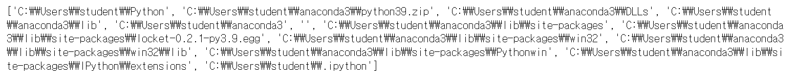

# 내장함수 / 외장함수

### 1. 내장함수

- 파이썬 내장 함수는 외부 모듈과 달리 `import`가 필요하지 않기 때문에 아무런 설정 없이 바로 사용 가능

1. `abs()`

     - `abs(x)` 는 어떤 숫자를 입력 받았을 때, 그 숫자의 절댓값을 돌려주는 함수

     ```python
     abs(3)		# 3출력
     abs(-3)		# 3출력
     abs(-1.2)	# 1.2출력
     ```

  2.  `all()`

     - `all(x)`는 반복 가능한(iterable) 자료형 x를 입력 인수로 받으며  이 x가 모두 참이면 True, 거짓이 하나라도 있으면 False 리턴
     - 반복 가능한 자료형이란 `for문` 으로 그 값을 출력할 수 있는 것을 의미한다. 리스트, 튜플, 문자열, 딕셔너리, 집합 등

     ```python
     all([1, 2, 3])	# True 출력
     all([1, 2, 3, 0])	# False 출력
     ```

  3.  `any()`

     - `any(x)`는 x 중 하나라도 참이 있으면 True를 돌려주고, x가 모두 거짓일때만 False를 리턴

     ```python
     any([1, 2, 3, 0])	# True 출력
     any([0, ""])	# False 출력
     ```

  4. `chr()`

     - `chr(i)`는 **아스키(ASCII)** 코드 값을 입력받아 그 코드에 해당하는 문자를 출력하는 함수

     ```python
     chr(97)	# 'a'출력
     chr(48)	# '0' 출력, 문자열로 '0'임 정수형 0과는 다름
     ```

  5. `dir()`

     - `dir`은 객체가 자체적으로 가지고 있는 변수나 함수를 보여줌

     ```python
     dir([1, 2, 3])	# 리스트 객체 관련 함수를 출력
     
     dir({'1':'a'})	# 딕셔너리 객체 관련 함수를 출력
     ```

  6. `divmod()`

     - `divmod(a, b)`는 2개의 숫자를 입력받은 후 a를 b로 나눈 몫과 나머지를 튜플 형태로 돌려주는 함수

     ```python
     divmod(7, 3)
     
     # (2, 1) 출력
     ```

  7. `enumerate()` 

     - `enumerate`는 "열거하다"라는 뜻으로 순서가 잇는 자료형(리스트, 튜플, 문자열)을 입력으로 받아 인덱스 값을 포함하는 `enumerate` 객체를 돌려줌
     - 보통 `enumerate` 함수는 `for문`과 함께 자주 사용

     ```python
     for i, name in enumerate(['body', 'foo', 'bar']):
         print(i, name)
         
     '''
     <출력문>
     0 body
     1 foo
     2 bar
     '''
     ```

  8. `eval()`

     - `eval(expression)`은 실행 가능한 문자열(1 + 2, 'hi' + 'a' 같은 것)을 입력으로 받아 문자열을 실행한 결괏값을 돌려주는 함수

     ```python
     a = '1 + 2'
     print(a)	# 1 + 2 출력
     
     eval('1 + 2')	# 3 출력
     ```

  9. `filter()`

     - filter란 무엇인가를 걸러낸다는 뜻으로 filter 함수도 동일한 의미
     - 첫 번째 인수로 함수 이름을, 두 번째 인수로 그 함수에 차례로 들어갈 반복 가능한 자료형을 받음
     - 두 번째 인수인 반복 가능한 자료형 요소가 첫 번째 인수인 함수에 입력되었을 때 반환 값이 참인 것만 묶어서(걸러 내서) 돌려줌
     - `filter()` 함수 예제 (filter 사용 전)

     ```python
     # 필터링하는 함수
     def positive(l):
         result = []
         for i in l:
             if i > 0:
                 result.append(i)
         return result
     
     print(positive([1, -3, 2, 0, -5, 6]))
     # [1, 2, 6] 출력
     ```

     - `filter()` 함수 예제(filter 사용)

     ```python
     def positive(x):
         return x> 0
     
     print(list(filter(positive, [1, -3, 2, 0, -5, 6])))
     # [1, 2, 6] 출력
     ```

     - `filter()` 함수 예제(filter)- 람다함수

     ```python
     print(list(filter(lambda x : x >0, [1, -3, 2, 0, -5, 6])))
     ```

  10. `int()`
  
      - `int(x)` 는 문자열 형태의 숫자나 소수점이 있는 숫자 등을 정수 형태로 돌려주는 함수
      - `int(x, radix)` 는 radix 진수로 표현된 문자열 x를 10진수로 변환하여 돌려줌 
    
      ```python
      int('3')		# 3출력
      int(3.4)		# 3출력
      int('11', 2)	# 3출력
      int('1A', 16)	# 26출력
      ```
  
  11. `isinstance()`
  
      - `isinstance(object, class)` 는 첫 번째 인수로 인스턴스, 두 번째 인수로 클래스 이름을 받음
      - 입력으로 받은 인스턴스가 그 클래스의 인스턴스인지 판단하여 참이면 True, 거짓이면 False
    
      ```python
      class Person:
          pass
      
      a = Person()
      
      isinstance(a, Person)	# True출력
      
      b = 3
      isinstance(b, Person)	# False출력
      ```
  
  12.  `map()`
  
      - `map(f, iterable)` 은 함수(f)와 반복 가능한(iterable) 자료형을 입력으로 받음
      - map은 입력받은 자료형의 각 요소를 함수 f가 수행한 결과를 묶어서 돌려주는 함수
    
      ```python
      def two_times(x):
          return x * 2
      
      print(list(map(two_times, [1, 2, 3, 4])))	# [2, 4, 6, 8] 출력
      
      # 람다 함수 사용시
      print(list(map(lambda a:a*2, [1, 2, 3, 4])))
      ```
  
  13. `max()`
  
      - `max(iterable)` 는 인수로 반복 가능한 자료형을 입력받아 그 최댓값을 돌려주는 함수
    
      ```python
      max([1, 2, 3])	# 3출력
      max("python")	# 'y'출력
      max(1, 2, 3)	# 3출력
      ```
  
  14. `min()`
  
      - `min(iterable)` 는 `max` 함수와 반대로, 인수로 반복 가능한 자료형을 입력받아 그 최솟값을 돌려주는 함수
    
      ```python
      max([1, 2, 3])	# 1출력
      max("python")	# 'h'출력
      ```
  
  15.  `ord()`
  
      - `ord(c)` 는 문자의 아스키 코드 값을 돌려주는 함수
      - `ord` 함수는 `chr` 함수와 반대
    
      ```python
      ord('a')	# 97출력
      ord('0')	# 48출력
      ```
  
  16. `pow()`
  
      - `pow(x, y)`는 x의 y 제곱한 결괏값을 돌려주는 함수
    
      ```python
      pow(2, 4)	# 16출력
      pow(3, 3)	# 27출력
      ```
  
  17.  `range()`
  
      - `range([start,] stop [,step])` 는 `for문` 과 함께 자주 사용하는 함수
    
      - 입력받은 숫자에 해당하는 범위 값을 반복 가능한 객체로 만들어 돌려줌
    
      - 인수가 하나일 경우
    
        - 시작 숫자를 지정해 주지 않으면 range 함수는 0부터 시작
    
        ```python
        list(range(5))	# [0, 1, 2, 3, 4]
        ```
    
      - 인수가 2개일 경우
    
        - 입력으로 주어지는 2개의 인수는 시작 숫자와 끝 숫자를 나타냄
        - 단 끝 숫자는 해당 범위에 포함되지 않는다는 것에 주의
    
        ```python
        list(range(5, 10))	# [5, 6, 7, 8, 9]
        ```
    
      - 인수가 3개일 경우
    
        - 세 번째 인수는 숫자 사이의 거리
    
        ```python
        list(range(1, 10, 2))	# [1, 3, 5, 7, 9]
        list(range(0, -10, -1))	# [0, -1, -2, -3, -4, -5, -6, -7, -8, -9]
        ```
  
  18.  `round()`
  
      - `round(number[, ndigits])` 함수는 숫자를 입력받아 반올림해 주는 함수
      - `[, ndigits]` 는 ndigits가 있을 수도 있고 없을 수도 있다는 의미
    
      ```python
      round(4.6)	# 5
      round(4.2)	# 4
      
      # 실수 5.678을 소수점 2자리 까지만 반올림
      round(5.678, 2)	# 5.68
      ```
  
      > `round` 함수의 두 번째 매개변수는 반올림하여 표시하고 싶은 소수점의 자릿수(ndigits)
  
  19.  `sorted()`
  
      - `sorted(iterable)` 함수는 입력값을 정렬한 후 그 결과를 리스트로 돌려주는 함수
    
      ```python
      sorted([3, 1, 2])	# [1, 2, 3]
      sorted(['a', 'c', 'b'])	# ['a', 'b', 'c']
      sorted(['zero'])	# ['e', 'o', 'r', 'z']
      sorted((3, 2, 1))	# [1, 2, 3]
      ```
  
      > 리스트 자료형에도 `sort` 함수가 있지만 리스트 자료형의 sort 함수는 리스트 객체 그 자체를 정렬만 할 뿐 정렬된 결과를 돌려주지는 않음
  
  20.  `str()`
  
      - `str(object)` 은 문자열 형태로 객체를 변환하여 돌려주는 함수
    
      ```python
      str(3)	# '3'
      str('hi')	# 'hi'
      str('hi'.upper())	# 'HI'
      ```
  
  21.  `sum()`
  
      - `sum(iterable)` 은 입력받은 리스트나 튜플의 모든 요소의 합을 돌려주는 함수
    
      ```python
      sum([1, 2, 3])	# 6출력
      sum((4, 5, 6))	# 15출력
      ```
  
  22.  `zip()`
  
      - `zip(*iterable)` 은 동일한 개수로 이루어진 자료형을 묶어 주는 역할을 하는 함수
      - *iterable은 반복 가능(iterable)한 자료형 여러 개를 입력할 수 있다는 의미
    
      ```python
      list(zip([1, 2, 3], [4, 5, 6]))		# [(1, 4), (2, 5), (3, 6)]
      list(zip([1, 2, 3], [4, 5, 6], [7, 8, 9]))	# [(1, 4, 7), (2, 5, 8), (3, 6, 9)]
      list(zip("abc", "def"))		# [('a', 'd'), ('b', 'e'), ('c', 'f')]
      ```


---

### 2. 외장함수

- 유용한 프로그램을 모아 놓은 것이 바로 파이썬 라이브러리
- 파이썬 라이브러리는 파이선을 설치할 때 자동으로 컴퓨터에 설치

1. `sys`

   - 파이썬 인터프리터가 제공하는 변수와 함수를 직접 제어할 수 있게 해주는 모듈

   - 강제로 스크립트 종료하기 - `sys.exit`

     - `sys.exit` 는 `Ctrl + Z`나 `Ctrl + D`를 눌러서 대화형 인터프리터를 종료하는 것과 같은 기능

   - 자신이 만든 모듈 불러와 사용하기 - `sys.path`

     - `sys.path` 는 파이선 모듈들이 저장되어 있는 위치를 나타냄
     - 이 위치에 있는 파이썬 모듈은 경로에 상관없이 어디에서나 불러올 수 있음

     ```python
     import sys
     print(sys.path)
     ```

     

     > 첫 번째 인수인 ''는 현재 디렉터리를 말함

2. `pickle`

   - `pickle` 은 객체의 형태를 그대로 유지하면서 파일에 저장하고 불러올 수 있게 하는 모듈
   - `pickle` 모듈 예제

   ```python
   # pickle 사용 X
   with open("hello.txt", "w") as f:
       f.write("hello")
       
   with open("list.txt", "w") as f:
       f.write(["a", "b", "c"])	# 에러 발생
       
   # pickle 사용 O
   import pickle
   with open("list.txt", "wb") as f:
       pickle.dump(["a", "b", "c"], f)
   ```

   > - `pickle.dump` : 리스트 객체인 data를 그대로 파일에 저장
   > - 파일 모드 종류(pickle을 쓸때는 파일모드 뒤에 **`b(바이너리모드)`**를 꼭 붙여줌)
   >   - `r` : 읽기 모드 
   >   - `w` :  쓰기 모드
   >   - `x` :  쓰기 모드(동일 파일이 존재하면 오류발생)
   >   - `a` :  쓰기 모드(동일 파일이 존재하면 뒤에 내용 추가)
   >   - `+` : 읽기, 쓰기 모드
   >   - `t` : 텍스트 모드
   >   - `b` : 바이너리 모드(바이트 단위 데이터 기록에 사용)
   >     - 바이너리 파일은 사용자가 읽을 수 없음

   ```python
   with open('list.txt', 'rb') as f:
       data = pickle.load(f)
       
   print(data)	# ['a', 'b', 'c']
   ```

   > - pickle을 이용하여 데이터를 불러올 경우 변수 지정을 해줘야 함

   ```python
   import pickle
   f = open("dic.txt", "wb")
   data = {1: 'python', 2: 'you need'}
   pickle.dump(data, f)
   f.close()
   ```

   ```python
   import pickle
   f = open("dic.txt", "rb")
   data = pickle.load(f)
   print(data)
   f.close()	# {1 :'python', 2 : 'you need'} 출력
   ```

3.  `os`

   - `os`모듈은 환경 변수나 디렉터리, 파일 등의 OS 자원을 제어할 수 있게 해주는 모듈
   - `os`모듈 예제

   ```python
   # 작업 디렉터리 변경
   import os
   os.chdir('C:\\Users\\student')	# 해당 디렉터리로 작업 위치를 변경
   
   # 디렉터리 위치 확인
   import os
   os.getcwd()		# 현재 디렉터리 위치를 결과값으로 리턴
   
   # 시스템 명령어 호출
   import os
   os.system('dir')
   os.system('cls')
   ```

   - 기타 유용한 os 관련 함수( cmd에서 입력해보는것이 편함 )
     - `os.mkdir(디렉터리)` : 디렉터리를 생성
     - `os.rmdir(디렉터리)` : 디렉터리를 삭제, 디렉터리가 비어 있어야 삭제 가능
     - `os.unlink(파일)` : 파일을 지운다
     - `os.rename(src, dst)` : src라는 이름의 파일을 dst라는 이름으로 바꿔줌

4.  `shutil`

   - `shutil`은 파일을 복사해 주는 파이썬 모듈

   ```python
   import shutil
   
   shutil.copy("src.txt", "dst.txt")	# src.txt파일과 동일한 내용의 파일이 dst.txt로 복사
   ```

5.  `glob`

   - 특정 디렉터리에 있는 파일 이름 모두를 알아야 할 때 사용하는 모듈

   ```python
   # 디렉터리에 있는 파일들을 리스트로 만들기 - glob(pathname)
   import glob
   glob.glob("C:\\Users\\student\\Python\\list*")	
   # 디렉터로에 list로 시작하는 파일을 모두 찾아 리스트로 만듦
   ```

6.  `random`

   - 난수(규칙이 없는 임의의 수)를 발생시키는 모듈
   - `random.random` : 실수 중에서 난수값 돌려주기 (0 <= x < 1)

   ```python
   import random
   random.random()
   ```

   - `random.randint` : 정수 중에서 난수 값 돌려주기

     - `random.randint(a, b)` 형태로 함수의 인자를 넣어주면 `a <= x <= b` 범위의 정수를 반환

     ```python
     import random
     random.randint(1, 10)
     random.randint(10, 20)
     ```

   - `random.uniform(a, b)` :  `a <= x <= b` 범위의 실수를 반환

   ```python
   import random
   random.uniform(10, 20)
   ```

   - `random.choice` : 객체의 요소 중에서 무작위로 하나를 선택하여 리턴

   ```python
   # 1. random.choice 사용 X
   import random
   def random_pop(data):
       number = random.randint(0, len(data) - 1)	# 0 ~ 리스트길이 범위의 숫자를 랜덤으로 변수에 저장
       return data.pop(number)		# data리스트에서 number자리의 요소를 빼낸다
   
   if __name__ = "__main__":
       data = [1, 2, 3]
       while data:
           print(random_pop(data))
           
           
   # 2. random.choice 사용
   def random_pop(data):
       number = random.choice(data)
       data.remove(number)
       return number
   
   if __name__ == "__main__":
       data = [1, 2, 3]
       while data:
           print(random_pop(data))     
   
   ```

   - `random.shuffle` : 객체의 요소를 무작위로 섞고 싶을 때 사용

   ```python
   import random
   data = [1, 2, 3, 4, 5]
   random.shuffle(data)
   print(data)	# [5, 1, 3, 4, 2]
   ```

7.  `webbrowser`

   - 시스템에서 사용하는 기본 웹 브라우저를 자동으로 실행하는 모듈

   ```python
   import webbrowser
   
   webbrowser.open("http://google.com")	# 자동으로 사이트 열기(구글 사이트)
   										# open함수는 웹 브라우저가 이미 실행된 상태라면 입력 주소로 이동
       									# 웹브라우저가 실행되지 않은 상태라면 새로 웹 브라우저를 실행한 후 해당 주소로 이동
           
   webbrowswer.open_new("http://google.com")	# 새창으로 사이트 열기
   											# 이미 웹 브라우저가 실행된 상태이더라도 새로운 창으로 해당 주소가 열림
   ```

   