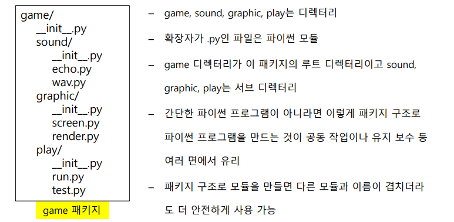
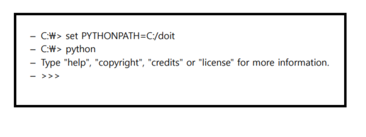
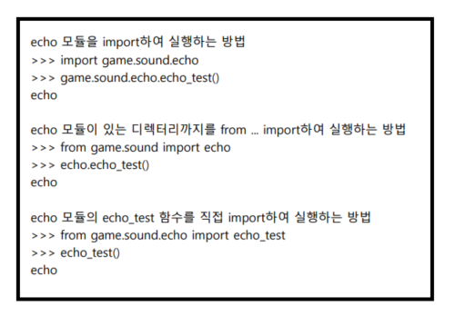

# 모듈

### 1. 정의

- 함수, 변수, 클래스들을 모아놓고, 서로 다른 파이썬 프로그램에서 호출하여 사용할 수 있도록 설계된 파이썬 라이브러리
- 리눅스의 패키지 관리자처럼 관리할 수 있는 `pip`, `easy_install` 과 같은 모듈 관리자를 제공함으로써 필요한 모듈을 검색하고, 설치하는 것이 용이
- 모듈은 개별 파이썬 스크립트에서 `임포트(import)` 시켜야 함 
- 모듈의 장점
  - 코드 **`재사용성`** 이 높아짐
  - 모듈만 수정하면 프로그램의 동작 로직 자체를 재설계 하는 효과
  - **`메모리 절약 효과`**(필요한 모듈만 import 가능)

---

### 2. 생성 방법

1. 메모장 열기
2. 코드 입력
3. 현재 작업중인 위치에 `python파일` 로 저장( 형식 : `파일명.py` )

---

### 3. 생성, 불러오기

- 모듈 불러오기 예제

```python
# 메모장에 아래 내용 입력 후 저장(mod1.py)

def add(a, b):
    return a + b

def sub(a, b):
    return a - b
```

```python
# 위에 저장한 모듈 불러옴
import mod1
```

> - 모듈 VS 라이브러리
>   - 모듈
>     - 작은 부품으로 비유
>     - mod1.py
>   - 라이브러리
>     - 자주 사용되는 로직을 잘 정리한 집합 느낌
>     - 흐름이 잘 짜여진 집합 느낌
>     - 모듈이라고도 부를 수는 있음
>     - sys.py

- **`import`**
  - import는 이미 만들어 놓은 파이썬 모듈을 사용할 수 있게 해주는 명령어
  - import는 현재 디렉터리에 있는 파일이나 파이썬 라이브러리가 저장된 디렉터리에 있는 모듈만 가능
  - 사용법
    1. `import 모듈이름`
       - 여기서 모듈이름은 XXX.py에서 .py확장자를 제거한 XXX만을 가리킴
    2. `from 모듈이름 import 모듈함수`
       - 모듈안에 함수하나만 쓰고 싶은 경우
       - `from 모듈이름 import*` :  `*`은 해당하는 모듈의 모든 함수를 다 쓰겠다
       - 함수 여려개 사용 할 때 : `from 모듈이름 import 모듈함수1, 모듈함수2, ...`

- **`__name__`** 변수 사용해 보기 예제

> - **`__name__`**
>
>   - 파일을 생성할 시 자동으로 생성되는 변수
>   - 출력하면 `__main__` 이 나오는데 그것은 현재 작업공간이 main이라는 뜻
>
> - 순서
>
>   1.  모듈 생성
>
>   ```python
>   if __name__ == '__main__':
>       print('실행합니다.')
>   else:
>       print('실행하지 않습니다.')
>   ```
>
>   2. 현재 디렉터리에 저장(test.py)
>   3. cmd에서 test.py 실행 시켜 보기
>
>   ```bash
>   py test.py
>   ```
>
>   4. 실행 됨
>   5. python에서 다시 실행
>
>   ```python
>   from importlib import reload	# 한번 부른 모듈을 다시 부르면 오류가 나기 때문에 reload 메서드를 쓰기위해 import해줌
>   import test
>   reload(test)
>   ```
>
> - `__name__` 변수의 사용 목적
>
>   - 메인 환경에서 실행시킬 수 있는 코드와 import 시켜서 실행시킬 수 있는 코드를 구분지어 주고 싶을 때 사용

- 모듈 사용해보기 예제

  - 사전 작업

  ```python
  # 메모장에 아래 내용 입력후 저장(mod2.py) 
  
  PI = 3.141592
  
  class Math:
      def solv(self, r):
          return PI * (r ** 2)
  
  def add(a, b):
      return a + b
  ```

  - 모듈 사용

  ```python
  import mod2
  print(mod2.PI)	# 3.141592 출력
  
  a = mod2.Math()
  print(a.solv(2))	# 12.577368 출력
  
  # 모듈 내 메서드나 변수 사용하려면
  # 모듈명.모듈변수(메서드) 로 사용
  
  print(mod2.add(mod2.PI, 4.4))	# 7.5415920000000005출력
  
  # 모듈 내에 있는 클래스를 객체로 지정
  # 클래스 내의 메서드를 사용할 수 있음
  ```
  
- 모듈 경로 추가하기 예제(sys 모듈)

  - 선행 작업 : 현재 디렉터리의 상위 디렉터리에 mymod폴더 생성

  ```python
  import sys
  print(sys.path)	# 모듈을 사용할 수 있는 경로를 확인 하는 것
  				# 출력 값 이외에 디렉터리에 있는 .py파일은 모듈로 쓰지 못 함
      			# 리스트 형태로 출력값이 나옴
  ```

  ```python
  sys.path.append("C:/경로")	# 모듈을 사용할 수 있는 경로를 추가 해줌
  ```

- 모듈 경로 삭제 하기

```python
# 첫 번째 방법
sys.path.remove("C:/경로")

# 두 번째 방법
sys.path.remove(sys.path[-1])	# 리스트 형태이기 때문에 가능, 마지막에 추가한 경로 삭제
```

- 모듈 경로 추가하기 ( `윈도우 gui 환경` )
  1. 아래 검색에서 **`"고급 시스템 설정 보기"`** 검색
  2. **`[환경변수]`** 클릭
  3. **`[시스템 변수]`** 항목에서 **`[path]`** 항목을 찾고 클릭
  4. **`[편집]`** 클릭
  5. **`[새로만들기]`** 클릭 후 경로 추가

---

# 패키지

### 정의

- `패키지(Packages)`는 도트(.)를 사용해 파이썬 모듈을 계층적(디렉터리 구조)으로 관리 가능
- 파이썬 패키지는 `디렉터리`와 `파이썬 모듈`로 이루어진 구조
- 예시)




---

### 패키지 만들기

- 패키지 기본 구성 요소 준비

- echo.py 파일 생성

  ```python
  # echo.py
  
  def echo_test():
      print("echo")
  ```

- render.py 파일 생성

  ```python
  # render.py
  
  def render_test():
      print("render")
  ```

- game 패키지를 참조할 수 있도록 명령 프롬프트 창에서 set 명령어로 PYTHONPATH 환경 변수에 C:/doit 디렉터리를 추가

- 파이썬 인터프리터(interactive shell)를 실행



- 패키지 안에 함수 실행


